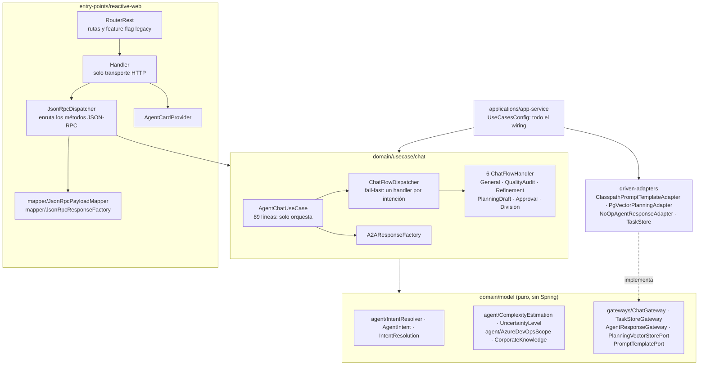

# Proyecto Base Implementando Clean Architecture

## Antes de Iniciar

Empezaremos por explicar los diferentes componentes del proyectos y partiremos de los componentes externos, continuando con los componentes core de negocio (dominio) y por último el inicio y configuración de la aplicación.

Lee el artículo [Clean Architecture — Aislando los detalles](https://medium.com/bancolombia-tech/clean-architecture-aislando-los-detalles-4f9530f35d7a)

# Arquitectura


## Domain

Es el módulo más interno de la arquitectura, pertenece a la capa del dominio y encapsula la lógica y reglas del negocio mediante modelos y entidades del dominio.

## Usecases

Este módulo gradle perteneciente a la capa del dominio, implementa los casos de uso del sistema, define lógica de aplicación y reacciona a las invocaciones desde el módulo de entry points, orquestando los flujos hacia el módulo de entities.

## Infrastructure

### Helpers

En el apartado de helpers tendremos utilidades generales para los Driven Adapters y Entry Points.

Estas utilidades no están arraigadas a objetos concretos, se realiza el uso de generics para modelar comportamientos
genéricos de los diferentes objetos de persistencia que puedan existir, este tipo de implementaciones se realizan
basadas en el patrón de diseño [Unit of Work y Repository](https://medium.com/@krzychukosobudzki/repository-design-pattern-bc490b256006)

Estas clases no puede existir solas y debe heredarse su compartimiento en los **Driven Adapters**

### Driven Adapters

Los driven adapter representan implementaciones externas a nuestro sistema, como lo son conexiones a servicios rest,
soap, bases de datos, lectura de archivos planos, y en concreto cualquier origen y fuente de datos con la que debamos
interactuar.

### Entry Points

Los entry points representan los puntos de entrada de la aplicación o el inicio de los flujos de negocio.

## Application

Este módulo es el más externo de la arquitectura, es el encargado de ensamblar los distintos módulos, resolver las dependencias y crear los beans de los casos de use (UseCases) de forma automática, inyectando en éstos instancias concretas de las dependencias declaradas. Además inicia la aplicación (es el único módulo del proyecto donde encontraremos la función “public static void main(String[] args)”.

**Los beans de los casos de uso se disponibilizan automaticamente gracias a un '@ComponentScan' ubicado en esta capa.**

---

# Arquitectura de este agente

> Estado tras el plan de refactorización documentado en `docs/plan/PLAN_MAESTRO.md`
> (fases 00 a 07, cerrado el 2026-08-29). El informe de cierre está en
> `docs/resultados/CIERRE-DEL-PLAN.md`.

## Flujo de una petición



## Decisiones de diseño que conviene conocer

| Tema | Decisión |
|---|---|
| **Resolución de intención** | Vive en `domain/model` como servicio puro (`IntentResolver`). Un `(ID: n)` explícito junto a un verbo de intención **gana** sobre las palabras clave genéricas (DP-01) |
| **Prompts** | Externalizados en `applications/app-service/src/main/resources/prompts/`. Se renderizan por `PromptTemplatePort`; el dominio no contiene texto de prompt |
| **Estimación** | Umbral de división `> 8` puntos (DP-02). Si el modelo no estima, se **avisa explícitamente** en lugar de inventar un valor (DP-03) |
| **Flujos** | Patrón Strategy: seis `ChatFlowHandler` indexados por `AgentIntent`. `ChatFlowDispatcher` **falla al arrancar** si falta un handler o hay duplicados |
| **Manejo de error** | Un **único** `onErrorResume`, en `AgentChatUseCase.executeChat()` |
| **Entry-point** | `Handler` solo traduce HTTP↔dominio. El contrato JSON-RPC 2.0 y sus códigos de error están fijados por `JsonRpcErrorContractTest` |

## Transporte A2A: síncrono y asíncrono

El caso de uso expone dos transportes:

- **`chatAndRespond(...)`** — síncrono. Es el que usan hoy `POST /` (JSON-RPC) y el endpoint legacy.
- **`chat(...)`** — asíncrono: persiste la tarea y publica la respuesta en `AgentResponseGateway`.

> **En la plataforma del Banco, A2A viaja sobre Kafka**, no sobre el transporte oficial del
> protocolo. Por eso el camino asíncrono **se conserva** (DP-05, Opción A).
>
> Hoy el puerto lo resuelve `NoOpAgentResponseAdapter`, un **Null Object** que devuelve
> `Mono.empty()`. Publicar no tiene efecto lateral, de modo que el camino queda apagado **sin
> necesidad de un feature flag**.
>
> **Para activar A2A sobre Kafka:** sustituir ese bean por un adaptador productor que implemente
> `AgentResponseGateway`. No hay que tocar el dominio, el caso de uso ni la configuración.

El camino asíncrono está cubierto por `AgentChatUseCaseAsyncTransportTest`, para que una regresión
se detecte en el build y no el día que se encienda la mensajería.

## Endpoints

| Método | Ruta | Notas |
|---|---|---|
| `POST` | `/` | JSON-RPC 2.0: `message/send`, `tasks/get`, `tasks/cancel` |
| `GET` | `/.well-known/agent-card.json`, `/.well-known/agent.json`, `/card` | Agent Card A2A |
| `GET` | `/api/tasks` | Listado de tareas |
| `POST` | `/message:send` | **Deprecado.** Emite `Deprecation`, `Sunset` y `Link`. Se desactiva con `a2a.legacy-message-send-enabled=false` o automáticamente tras la fecha de sunset con `a2a.legacy.disable-after-sunset=true` |

## Calidad

| Métrica | Valor |
|---|---|
| Pruebas | **305**, todas en verde |
| Cobertura `domain/model` | **99,7%** |
| Cobertura `domain/usecase` | **99,2%** |
| Clases de más de 300 líneas | **0** |
| Violaciones de ArchUnit | **0** |

### Comandos

```powershell
.\gradlew.bat build                                          # compila, prueba, ArchUnit y BlockHound
.\gradlew.bat jacocoMergedReport --no-configuration-cache     # reporte de cobertura fusionado
```

> ⚠️ **Por qué `--no-configuration-cache`.** No es un problema de JaCoCo. La tarea
> `pitestReportAggregate` del plugin `info.solidsoft.gradle.pitest` no es serializable para la
> *configuration cache* de Gradle: falla al escribir el campo `__additionalClasspath__`
> (`error writing value of type DefaultConfigurableFileCollection`). Es un defecto del plugin,
> ajeno a este proyecto. Mientras no se corrija aguas arriba, el reporte de cobertura debe
> generarse con la bandera. El resto del build (`.\gradlew.bat build`) **sí** usa la caché.


