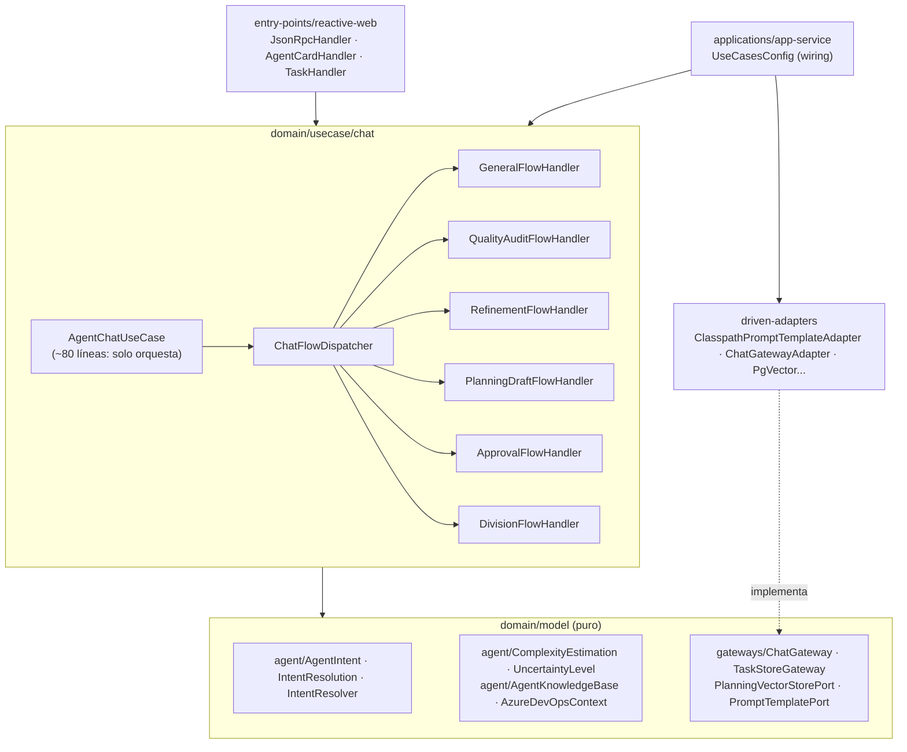

# Plan Maestro de Refactorización — `azure-devops-agent`

> **Versión:** 1.0 · **Fecha:** 2026-08-28
> **Cumple:** `rules/spring-rules.md`, `.github/copilot-instructions.md`, `COMMIT_RULES.md`

---

## 1. Objetivo

Separar los flujos de negocio del agente, hoy colapsados en dos god-classes, aplicando Clean
Architecture de Bancolombia, SOLID (especialmente **S** y **O**) y los umbrales de calidad de
SonarQube definidos en `rules/spring-rules.md` §4.

**Restricción transversal:** la refactorización es de **comportamiento equivalente**. Ningún cambio
funcional visible al usuario se introduce sin aprobación explícita registrada en
`DECISIONES_PENDIENTES.md`.

---

## 2. Situación actual (baseline medido)

| Artefacto | Líneas | Diagnóstico |
|---|---:|---|
| `domain/usecase/.../chat/AgentChatUseCase.java` | 644 | 6 flujos + 6 prompts + parsers + routing + post-procesado |
| `infrastructure/entry-points/reactive-web/.../api/Handler.java` | 495 | JSON-RPC + REST legacy + Agent Card + tasks + coerción de tipos |
| `applications/app-service/.../config/UseCasesConfig.java` | 54 | Constructor de 9 argumentos, 5 `String` consecutivos |

**Stack confirmado:** Java toolchain 25 · Spring Boot 4.1.0 · Reactor · Lombok 1.18.46 ·
JaCoCo 0.8.15 (reporte fusionado ya publicado a Sonar) · ArchUnit 1.4.2 · BlockHound.

### Deudas técnicas identificadas

| ID | Deuda | Regla violada |
|---|---|---|
| D-01 | Routing por cascada de `if` con `contains()` sobre texto libre; el primer `if` gana siempre | SOLID-O, Cognitive Complexity |
| D-02 | 6 bloques `onErrorResume` duplicados con cuerpo idéntico | DRY |
| D-03 | ~180 líneas de prompts como constantes `String` en el dominio | SRP |
| D-04 | Post-procesado de respuesta LLM duplicado literal entre 2 flujos | DRY |
| D-05 | Parseo de JSON con regex y defaults silenciosos (`return 1`) | S2259, robustez |
| D-06 | Números mágicos `13`, `8`, `25`, `3` sin constante | S109 |
| D-07 | `Pattern.compile()` en caliente por request | Performance |
| D-08 | Imports FQN inline (`java.util.regex.Pattern`) | Estilo Sonar |
| D-09 | Constructor de 9 args con 5 `String` posicionales intercambiables | SRP, robustez |
| D-10 | `Handler` mezcla 4 responsabilidades sin relación | SRP |
| D-11 | Agent Card A2A construida a mano en Java (~70 líneas de contenido estático) | SRP |
| D-12 | Lista de comandos duplicada en `shouldSearchPlanning` y `handleSpecialCommands` | DRY |
| D-13 | `chat()` async publica a un adapter no-op: camino muerto no documentado | Claridad |
| D-14 | Cobertura de `domain/usecase` muy por debajo del 90% exigido | `spring-rules.md` §5 |

---

## 3. Arquitectura objetivo



### Contratos nuevos clave

```java
// domain/model/.../model/agent/ — dominio puro, sin Spring
public enum AgentIntent { GENERAL, QUALITY_AUDIT, REFINEMENT, PLANNING_DRAFT, APPROVAL, DIVISION, STRUCTURED_CREATION }

public record IntentResolution(AgentIntent intent, Map<String, String> params) { }

public record ComplexityEstimation(int points, UncertaintyLevel level, String rationale) { }

// domain/model/.../model/prompt/gateways/
public interface PromptTemplatePort {
    String render(PromptTemplateId id, Map<String, Object> variables);
}

// domain/usecase/.../chat/handler/
public interface ChatFlowHandler {
    AgentIntent supports();
    Mono<String> handle(ChatFlowContext context);
}
```

---

## 4. Fases

| # | Fase | Objetivo | Riesgo | Depende de |
|---|---|---|---|---|
| **00** | Baseline y caracterización | Medir estado real y blindar el comportamiento actual con tests de caracterización antes de tocar nada | Nulo | — |
| **01** | Externalización de prompts | Sacar los 6 prompts del dominio a `resources/prompts/` vía `PromptTemplatePort` | Bajo | 00 |
| **02** | Value Objects de estimación | `ComplexityEstimation`, `UncertaintyLevel`, `LlmResponseSanitizer`; eliminar D-04, D-05, D-06 | Bajo | 01 |
| **03** | Resolución de intención | `AgentIntent` + `IntentResolver` en dominio puro; eliminar D-01, D-07, D-08, D-12 | Medio | 02 |
| **04** | Separación de flujos (Strategy) | 6 `ChatFlowHandler` + `ChatFlowDispatcher`; `AgentChatUseCase` baja a ~80 líneas | Medio | 03 |
| **05** | Value Objects de configuración | `AgentKnowledgeBase`, `AzureDevOpsContext`; adelgazar `UseCasesConfig` (D-09) | Bajo | 04 |
| **06** | Separación del entry-point | Partir `Handler` en `JsonRpcHandler`, `AgentCardHandler`, `TaskHandler`, `JsonRpcParamMapper` (D-10, D-11) | Medio | 05 |
| **07** | Endurecimiento y cierre | Reglas ArchUnit nuevas, cobertura ≥90% en dominio, checklist Sonar, resolución de D-13 | Bajo | 06 |

### Principio de corte

Cada fase deja el repositorio **compilando, con tests verdes y desplegable**. No hay big-bang.
Si una fase no puede cerrarse verde, se revierte completa y se documenta el bloqueo en `ESTADO.md`.

---

## 5. Métricas de éxito

| Métrica | Baseline | Objetivo |
|---|---:|---:|
| Líneas de `AgentChatUseCase` | 644 | ≤ 100 |
| Líneas de `Handler` | 495 | ≤ 150 por clase resultante |
| Clases > 300 líneas | 2 | 0 |
| Complejidad cognitiva máx. por método | > 15 | ≤ 15 |
| Cobertura `domain/model` + `domain/usecase` | por medir (Fase 00) | ≥ 90% |
| Constructores con > 5 parámetros | 1 | 0 |
| Bloques `onErrorResume` duplicados | 6 | 1 |
| Números mágicos en dominio | ≥ 4 | 0 |

---

## 6. Definición de Hecho (DoD) — aplica a TODAS las fases

Tomado literalmente de `rules/spring-rules.md` §7:

- [ ] La estructura de paquetes respeta `domain/model`, `domain/usecase`, `driven-adapters`, `entry-points`.
- [ ] `domain/model` sin dependencias de Spring, persistencia ni serialización.
- [ ] `domain/usecase` sin anotaciones de Spring (wiring exclusivo en `app-service`).
- [ ] Los mappers modelo↔entidad viven en `driven-adapters`.
- [ ] Sin credenciales ni secretos hardcodeados (S2068).
- [ ] Retornos opcionales gestionados con `Optional<T>` (S2259).
- [ ] Complejidad cognitiva ≤ 15 en todo método modificado.
- [ ] Todo bloque de control de flujo con llaves `{}` (S1117).
- [ ] Sin literales numéricos sueltos salvo `-1`, `0`, `1` (S109).
- [ ] Tests GIVEN/WHEN/THEN con `@ExtendWith(MockitoExtension.class)`, `@Mock`, `@InjectMocks`.
- [ ] `./gradlew build` verde (incluye ArchUnit y BlockHound).
- [ ] Ningún contrato ni nombre asumido sin validación (§6 No-Asunción).
- [ ] Commit con formato `tipo(scope): descripción` en español.

---

## 7. Convención de commits del plan

| Fase | Commit sugerido |
|---|---|
| 00 | `test(agent_chat): agregar pruebas de caracterizacion del enrutamiento de flujos` |
| 01 | `refactor(agent_prompts): externalizar plantillas de prompt a recursos` |
| 02 | `refactor(agent_chat): extraer objeto de valor de estimacion de complejidad` |
| 03 | `refactor(agent_intent): introducir resolutor de intencion en el dominio` |
| 04 | `refactor(agent_chat): separar flujos de conversacion con patron strategy` |
| 05 | `refactor(agent_config): agrupar configuracion en objetos de valor` |
| 06 | `refactor(reactive_web): separar responsabilidades del handler jsonrpc` |
| 07 | `test(agent_chat): elevar cobertura y reglas de arquitectura` |

---

## 8. Riesgos y mitigación

| Riesgo | Impacto | Mitigación |
|---|---|---|
| El refactor cambia el flujo elegido para un texto dado | Alto | Fase 00 congela el comportamiento actual con tests de caracterización; cualquier desvío rompe el build |
| Los prompts externalizados alteran la salida del LLM | Alto | Fase 01 exige comparación byte a byte del prompt renderizado contra la constante original |
| Corregir D-01 cambia funcionalidad para el usuario final | Alto | **Bloqueado** hasta aprobación explícita (ver `DECISIONES_PENDIENTES.md`, DP-01) |
| Pérdida de contexto o desconexión a mitad del trabajo | Medio | Protocolo de continuidad en `docs/README.md` + `ESTADO.md` + MD por fase |
| Regresión en el contrato A2A / JSON-RPC | Alto | `JsonRpcErrorContractTest` y `RouterRestTest` existentes deben permanecer intactos y verdes |

---

## 9. Fuera de alcance

- Migración de `NoOpAgentResponseAdapter` a un productor Kafka real.
- Cambios en el esquema de base de datos (`agent_tasks`, `planning_chunks`).
- Modificación del contrato público A2A / JSON-RPC 2.0.
- Cambios en `azure-devops-backend`, `azure-devops-frontend` o `azure-devops-mcp`.

