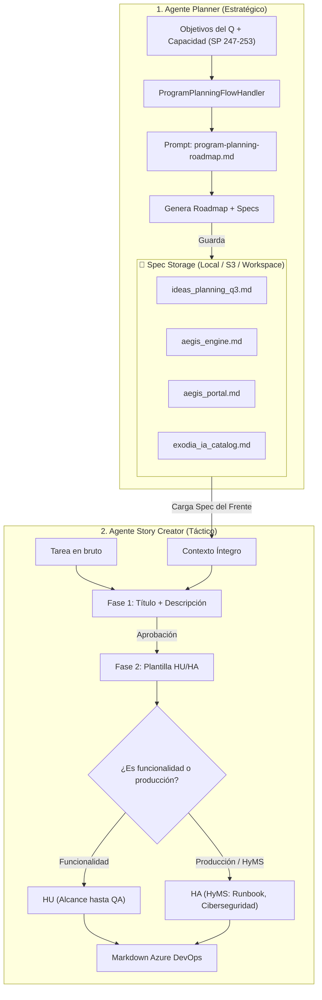

# Plan Maestro — Harness de Agentes: Program Planning y Story Engine

> **Versión:** 1.0 · **Fecha:** 2026-09-05  
> **Alineado con:** Clean Architecture Bancolombia, Marco HyMS, Fibonacci (< 8 pts) y Metodología
> SDD Adaptativa.

---

## 1. Objetivo y Visión Técnica

Construir un **Harness de Agentes Especializados** dentro de `azure-devops-agent` para resolver de
punta a punta las dos capacidades clave del ciclo de vida ágil:

1. **Capacidad 1 — Agente Planner (Estratégico / Macro):**  
   A partir de los objetivos del Q, la capacidad de los sprints (SP 247 a SP 253) y los frentes
   técnicos, estructurar el **Roadmap Maestro de Sprints** y generar los documentos de
   especificación Markdown por frente (`ideas_planning_QX.md`, `frente_*.md`).
2. **Capacidad 2 — Agente Story Creator (Táctico / Micro):**  
   Tomar tareas en bruto, leer el spec completo del frente seleccionado y generar historias
   estructuradas en Markdown puro para Azure DevOps, aplicando con rigor la regla corporativa:
    * **HU (Historia de Usuario):** Construir la funcionalidad (diseño, código y pruebas hasta QA).
    * **HA (Historia Habilitadora):** Habilitar la operación en producción bajo el marco **HyMS**
      (ciberseguridad, observabilidad, alertas, Runbook de operación y soporte post-producción).

---

## 2. Diagnóstico y Deuda Técnica a Resolver

|    ID    | Componente / Archivo                 | Diagnóstico Actual                                                                                                            | Solución Propuesta                                                                                                        |
|:--------:|:-------------------------------------|:------------------------------------------------------------------------------------------------------------------------------|:--------------------------------------------------------------------------------------------------------------------------|
| **D-01** | `PlanningVectorStorePort` (pgvector) | Obliga a tener PostgreSQL/pgvector corriendo localmente. Fragmentar archivos de 5 a 20 KB en chunks rompe el contexto global. | Desacoplar pgvector e implementar `SpecStoragePort` documental para inyectar documentos Markdown íntegros.                |
| **D-02** | Ausencia de capacidad de planeación  | El agente solo tenía intención para HU individuales (`PLANNING_DRAFT`). No podía generar roadmaps de sprints ni specs.        | Introducir `AgentIntent.PROGRAM_PLANNING`, `ProgramPlanningFlowHandler` y su prompt de roadmap.                           |
| **D-03** | Ambigüedad en regla HU vs HA         | No se diferenciaba claramente el alcance funcional (hasta QA) del paso a producción (HyMS).                                   | Especializar los prompts para que la HU cubra hasta QA y toda entrega a producción genere obligatoriamente la HA de HyMS. |
| **D-04** | Orquestación rígida                  | No había alternancia fluida entre planear un Q completo y generar una historia específica.                                    | Incorporar el selector de frente y el enrutamiento bidireccional en el dispatcher del harness.                            |

---

## 3. Arquitectura del Harness Interno



---

## 4. Mapa de Fases Atómicas (01 a 09)

```
[Fase 01] Modelos y Puerto de Almacenamiento Documental (domain/model)
    │
    ▼
[Fase 02] Adaptador FileSystemSpecAdapter (infrastructure/driven-adapters)
    │
    ▼
[Fase 03] Migración de PlanningDraftFlowHandler a SpecStoragePort
    │
    ▼
[Fase 04] Modelos de Dominio para Program Planning (QuarterPlan, SprintPlan)
    │
    ▼
[Fase 05] Prompt Externalizado de Planeación (program-planning-roadmap.md)
    │
    ▼
[Fase 06] Caso de Uso y Handler del Planner Agent (ProgramPlanningFlowHandler)
    │
    ▼
[Fase 07] Especialización de Prompts Story Creator con Regla HyMS
    │
    ▼
[Fase 08] Orquestación y Despacho del Harness (ChatFlowDispatcher)
    │
    ▼
[Fase 09] Validación E2E con Caso Real Q3-2026 y Cierre del Plan
```

### Detalle de Fases:

### **Fase 01 — Modelos y Puerto de Almacenamiento Documental (`domain/model`)**

* **Objetivo:** Definir el modelo inmutable `SpecDocument`, el puerto `SpecStoragePort` y la
  excepción `SpecNotFoundException`.
* **Entregable:** Clases de dominio puras sin anotaciones de infraestructura y sus pruebas
  unitarias.

### **Fase 02 — Adaptador `FileSystemSpecAdapter` (`infrastructure`)**

* **Objetivo:** Implementar la lectura y escritura no bloqueante de archivos Markdown desde
  disco/workspace.
* **Entregable:** Adaptador reactivo con scheduler elástico para I/O y suite de tests con
  directorios temporales.

### **Fase 03 — Migración de `PlanningDraftFlowHandler`**

* **Objetivo:** Reemplazar la dependencia de `PlanningVectorStorePort` por `SpecStoragePort` e
  inyectar el contexto documental completo.
* **Entregable:** Handler actualizado, `UseCasesConfig` recableado, sin llamadas obligatorias a
  PostgreSQL.

### **Fase 04 — Modelos de Dominio para Program Planning**

* **Objetivo:** Modelar los conceptos macro: `AgentIntent.PROGRAM_PLANNING`, `ProgramPlanRequest`,
  `SprintAllocation`, `ActivityType` (HU vs HA).
* **Entregable:** Enums, records de dominio y actualización de `IntentResolver`.

### **Fase 05 — Prompt Externalizado de Planeación**

* **Objetivo:** Redactar y registrar la plantilla `program-planning-roadmap.md` con las reglas de
  capacidad por sprint, dependencias y cierre HyMS.
* **Entregable:** Archivo Markdown en classpath, enum `PromptTemplateId.PROGRAM_PLANNING` y pruebas
  de renderizado.

### **Fase 06 — Caso de Uso y Handler del Planner Agent**

* **Objetivo:** Implementar `ProgramPlanningFlowHandler` para generar el roadmap y persistir
  `ideas_planning_QX.md` y los specs por frente a través del storage.
* **Entregable:** Handler probado al 100% con stubs y mocks.

### **Fase 07 — Especialización de Prompts Story Creator con Regla HyMS**

* **Objetivo:** Ajustar `fase1-propuesta-inicial.md` y `fase2-historia-estructurada.md` para
  inyectar el spec del frente seleccionado y forzar la regla: funcionalidad $\rightarrow$ HU (hasta
  QA); producción $\rightarrow$ HA (HyMS).
* **Entregable:** Prompts actualizados y pruebas de generación.

### **Fase 08 — Orquestación y Despacho del Harness**

* **Objetivo:** Integrar el enrutamiento bidireccional en `ChatFlowDispatcher` y actualizar los
  controladores reactivos para soportar ambos modos.
* **Entregable:** Enrutador probado con caracterización de flujos.

### **Fase 09 — Validación E2E con Caso Real Q3-2026 y Cierre del Plan**

* **Objetivo:** Ejecutar una planeación real con los insumos de `Planning/Q3-2026` (*Guardián de la
  Experiencia*), generar las HUs/HAs de un frente, verificar cobertura ($\ge 90\%$), ArchUnit y
  redactar `CIERRE-DEL-PLAN.md`.

---

## 5. Regla de Adaptabilidad y Feedback Continuo

> [!IMPORTANT]
> **Ajuste por Hallazgos:** Una fase ejecutada **puede y debe** modificar este Plan Maestro y la
> especificación de la siguiente fase si durante la implementación se detectan oportunidades de
> diseño, restricciones técnicas o simplificaciones.
>
> **Regla de Cierre:** Cada fase concluida debe:
> 1. Medir métricas reales en `resultados/RESULTADO-FASE-XX.md`.
> 2. Generar el prompt/especificación ejecutable de la fase siguiente (`fases/FASE-XX+1-*.md`).
> 3. Actualizar `plan/ESTADO.md`.
