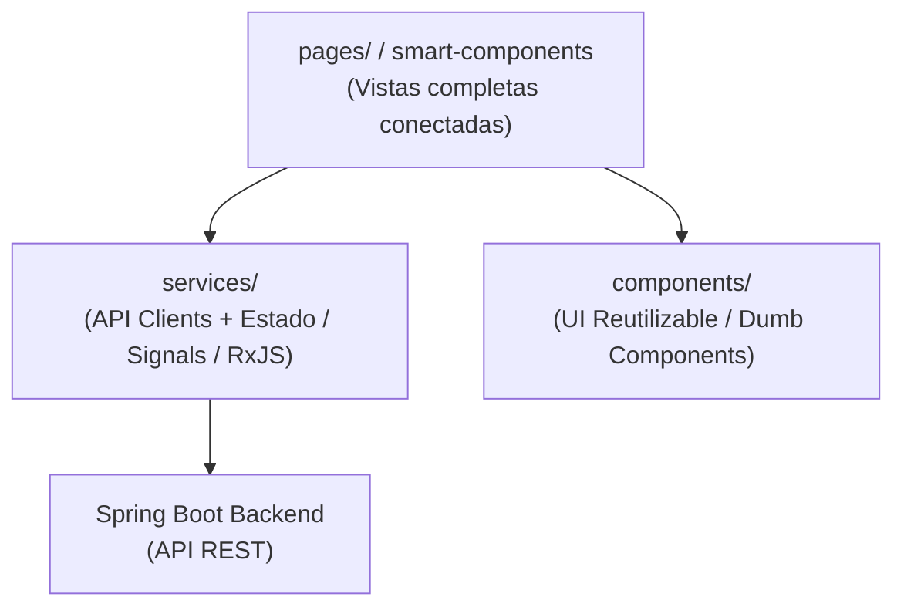

# Angular Frontend — Arquitectura Modular y Buenas Prácticas

## Principio

El frontend de este monorepo está construido en **Angular** y sigue una **arquitectura por feature**
con separación estricta de responsabilidades. La lógica de presentación, la lógica de estado y la
comunicación con el backend (I/O) están estrictamente desacopladas.



Los componentes de presentación son **solo UI y datos de entrada**. La lógica de negocio, de
orquestación y el manejo de estado viven en **servicios**. El acceso a la red se realiza
exclusivamente a través de la capa de API de los servicios.

---

## 1. Estructura de Directorios

El código vive dentro de la carpeta `frontend/src/app/` y se organiza bajo una estructura modular
por feature:

```
frontend/src/app/
├── app.config.ts                     # Configuración global (Providers, Routing, PrimeNG, Animaciones)
├── app.routes.ts                     # Rutas principales de la aplicación
├── app.ts                            # Componente raíz (AppComponent)
├── app.css                           # Estilos globales y Tailwind CSS imports
│
├── core/                             # SINGLETONS GLOBALES
│   ├── guards/                       # Functional guards para seguridad de rutas
│   ├── interceptors/                 # Interceptores HTTP (auth headers, error handling)
│   └── services/                     # Servicios globales (AuthService, ConfigService)
│
├── shared/                           # COMPONENTES COMPARTIDOS (Puros de UI)
│   ├── components/                   # Botones custom, spinners, loaders, modales genéricos
│   ├── directives/                   # Directivas personalizadas de comportamiento
│   └── pipes/                        # Pipes reutilizables sin lógica de negocio
│
└── features/{nombre_feature}/        # CARPETAS POR FEATURE / DOMINIO
    ├── components/                   # DUMB COMPONENTS (Presentación únicamente)
    │   ├── {componente}/
    │   │   ├── {componente}.ts
    │   │   ├── {componente}.html
    │   │   └── {componente}.spec.ts
    │   └── index.ts                  # Barrel exports públicos
    │
    ├── services/                     # SERVICES & STATE MANAGEMENT
    │   ├── {feature}-api.service.ts  # HttpClient wrapper para endpoints específicos
    │   ├── {feature}-state.service.ts# Estado local de la feature (BehaviorSubject / Signals)
    │   └── index.ts
    │
    ├── pages/                        # SMART COMPONENTS / VISTAS (Puntos de entrada de rutas)
    │   ├── {feature}-home.page.ts    # Página principal de la feature
    │   └── {feature}-detail.page.ts  # Vista de detalle
    │
    ├── models/                       # INTERFACES Y TIPOS
    │   └── {feature}.model.ts        # Modelos TypeScript específicos de la feature
    │
    └── {nombre_feature}.routes.ts    # Sub-rutas específicas de la feature
```

---

## 2. Componentes Standalone (Modern Angular)

Todos los componentes deben crearse de forma estricta como **Standalone Components** (
`standalone: true`).

- Declarar las importaciones de componentes de PrimeNG, directivas compartidas o pipes necesarios
  directamente en el array `imports` del componente.
- Utilizar la sintaxis moderna de **Control Flow** (`@if`, `@for`, `@switch`) para optimizar el
  rendimiento y legibilidad, descartando el uso de `*ngIf`, `*ngFor` y `*ngSwitch`.

```typescript
import {Component, Input, Output, EventEmitter} from '@angular/core';
import {CommonModule} from '@angular/common';
import {ButtonModule} from 'primeng/button';
import {CardModule} from 'primeng/card';
import {AgentCard} from '../models/agent.model';

@Component({
  selector: 'app-agent-card',
  standalone: true,
  imports: [CommonModule, ButtonModule, CardModule],
  template: `
    <p-card [header]="agent.name" styleClass="shadow-md hover:shadow-lg transition-shadow">
      <p class="text-gray-600 mb-4">{{ agent.description }}</p>
      
      <div class="flex justify-end gap-2">
        @if (agent.active) {
          <p-button label="Interactuar" icon="pi pi-comments" (onClick)="onInteract.emit(agent)" />
        } @else {
          <span class="text-sm text-red-500 font-semibold flex items-center gap-1">
            <i class="pi pi-exclamation-triangle"></i> Inactivo
          </span>
        }
      </div>
    </p-card>
  `,
  styles: []
})
export class AgentCardComponent {
  @Input({required: true}) agent!: AgentCard;
  @Output() onInteract = new EventEmitter<AgentCard>();
}
```

---

## 3. Manejo de Estado Reactivo (Signals & RxJS)

La reactividad es un pilar fundamental en Angular. Se debe estructurar la lógica de estado de la
siguiente manera:

1. **Signals para Estado de UI Local**: Usar `signal()`, `computed()`, y `effect()` para datos
   reactivos de renderizado en el componente (ej. visibilidad de modales, filtros locales,
   selecciones simples).
2. **RxJS BehaviorSubject para Estados Compartidos Complejos**: En los servicios de estado (
   `{feature}-state.service.ts`), encapsular el estado de negocio usando `BehaviorSubject` privados
   y exponerlos públicamente como `Observable` puros (`asObservable()`) para mantener la
   inmutabilidad desde el exterior.
3. **Suscripción Segura (Memory Leak Prevention)**:
    - **Preferir siempre `AsyncPipe` (`| async`)** en las plantillas HTML para la gestión automática
      de suscripciones de Observables.
    - Si es imperativo suscribirse dentro del código TypeScript de un componente, utiliza *
      *`takeUntilDestroyed()`** de `@angular/core/rxjs-interop` en el contexto del constructor, o
      inyecta `DestroyRef` para desvincular la suscripción al destruirse el componente. **Prohibido
      mantener suscripciones manuales abiertas**.

```typescript
// features/chat/services/chat-state.service.ts
import {Injectable, inject} from '@angular/core';
import {BehaviorSubject, finalize} from 'rxjs';
import {ChatApiService} from './chat-api.service';
import {Message} from '../models/chat.model';

@Injectable({providedIn: 'root'})
export class ChatStateService {
  private readonly api = inject(ChatApiService);

  private readonly messages$ = new BehaviorSubject<Message[]>([]);
  private readonly loading$ = new BehaviorSubject<boolean>(false);

  public readonly messages = this.messages$.asObservable();
  public readonly loading = this.loading$.asObservable();

  public sendMessage(text: string): void {
    this.loading$.next(true);
    this.api.send(text)
    .pipe(finalize(() => this.loading$.next(false)))
    .subscribe({
      next: (response) => {
        const current = this.messages$.value;
        this.messages$.next([...current, response.message]);
      },
      error: (err) => console.error('Error enviando mensaje', err)
    });
  }
}
```

---

## 4. UI con PrimeNG y Tailwind CSS

Este proyecto utiliza **PrimeNG** como suite de componentes visuales y **Tailwind CSS** para
maquetación, layouts y espaciado ágil.

- **Mantenibilidad Estética**: Utilizar clases semánticas de Tailwind CSS para posicionamiento (
  `flex`, `grid`, `gap`, `justify-*`, `items-*`). Evitar estilos en línea (`style="..."`) a menos
  que sean calculados de manera dinámica.
- **A11Y (Accesibilidad Obligatoria)**:
    - Todos los botones interactivos e inputs de formulario **deben** tener un descriptor accesible
      claro.
    - Los botones de iconos (`p-button` sin label o con solo icono) deben declarar obligatoriamente
      un atributo `aria-label` descriptivo:

```html
<!-- CORRECTO -->
<p-button icon="pi pi-trash" aria-label="Eliminar agente de la lista" (onClick)="delete()"/>

<!-- INCORRECTO -->
<p-button icon="pi pi-trash" (onClick)="delete()"/>
```

---

## 5. TypeScript Estricto y Calidad de Código

- **Prohibido `any`**: No utilizar `any` bajo ninguna circunstancia. Si una respuesta externa no
  está tipada, usar `unknown` acoplado a un Type Guard o validación manual, o definir la interfaz de
  contrato.
- **Interfaces con Prefijo**: No es obligatorio el prefijo `I` en TypeScript para interfaces de
  negocio normales (ej. usar `AgentCard` en lugar de `IAgentCard`), pero sé consistente con los
  modelos del backend si son compartidos.
- **Tipado explícito de retornos públicos**: Todos los métodos públicos expuestos en servicios y
  componentes deben declarar explícitamente el tipo de dato que retornan.
- **Sin Números Mágicos**: Extraer literales numéricos a constantes tipadas fuera del flujo local de
  la función para mayor semántica.
- **Safe Navigation**: Usar de manera proactiva el operador de encadenamiento opcional `?.` y
  operador nullish coalescing `??` ante variables que puedan ser nulas o no definidas.

---

## 6. Convenciones de Testing (Vitest en Angular)

El proyecto utiliza **Vitest** en lugar de Karma/Jasmine para mayor agilidad en ejecución.

- **Estructura GIVEN / WHEN / THEN**: Mantener la nomenclatura de aserciones clara en los bloques de
  `describe` e `it`.
- **Mocks de Dependencias**:
    - Utilizar el inyector nativo `TestBed.configureTestingModule` y proveer mocks de los servicios
      usando proveedores simplificados o espías (`spyOn`).
    - Para pruebas con peticiones de red, usar `provideHttpClientTesting()` de
      `@angular/common/http/testing` para interceptar llamadas.

```typescript
import {TestBed} from '@angular/core/testing';
import {provideHttpClient} from '@angular/common/http';
import {provideHttpClientTesting, HttpTestingController} from '@angular/common/http/testing';
import {ChatApiService} from './chat-api.service';

describe('GIVEN ChatApiService', () => {
  let service: ChatApiService;
  let httpMock: HttpTestingController;

  beforeEach(() => {
    TestBed.configureTestingModule({
      providers: [
        ChatApiService,
        provideHttpClient(),
        provideHttpClientTesting()
      ]
    });
    service = TestBed.inject(ChatApiService);
    httpMock = TestBed.inject(HttpTestingController);
  });

  afterEach(() => {
    httpMock.verify();
  });

  describe('WHEN sendMessage is invoked', () => {
    it('THEN performs a POST request and returns the parsed message', () => {
      // Arrange (GIVEN)
      const text = 'hola';
      const mockResponse = {message: {text: 'hola de regreso', sender: 'agent'}};

      // Act (WHEN)
      service.send(text).subscribe((response) => {
        // Assert (THEN)
        expect(response.message.text).toBe('hola de regreso');
      });

      const req = httpMock.expectOne('/api/chat');
      expect(req.request.method).toBe('POST');
      req.flush(mockResponse);
    });
  });
});
```

---

## 7. Política de No-Asunción (Transversal)

**Nunca asumas información que no esté explícita**. Las interfaces visuales y textos son de cara al
usuario. Si hay vacíos en el diseño o especificación, **detente y consulta** directamente al
usuario.

### Casos típicos en los que DEBES preguntar en Angular:

1. **Textos y Copys**: Títulos de ventanas, etiquetas de formularios, descripciones, mensajes de
   confirmación de eliminación, copys de error, placeholders.
2. **Flujos de Navegación**: Comportamiento ante clics (¿abre un modal, redirige a otra página o
   realiza una acción en línea?), dónde vuelve el usuario tras cancelar una operación.
3. **Iconografía**: Selección de iconos visuales cuando existen múltiples opciones razonables en
   PrimeIcons (`pi pi-trash` vs `pi pi-times`, etc.).
4. **Validaciones**: Límites máximos o mínimos de caracteres de un formulario, si un campo es
   opcional en la UI (aunque en BD sea requerido).

---

## 8. Checklist de Entrega para Angular

Al finalizar o revisar un desarrollo en Angular, valida que:

- [ ] Todos los componentes creados son standalone (`standalone: true`).
- [ ] No se utilizan directivas antiguas como `*ngIf` o `*ngFor` (usar `@if`, `@for`).
- [ ] El estado del componente se maneja reactivamente con Signals u Observables seguros.
- [ ] No existen fugas de memoria (memory leaks); todas las suscripciones manuales se cierran con
  `takeUntilDestroyed()` o `AsyncPipe`.
- [ ] Todos los botones que contienen únicamente iconos tienen configurado su `aria-label`.
- [ ] No se utiliza `any` en ninguna declaración de variable o parámetro.
- [ ] Todas las llamadas a backend HTTP están centralizadas en servicios de API, nunca directamente
  en el componente.
- [ ] Se implementaron pruebas unitarias con Vitest que cubren happy paths y flujos lógicos
  aplicando GIVEN/WHEN/THEN.
- [ ] No se inventaron copys de interfaz o rutas sin la debida confirmación.
