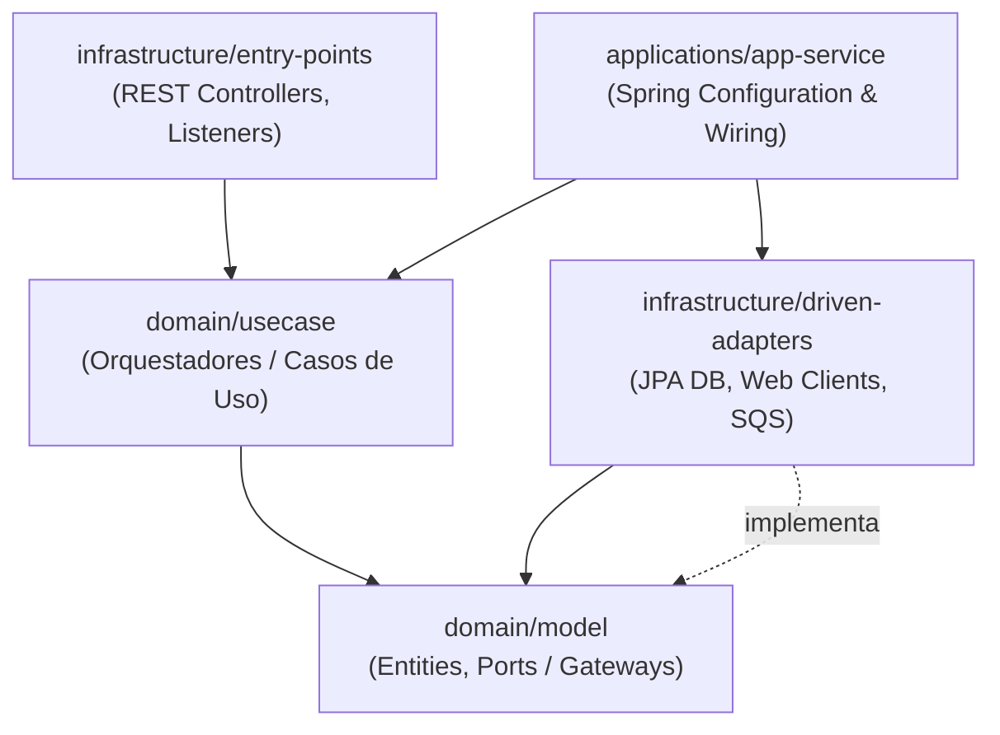

# Java Spring Boot — Bancolombia Clean Architecture & DDD

## Principio

El backend de este repositorio sigue una **Arquitectura Limpia (Hexagonal)** basada en el estándar
del [Scaffold Clean Architecture de Bancolombia](https://github.com/bancolombia/scaffold-clean-architecture)
en Java. Las dependencias son unidireccionales y fluyen hacia el núcleo de dominio (`domain/model`).
Las capas externas conocen a las internas, pero nunca al revés.



La regla de oro: **El dominio es puro**. No conoce Spring, JPA, Jackson, Express ni ningún detalle
técnico de infraestructura.

---

## 1. Estructura de Capas (Bancolombia Standard)

### `domain/model` — El Núcleo Puro del Negocio

Contiene las entidades del dominio, objetos de valor y, lo más importante, los **puertos (
interfaces / gateways)** que definen los contratos para comunicarse con el mundo exterior.

- **Entidades de Dominio** (`domain/model/src/main/java/.../model/{aggregate}/`): Clases ricas en
  comportamiento e invariantes de negocio. **Prohibido el modelo anémico**.
- **Value Objects**: Clases inmutables sin identidad propia que encapsulan datos validados (ej.
  `AppCode`, `SubjectRef`).
- **Gateways / Ports** (`domain/model/src/main/java/.../model/{aggregate}/gateways/`): Interfaces de
  puertos que definen los contratos de persistencia o comunicación (ej. `PlanningVectorStorePort`,
  `TaskStoreGateway`).
- **Domain Services**: Lógica de dominio cross-entidad que no encaja en una sola clase de entidad.
- **Domain Exceptions**: Excepciones específicas de negocio que extienden de una excepción base del
  dominio (no de Spring o HTTP).

**Restricciones estrictas**:

- **Cero anotaciones de Spring** (`@Component`, `@Service`, `@Repository`, `@Autowired`, `@Value`).
- **Cero dependencias de persistencia** (no JPA, no `@Entity`, no `@Table`, no Hibernate).
- **Cero dependencias de serialización** (no Jackson, no `@JsonProperty`).
- Solo dependencias de Java base y utilidades básicas (ej. Lombok, pero limitado a `@Getter`,
  `@Setter`, `@Builder`, `@NoArgsConstructor`, `@AllArgsConstructor` de manera controlada).

---

### `domain/usecase` — Orquestación de Casos de Uso

Contiene los casos de uso que implementan las reglas de aplicación del negocio. Orquestan el flujo
de datos desde y hacia el dominio, interactuando con los Gateways del dominio.

- **Usecases** (`domain/usecase/src/main/java/.../usecase/{feature}/`): Clases que expresan las
  intenciones de negocio (ej. `AgentChatUseCase`, `SearchPlanningSpecUseCase`).

**Restricciones estrictas**:

- **Cero anotaciones de Spring** (`@Service`, `@Component`, `@Autowired`).
- El wiring se realiza en la capa `applications/app-service` mediante clases de configuración con
  `@Configuration` y métodos con `@Bean`.
- Para inyección de dependencias, usar inyección por constructor nativa de Java, preferiblemente con
  `@RequiredArgsConstructor` de Lombok. Todos los campos de Gateways inyectados deben ser `final`.

```java
package co.com.bancolombia.usecase.chat;

import co.com.bancolombia.model.chat.gateways.ChatGateway;
import lombok.RequiredArgsConstructor;

@RequiredArgsConstructor
public class AgentChatUseCase {
    private final ChatGateway chatGateway; // Inyectado por constructor de manera estricta

    public SendMessageResponse execute(SendMessageRequest request) {
        // Reglas de aplicación
        return chatGateway.sendMessage(request);
    }
}
```

---

### `infrastructure/driven-adapters` — Adaptadores Concretos (Salida)

Implementan las interfaces (gateways / ports) declaradas en el dominio. Es donde se maneja la
tecnología específica de persistencia, integración y servicios externos.

- **JPA Repository / R2DBC** (`driven-adapters/jpa-repository/`): Conexión a bases de datos
  relacionales.
- **REST Clients** (`driven-adapters/web-client/`): Consumo de APIs externas usando `WebClient` o
  `RestTemplate`.
- **Message Senders** (`driven-adapters/async-messages/`): Publicadores de eventos o mensajes a
  colas (SQS, SNS, RabbitMQ).

**Reglas de negocio**:

- **Mappers Obligatorios**: La base de datos o el DTO externo tiene su propio modelo (ej.
  `PlanningChunkEntity` o `ExternalApiDto`). Se **debe** mapear obligatoriamente a/desde la entidad
  pura del dominio (`PlanningChunk`) usando un mapper estático o MapStruct. Las entidades de JPA *
  *nunca** se propagan al dominio o a la capa de casos de uso.
- **Manejo de Excepciones**: Capturan excepciones técnicas (ej. `SQLException`,
  `WebClientResponseException`) y las traducen a excepciones tipadas del dominio o controladas de
  negocio.

---

### `infrastructure/entry-points` — Puntos de Entrada (Entrada)

Adaptadores que exponen las capacidades de la aplicación al mundo exterior (HTTP Controllers,
Message Listeners, Event Consumers).

- **REST Controllers** (`entry-points/reactive-web/` o `entry-points/webmvc/`): Controladores REST
  con `@RestController`.
- **Message Receivers** (`entry-points/async-receiver/`): Oyentes de colas de mensajería.

**Reglas de negocio**:

- **Cero lógica de negocio**: Solo parsean la solicitud, validan el input (usando `@Valid` de
  Jakarta Validation o similar), delegan la ejecución al Usecase correspondiente, y mapean la salida
  del usecase al DTO de respuesta HTTP.
- **Manejo de errores centralizado**: Usar `@ControllerAdvice` y `@ExceptionHandler` en la capa de
  entry-points para capturar excepciones de negocio / dominio y convertirlas en respuestas HTTP
  consistentes (ej. 404 para `NotFoundException`, 400 para `IllegalArgumentException`).

---

### `applications/app-service` — Inicialización y Configuración

El módulo ejecutable de Spring Boot. Contiene la clase principal con `@SpringBootApplication` y las
configuraciones de wiring.

- **Main Application** (`co.com.bancolombia.MainApplication.java`): Punto de entrada.
- **Usecase Configuration** (`applications/app-service/src/main/java/.../config/`): Clases de
  configuración donde se registran los usecases como beans de Spring:

```java
@Configuration
public class UseCaseConfig {
    @Bean
    public AgentChatUseCase agentChatUseCase(ChatGateway chatGateway) {
        return new AgentChatUseCase(chatGateway);
    }
}
```

---

## 2. CQRS / CQS & Repository Segregation

Para mantener una separación clara entre lecturas y escrituras, se aplica un patrón pragmático de
CQS (Command-Query Separation) a nivel de puertos y adaptadores:

1. **Separación de Puertos (Interfaces)**: Separar interfaces de lectura de las de escritura para un
   mismo agregado si el modelo es complejo o tiene base de datos persistente:
    - `PlanningQueryGateway`: Contratos de búsqueda y listado. Devuelven DTOs optimizados para
      lectura (Read Models).
    - `PlanningCommandGateway`: Contratos de persistencia y mutación (crear, actualizar, eliminar).
2. **Separación de Adapters**: Implementar adaptadores distintos para lectura y escritura:
    - `PlanningQueryJpaAdapter` implementa `PlanningQueryGateway`.
    - `PlanningCommandJpaAdapter` implementa `PlanningCommandGateway`.
3. **CQS en Mutaciones**: Los métodos de mutación (comandos) en los usecases respetan CQS: retornan
   `void` o el identificador mínimo creado (`id`), nunca el objeto con el estado completo. Si el
   cliente requiere el estado completo, debe realizar una consulta posterior.
4. **Outbox Pattern (Domain Events Post-Commit)**: Si un caso de uso realiza mutaciones
   transaccionales mediante `@Transactional`, los eventos de dominio acumulados en la entidad *
   *nunca** se deben despachar dentro de la transacción activa. Se deben registrar localmente y
   despacharse únicamente tras confirmar el commit exitoso de la transacción (usar
   `@TransactionalEventListener(phase = TransactionPhase.AFTER_COMMIT)` de Spring).

---

## 3. Principios SOLID en Spring Boot

- **S — Single Responsibility**: Cada Usecase debe representar una única acción o flujo de negocio
  estrechamente relacionado. Si un Usecase inyecta más de 5 Gateways o tiene demasiadas líneas,
  considera dividirlo. Los controladores REST solo manejan protocolo HTTP; no contienen lógica.
- **O — Open/Closed**: Usar polimorfismo o patrones de estrategia (`Strategy`) para soportar nuevos
  comportamientos sin modificar el orquestador principal.
- **L — Liskov Substitution**: Cualquier adaptador implementado (ej. base de datos PostgreSQL vs
  MongoDB vs InMemory) debe ser 100% intercambiable bajo el mismo Gateway sin alterar las
  aserciones, precondiciones ni lanzar excepciones inesperadas.
- **I — Interface Segregation**: Diseñar Gateways pequeños y enfocados en lugar de interfaces
  gigantes de persistencia. Separar lecturas de escrituras (CQS).
- **D — Dependency Inversion**: Los usecases dependen únicamente de abstracciones (interfaces
  Gateways en `domain/model`). La inyección de la implementación concreta (`driven-adapters`) es
  manejada por el contenedor de Spring Boot y configurada en `app-service`.

---

## 4. Calidad de Código (SonarQube Java)

- **S2068 — Secretos Hardcodeados (BLOCKER)**: Está estrictamente prohibido incluir tokens,
  passwords, claves privadas, o credenciales embebidas en el código Java o archivos YAML. Utilizar
  placeholders de Spring `@Value("${mi.propiedad}")` y configurar el mapeo mediante variables de
  entorno del sistema o bóvedas de secretos (Vault / Secrets Manager).
- **S2259 — NullPointerException Prevention (BLOCKER)**:
    - Siempre envolver los retornos opcionales de base de datos en `Optional<T>`.
    - Usar anotaciones `@NonNull` o realizar aserciones / validaciones explícitas (
      `Objects.requireNonNull()`) antes de desreferenciar variables de las cuales no se tiene
      certeza de su contenido.
- **Cognitive Complexity ≤ 15 (MAJOR)**: Funciones simples y limpias. Si una función supera los 15
  puntos de complejidad cognitiva:
    - Aplicar *Early Returns* para reducir anidamientos.
    - Extraer ramas o bucles anidados en métodos auxiliares privados descriptivos.
- **Sin Números Mágicos (S109)**: Prohibido usar literales numéricos sueltos (salvo -1, 0, 1).
  Declarar constantes privadas estáticas y finales claras (
  `private static final int MAX_RETRY_ATTEMPTS = 3`).
- **Bloques con llaves obligatorios (S1117)**: Todo control de flujo (`if`, `else`, `for`, `while`)
  requiere el uso explícito de llaves `{}` sin excepciones, incluso si el cuerpo es de una sola
  línea.

---

## 5. Convenciones de Testing (JUnit 5 & Mockito)

- **Patrón GIVEN / WHEN / THEN**: Estructurar los tests lógicamente mediante este patrón, ya sea en
  el nombre del método (ej. `givenValidPayload_whenSendMessage_thenSuccess`) o mediante comentarios
  estructurados AAA (Arrange-Act-Assert) dentro de la ejecución.
- **Mockito para inyección de Mocks**:
    - Usar `@ExtendWith(MockitoExtension.class)`.
    - Usar `@Mock` para simular las dependencias de los Gateways.
    - Usar `@InjectMocks` para instanciar la clase bajo prueba.
- **Testing por Capas (Slices)**:
    - **Dominio**: Tests unitarios puros rápidos sin inicialización de contexto de Spring. Usar
      Mockito simple para los Gateways. Cobertura objetivo de `domain/model` y `domain/usecase` ≥
      90%.
    - **Controladores**: Utilizar `@WebMvcTest` o `@WebFluxTest` para testear el entry-point REST de
      forma aislada, simulando los casos de uso.
    - **Driven-adapters**: Utilizar H2 o bases de datos en memoria para testear los adaptadores de
      base de datos, o simular clientes HTTP mediante `MockWebServer`.

```java
@ExtendWith(MockitoExtension.class)
class SearchPlanningSpecUseCaseTest {

    @Mock
    private PlanningVectorStorePort vectorStorePort;

    @InjectMocks
    private SearchPlanningSpecUseCase useCase;

    @Test
    void givenQueryText_whenSearch_thenReturnsChunks() {
        // Arrange (GIVEN)
        String query = "reglas de commit";
        List<PlanningChunk> expectedChunks = List.of(new PlanningChunk("chunk 1"));
        when(vectorStorePort.search(query)).thenReturn(expectedChunks);

        // Act (WHEN)
        List<PlanningChunk> result = useCase.execute(query);

        // Assert (THEN)
        assertThat(result).hasSize(1);
        assertThat(result.get(0).getContent()).isEqualTo("chunk 1");
        verify(vectorStorePort).search(query);
    }
}
```

---

## 6. Política de No-Asunción (Transversal)

**Nunca asumas información que no esté explícita**. Ante cualquier duda, ambigüedad o decisión de
negocio o técnica no documentada, **debes detenerte y preguntar antes de continuar**. Una mala
asunción genera código desalineado, refactors costosos y bugs difíciles de rastrear.

### Qué constituye una duda en Spring Boot (No asumir):

1. **Nombres**: Nombres exactos de nuevas tablas, columnas de bases de datos, nombres de endpoints
   HTTP, paths de recursos, variables de configuración en YAML.
2. **Contratos**: Tipos de datos exactos de requests/responses, opcionalidad de parámetros,
   nulabilidad de columnas, esquemas de bases de datos.
3. **Mapeos**: Qué campos del modelo de base de datos mapean a qué campos de la entidad del dominio.
4. **Seguridad**: Si una propiedad es confidencial y debe cargarse como secreto o si es una
   configuración pública.
5. **Comportamiento**: Qué excepciones lanzar exactamente en casos borde de negocio (ej. saldo
   insuficiente, token expirado).

---

## 7. Checklist de Entrega para Spring Boot

Al finalizar o revisar una tarea, valida que:

- [ ] La estructura del paquete respeta `domain/model`, `domain/usecase`, `driven-adapters`,
  `entry-points`.
- [ ] La capa `domain/model` no tiene ninguna dependencia técnica de Spring, persistencia o
  serialización.
- [ ] La capa `domain/usecase` no tiene anotaciones de Spring (wiring en `app-service`).
- [ ] Los mappers de conversión modelo-entidad se encuentran en la capa `driven-adapters`.
- [ ] No existen credenciales, passwords, ni secretos hardcodeados (S2068).
- [ ] Todos los retornos opcionales de BD se gestionan con `Optional<T>` (S2259).
- [ ] La complejidad cognitiva de las funciones modificadas es ≤ 15.
- [ ] Todos los bloques de control de flujo tienen llaves `{}` (S1117).
- [ ] Los tests unitarios cubren el happy path y los casos borde bajo la convención GIVEN/WHEN/THEN.
- [ ] No se asume ningún contrato ni nombre sin validación con el usuario o spec.
