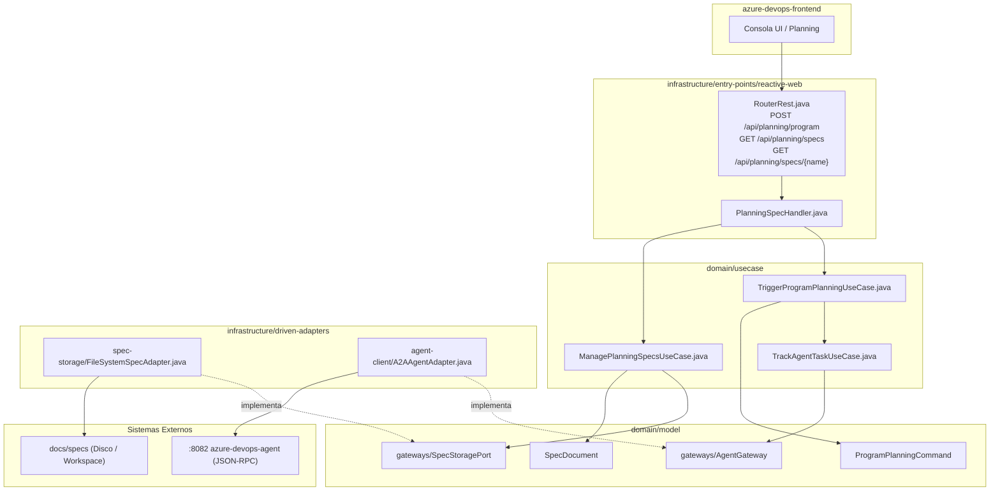

# Plan Maestro — Integración de Program Planning y Almacenamiento Documental en el BFF

> **Versión:** 1.0.0 · **Fecha:** 2026-09-06  
> **Alineado con:** Clean Architecture de Bancolombia (`rules/spring-rules.md`), Protocolo A2A v1.0, JSON-RPC 2.0  
> **Especificación Base:** `docs/specs/ESPECIFICACION-INTEGRACION-PLANNING-BFF.md`  
> **Módulo:** `azure-devops-backend` (BFF)

---

## 1. Objetivo y Caso de Uso

Implementar en el **BFF (`azure-devops-backend`)** la infraestructura documental (`SpecStoragePort`) y el caso de uso orquestador de **Program Planning**, permitiendo que el Frontend (`azure-devops-frontend`) dispare planeaciones trimestrales estructuradas, consulte los roadmaps maestros (`ideas_planning_QX.md`) y explore especificaciones por frente (`frente_*.md`), desacoplándose definitivamente del almacenamiento vectorial en desuso (`pgvector`) y garantizando la trazabilidad de tareas A2A.

---

## 2. Diagnóstico y Deuda Técnica a Resolver

| ID | Componente / Archivo | Diagnóstico / Deuda Actual | Solución Propuesta |
| :---: | :--- | :--- | :--- |
| **D-BFF-01** | `entry-points/reactive-web/RouterRest.java` | Endpoints `/api/planning/**` usan `pgvector-store` y fragmentan en chunks de 500 tokens (DP-PL-01). | Exponer endpoints REST limpios para lectura/escritura de especificaciones documentales íntegras en Markdown. |
| **D-BFF-02** | `entry-points/reactive-web/` | No existe un endpoint para disparar Program Planning con parámetros estructurados (Quarter, Sprints, Capacidad, Frentes). | Implementar `POST /api/planning/program` mapeando la solicitud estructurada al comando canónico A2A. |
| **D-BFF-03** | `domain/model/` | El modelo de dominio del BFF no conoce `SpecStoragePort`, `SpecDocument` ni `ProgramPlanningCommand`. | Crear las entidades inmutables y el puerto en `domain/model` con pureza hexagonal absoluta. |
| **D-BFF-04** | `driven-adapters/` | No existe un adaptador en el BFF para leer y persistir archivos de especificación Markdown en disco/workspace. | Implementar `FileSystemSpecAdapter` reactivo y no bloqueante con protección contra Path Traversal. |
| **D-BFF-05** | `domain/usecase/` | No existen casos de uso para orquestar la consulta documental ni el disparo de Program Planning hacia el agente. | Crear `ManagePlanningSpecsUseCase` y `TriggerProgramPlanningUseCase` delegando en `TrackAgentTaskUseCase`. |

---

## 3. Arquitectura Objetivo



---

## 4. Mapa de Fases Atómicas del Plan

```
[Fase 01] Modelos y Puerto de Almacenamiento Documental (domain/model)
    │
    ▼
[Fase 02] Modelos de Dominio para Program Planning (domain/model)
    │
    ▼
[Fase 03] Adaptador Concreto FileSystemSpecAdapter (infrastructure/driven-adapters)
    │
    ▼
[Fase 04] Casos de Uso de Gestión Documental y Program Planning (domain/usecase)
    │
    ▼
[Fase 05] Entry-Points Reactivos y DTOs (infrastructure/entry-points/reactive-web)
    │
    ▼
[Fase 06] Cableado en Spring (app-service), Validación E2E y Cierre Definitivo
```

---

### Detalle de Fases:

### **Fase 01 — Modelos y Puerto de Almacenamiento Documental (`domain/model`)**
* **Objetivo:** Definir las entidades inmutables y el puerto para especificaciones documentales en el núcleo puro de dominio.
* **Archivos involucrados:**
  - `domain/model/.../spec/SpecDocument.java` [CREAR]
  - `domain/model/.../spec/SpecNotFoundException.java` [CREAR]
  - `domain/model/.../spec/gateways/SpecStoragePort.java` [CREAR]
  - Pruebas unitarias en `domain/model`.
* **Entregable:** Modelos puros y puerto reactivo compilando con 100% de pruebas unitarias.
* **Dependencias:** Ninguna.

### **Fase 02 — Modelos de Dominio para Program Planning (`domain/model`)**
* **Objetivo:** Modelar el Value Object `ProgramPlanningCommand` con validación fail-fast de parámetros trimestrales y formateo del prompt canónico A2A.
* **Archivos involucrados:**
  - `domain/model/.../planning/ProgramPlanningCommand.java` [CREAR]
  - `domain/model/.../planning/ProgramPlanningCommandTest.java` [CREAR]
* **Entregable:** Value Object probado que valida formato `QX-YYYY`, límites de capacidad y serialización a `/plan ...`.
* **Dependencias:** Fase 01.

### **Fase 03 — Adaptador Concreto `FileSystemSpecAdapter` (`infrastructure/driven-adapters`)**
* **Objetivo:** Implementar la persistencia y lectura reactiva no bloqueante de archivos Markdown en el disco local o workspace.
* **Archivos involucrados:**
  - `infrastructure/driven-adapters/spec-storage/` [NUEVO SUBMÓDULO o PAQUETE]
  - `FileSystemSpecAdapter.java` [CREAR]
  - `FileSystemSpecAdapterTest.java` [CREAR] (pruebas con `@TempDir` y verificación de Path Traversal)
* **Entregable:** Adaptador reactivo con NIO.2 cumpliendo `SpecStoragePort`.
* **Dependencias:** Fase 01.

### **Fase 04 — Casos de Uso de Gestión Documental y Program Planning (`domain/usecase`)**
* **Objetivo:** Implementar la lógica de aplicación para gestionar especificaciones y orquestar el disparo de planeación trimestral hacia el Agente.
* **Archivos involucrados:**
  - `domain/usecase/.../planning/ManagePlanningSpecsUseCase.java` [CREAR]
  - `domain/usecase/.../planning/TriggerProgramPlanningUseCase.java` [CREAR]
  - Pruebas unitarias de ambos casos de uso con Mockito puro.
* **Entregable:** Casos de uso puros orquestando la persistencia documental y el despacho a través de `TrackAgentTaskUseCase`.
* **Dependencias:** Fase 02, Fase 03.

### **Fase 05 — Entry-Points Reactivos y DTOs (`infrastructure/entry-points/reactive-web`)**
* **Objetivo:** Exponer los endpoints REST reactivos para el Frontend (`POST /api/planning/program`, `GET /api/planning/specs`, `GET /api/planning/specs/{name}`, `POST /api/planning/specs`), DTOs con validaciones y mapeo de errores en `ApiErrorTranslator`.
* **Archivos involucrados:**
  - `infrastructure/entry-points/reactive-web/.../PlanningSpecHandler.java` [CREAR]
  - `infrastructure/entry-points/reactive-web/.../RouterRest.java` [MODIFICAR]
  - `infrastructure/entry-points/reactive-web/.../dto/planning/*` [CREAR DTOs]
  - `infrastructure/entry-points/reactive-web/.../PlanningSpecHandlerTest.java` [CREAR]
* **Entregable:** Controladores reactivos probados con `@WebFluxTest` respondiendo a los contratos OpenAPI especificados.
* **Dependencias:** Fase 04.

### **Fase 06 — Cableado en Spring (`app-service`), Validación E2E y Cierre Definitivo**
* **Objetivo:** Registrar los nuevos beans en `UseCasesConfig.java`, configurar propiedades en `application.yaml`, verificar el cableado de Spring, validar el flujo completo de extremo a extremo y ejecutar el cierre formal del plan.
* **Archivos involucrados:**
  - `applications/app-service/.../config/UseCasesConfig.java` [MODIFICAR]
  - `applications/app-service/src/main/resources/application.yaml` [MODIFICAR]
  - `applications/app-service/.../UseCasesConfigWiringTest.java` [MODIFICAR]
  - `docs/plan/ESTADO.md` [MODIFICAR]
  - `docs/resultados/RESULTADO-FASE-06.md` [CREAR]
* **Entregable:** Sistema completamente integrado, 100% de pruebas pasando (238+ baseline), `validateStructure` aprobado y reporte de cierre.
* **Dependencias:** Fase 05.

---

## 5. Métricas de Éxito y Criterios de Aceptación Globales

1. **Compilación y Build:** Build limpio sin errores ni warnings críticos en todos los submódulos.
2. **Cobertura y Pruebas:** $\ge 90\%$ de cobertura de líneas en `domain/model` y `domain/usecase`; 100% de pruebas pasando sin regresiones en las 238 pruebas previas.
3. **Calidad y Arquitectura:** Cero violaciones de arquitectura según ArchUnit y `./gradlew validateStructure` aprobado.
4. **Criterio Funcional:**
   - El frontend puede invocar `POST /api/planning/program` y recibir la `Task` completada con el Markdown estructurado del Agente.
   - El frontend puede consultar `GET /api/planning/specs` y `GET /api/planning/specs/ideas_planning_q3_2026.md` obteniendo el archivo Markdown íntegro generado por el Agente.
