# ESPECIFICACIÓN TÉCNICA DE INTEGRACIÓN — BFF DE PROGRAM PLANNING

> **Módulo:** `azure-devops-backend` (BFF)  
> **Versión:** 1.0.0  
> **Fecha:** 2026-09-06  
> **Estado:** 🟢 PROPUESTA PARA APROBACIÓN TÉCNICA  
> **Normativa:** Bancolombia Clean Architecture & DDD (`../../../rules/spring-rules.md`), A2A Protocol v1.0, JSON-RPC 2.0

---

## 1. Alcance y Propósito del Sistema

Esta especificación técnica define formalmente los contratos de datos, modelos de dominio, puertos de arquitectura hexagonal, interfaces reactivas, protocolos de transporte y diagramas de secuencia requeridos en **`azure-devops-backend` (BFF)** para consumir, gobernar y exponer las capacidades del nuevo motor de **Program Planning** y **Almacenamiento Documental de Especificaciones (`SpecStoragePort`)** desarrollado en `azure-devops-agent` bajo las decisiones corporativas **DP-PL-01**, **DP-PL-02** y **DP-PL-04**.

El BFF actúa como **único punto de entrada y mediador** para `azure-devops-frontend`, encapsulando la invocación al agente (`:8082`), gestionando la trazabilidad de tareas asíncronas (`Task`), y desacoplando la UI de la infraestructura de almacenamiento.

---

## 2. Contratos de API REST (OpenAPI 3.1 / JSON Schema)

Todos los endpoints se exponen bajo el prefijo `/api/planning/` y utilizan codificación `application/json;charset=UTF-8` salvo que se especifique lo contrario.

### 2.1 Disparo Estructurado de Program Planning
* **Ruta:** `POST /api/planning/program`
* **Descripción:** Recibe parámetros estructurados de planeación trimestral, valida restricciones de capacidad y formato, construye el comando canónico A2A y delega la ejecución al agente retornando la tarea rastreable.
* **Headers requeridos:**
  - `Content-Type: application/json`
  - `Accept: application/json`

#### Request Payload Schema
```json
{
  "$schema": "https://json-schema.org/draft/2020-12/schema",
  "title": "ProgramPlanningRequest",
  "type": "object",
  "required": ["quarter", "sprintCount", "maxCapacityPerSprint"],
  "properties": {
    "quarter": {
      "type": "string",
      "pattern": "^[qQ][1-4]-\\d{4}$",
      "description": "Trimestre de planeación en formato QX-YYYY (ej. Q3-2026)",
      "example": "Q3-2026"
    },
    "sprintCount": {
      "type": "integer",
      "minimum": 1,
      "maximum": 24,
      "description": "Número de sprints a planificar",
      "example": 6
    },
    "maxCapacityPerSprint": {
      "type": "integer",
      "minimum": 1,
      "maximum": 500,
      "description": "Capacidad máxima en Story Points por cada sprint",
      "example": 34
    },
    "targetFronts": {
      "type": "array",
      "items": { "type": "string", "minLength": 1 },
      "description": "Lista de frentes involucrados (ej. Canales, Core, DevOps)",
      "example": ["Canales", "Core"]
    },
    "objectives": {
      "type": "string",
      "maxLength": 2000,
      "description": "Objetivos estratégicos de negocio y lineamientos técnicos para el trimestre",
      "example": "Modernización de canales móviles y login biométrico bajo arquitectura Cloud"
    },
    "contextId": {
      "type": "string",
      "description": "Identificador opcional de conversación A2A. Si se omite, el BFF genera uno UUID.",
      "example": "planning-q3-2026"
    }
  }
}
```

#### Response 200 OK Schema (`TaskResponse`)
```json
{
  "taskId": "task-plan-q3-001",
  "contextId": "planning-q3-2026",
  "state": "completed",
  "reply": "# Roadmap de Planeación — Q3-2026\n\n## Resumen Ejecutivo\n...",
  "updatedAt": "2026-09-06T13:00:00Z"
}
```

#### Matriz de Respuestas de Error
| Código HTTP | Motivo | Body Schema |
|:---:|:---|:---|
| **400 Bad Request** | Validación fallida de parámetros (ej. `quarter` con formato inválido, `sprintCount <= 0`). | `{"error": "El trimestre debe cumplir el formato QX-YYYY (ej. Q3-2026)", "code": 400}` |
| **503 Service Unavailable** | El Agente (`azure-devops-agent`) no responde en `:8082` o rechaza la conexión. | `{"error": "El agente autónomo no está disponible", "code": 503}` |
| **504 Gateway Timeout** | La ejecución del LLM supera el timeout configurado (`agent.connection.timeout`). | `{"error": "Tiempo de espera agotado al consultar el agente", "code": 504}` |

---

### 2.2 Listado de Especificaciones y Roadmaps Disponibles
* **Ruta:** `GET /api/planning/specs`
* **Descripción:** Lista los nombres de los documentos Markdown persistidos en el almacenamiento documental (`SpecStoragePort`).

#### Response 200 OK Schema
```json
{
  "specs": [
    "ideas_planning_q3_2026.md",
    "frente_canales.md",
    "frente_core.md"
  ],
  "total": 3
}
```

---

### 2.3 Consulta de Documento de Especificación / Roadmap
* **Ruta:** `GET /api/planning/specs/{name}`
* **Descripción:** Obtiene el contenido íntegro y metadatos de un archivo Markdown de planeación.
* **Parámetros de Path:** `name` (string, regex: `^[a-zA-Z0-9_\\-\\.]+\\.md$`).

#### Response 200 OK Schema
```json
{
  "name": "ideas_planning_q3_2026.md",
  "content": "# Roadmap de Planeación — Q3-2026\n\n## 1. Resumen Ejecutivo\n...",
  "path": "docs/specs/ideas_planning_q3_2026.md",
  "lastModified": "2026-09-06T12:58:00Z"
}
```

#### Respuestas de Error
| Código HTTP | Condición | Body |
|:---:|:---|:---|
| **404 Not Found** | El spec solicitado no existe en el storage. | `{"error": "Documento de especificación no encontrado: ideas_planning_q4_2026.md", "code": 404}` |
| **400 Bad Request** | Intento de path traversal (ej. `../../etc/passwd`) o extensión distinta de `.md`. | `{"error": "Nombre de especificación inválido", "code": 400}` |

---

### 2.4 Carga o Actualización de Documento de Especificación
* **Ruta:** `POST /api/planning/specs`
* **Descripción:** Permite al frontend o al usuario cargar/actualizar una especificación Markdown completa de frente o iniciativa (sustituyendo la vectorización parcial).

#### Request Payload
```json
{
  "name": "frente_canales.md",
  "content": "# Especificación Funcional: Canales Móviles\n\n## Requerimientos...",
  "overwrite": true
}
```

#### Response 200 OK
```json
{
  "name": "frente_canales.md",
  "status": "saved",
  "message": "Especificación guardada exitosamente"
}
```

---

## 3. Protocolo de Comunicación y Flujos de Secuencia

### 3.1 Flujo de Ejecución de Program Planning (E2E)

```mermaid
sequenceDiagram
    autonumber
    actor User as Frontend (Angular)
    participant BFF_Router as Reactive-Web (RouterRest / PlanningHandler)
    participant BFF_UseCase as TriggerProgramPlanningUseCase
    participant BFF_Tracker as TrackAgentTaskUseCase
    participant BFF_Adapter as A2AAgentAdapter (WebClient)
    participant Agent as Agent Autonomous (:8082 JSON-RPC)
    participant Storage as FileSystemSpecAdapter (Disk / Specs)

    User->>BFF_Router: POST /api/planning/program (JSON estructurado)
    BFF_Router->>BFF_UseCase: execute(ProgramPlanningCommand)
    Note over BFF_UseCase: Valida invariantes y construye comando canónico:<br/>/plan Q3-2026 6 sprints 34 sp [Canales]
    BFF_UseCase->>BFF_Tracker: sendAndTrack(AgentCommand)
    BFF_Tracker->>BFF_Adapter: sendMessage(AgentCommand)
    BFF_Adapter->>Agent: POST / (JSON-RPC 2.0: method="message/send")
    
    rect rgb(20, 30, 45)
        Note over Agent: ProgramPlanningFlowHandler parsea comando<br/>ProgramPlanningUseCase renderiza prompt y llama LLM<br/>Guarda roadmap maestro
        Agent->>Storage: saveSpec("ideas_planning_q3_2026.md", roadmapMarkdown)
        Storage-->>Agent: Spec guardado exitosamente
    end

    Agent-->>BFF_Adapter: JSON-RPC Result (Task state="completed", message.text=Markdown)
    BFF_Adapter-->>BFF_Tracker: AgentInteraction(task, reply)
    BFF_Tracker-->>BFF_UseCase: Task persistida y actualizada
    BFF_UseCase-->>BFF_Router: TaskDto
    BFF_Router-->>User: 200 OK (TaskResponse con Markdown estructurado)
```



---

## 4. Diseño Hexagonal Detallado en el BFF (`azure-devops-backend`)

### 4.1 Capa Dominio: `domain/model`

Las clases del dominio son **puras**, inmutables, sin anotaciones técnicas (ni Jackson, ni JPA, ni Spring).

```text
domain/model/src/main/java/co/com/bancolombia/model/
├── spec/
│   ├── SpecDocument.java                       [RECORD] (name, content, path)
│   ├── SpecNotFoundException.java              [EXCEPCIÓN DE DOMINIO]
│   └── gateways/
│       └── SpecStoragePort.java                [PUERTO]
└── planning/
    └── ProgramPlanningCommand.java             [RECORD] (quarter, sprintCount, maxCapacity, fronts, objectives, contextId)
```

#### Contrato del Puerto `SpecStoragePort`
```java
package co.com.bancolombia.model.spec.gateways;

import co.com.bancolombia.model.spec.SpecDocument;
import reactor.core.publisher.Flux;
import reactor.core.publisher.Mono;

public interface SpecStoragePort {
    Mono<SpecDocument> getSpec(String specName);
    Flux<String> listAvailableSpecs();
    Mono<Void> saveSpec(String specName, String markdownContent);
}
```

#### Value Object `ProgramPlanningCommand`
```java
package co.com.bancolombia.model.planning;

import java.util.List;

public record ProgramPlanningCommand(
        String quarter,
        int sprintCount,
        int maxCapacityPerSprint,
        List<String> targetFronts,
        String objectives,
        String contextId
) {
    public ProgramPlanningCommand {
        if (quarter == null || !quarter.matches("^[qQ][1-4]-\\d{4}$")) {
            throw new IllegalArgumentException("El trimestre debe cumplir el formato QX-YYYY (ej. Q3-2026)");
        }
        if (sprintCount <= 0) {
            throw new IllegalArgumentException("El número de sprints debe ser mayor a 0");
        }
        if (maxCapacityPerSprint <= 0) {
            throw new IllegalArgumentException("La capacidad máxima debe ser mayor a 0");
        }
    }

    /**
     * Serializa los parámetros al comando canónico reconocido por el IntentResolver del Agente.
     */
    public String toAgentPrompt() {
        StringBuilder sb = new StringBuilder();
        sb.append("/plan ").append(quarter.toUpperCase())
          .append(" ").append(sprintCount).append(" sprints")
          .append(" ").append(maxCapacityPerSprint).append(" sp");
        if (targetFronts != null && !targetFronts.isEmpty()) {
            sb.append(" [").append(String.join(", ", targetFronts)).append("]");
        }
        if (objectives != null && !objectives.isBlank()) {
            sb.append(" Objetivos: ").append(objectives.trim());
        }
        return sb.toString();
    }
}
```

---

### 4.2 Capa Casos de Uso: `domain/usecase`

```text
domain/usecase/src/main/java/co/com/bancolombia/usecase/planning/
├── ManagePlanningSpecsUseCase.java             [GESTIÓN DOCUMENTAL]
└── TriggerProgramPlanningUseCase.java          [ORQUESTACIÓN DE PLANEACIÓN]
```

#### `TriggerProgramPlanningUseCase.java`
- Inyecta `TrackAgentTaskUseCase` (o `AgentGateway`).
- Recibe `ProgramPlanningCommand`.
- Construye `AgentCommand(userText = command.toAgentPrompt(), contextId = command.contextId())`.
- Invoca `trackAgentTaskUseCase.sendAndTrack(agentCommand)`.
- Retorna `Mono<Task>`.

#### `ManagePlanningSpecsUseCase.java`
- Inyecta `SpecStoragePort`.
- Métodos:
  - `Mono<SpecDocument> getSpec(String name)`
  - `Flux<String> listSpecs()`
  - `Mono<Void> saveSpec(String name, String content)`

---

### 4.3 Capa Adaptadores Concretos: `infrastructure/driven-adapters`

#### Submódulo `:spec-storage` (Nuevo o Compartido)
- Implementa `SpecStoragePort` en `FileSystemSpecAdapter.java`.
- Configurado con la propiedad `specs.storage.path` (por defecto `docs/specs` en el directorio de trabajo).
- Utiliza lectura reactiva con `DataBufferUtils` y `AsynchronousFileChannel` de NIO.2, sin bloqueos en hilos Netty (`blockhound` compliant).
- Sanitización estricta de nombres para prevenir ataques de Directory Traversal:
  ```java
  if (specName.contains("..") || specName.contains("/") || specName.contains("\\")) {
      return Mono.error(new IllegalArgumentException("Nombre de especificación no seguro: " + specName));
  }
  ```

---

### 4.4 Capa Puntos de Entrada: `infrastructure/entry-points/reactive-web`

```text
infrastructure/entry-points/reactive-web/src/main/java/co/com/bancolombia/api/
├── PlanningSpecHandler.java                    [NUEVO CONTROLADOR FUNCIONAL]
├── dto/planning/
│   ├── ProgramPlanningRequestDto.java          [DTO ENTRADA]
│   ├── SpecDocumentResponseDto.java            [DTO SALIDA]
│   ├── SpecListResponseDto.java                [DTO SALIDA]
│   └── SaveSpecRequestDto.java                 [DTO ENTRADA]
└── RouterRest.java                             [REGISTRO DE RUTAS]
```

#### Mapeo en `RouterRest.java`
```java
routes = routes
    .andRoute(POST("/api/planning/program"), planningSpecHandler::handleTriggerPlanning)
    .andRoute(GET("/api/planning/specs"), request -> planningSpecHandler.handleListSpecs())
    .andRoute(GET("/api/planning/specs/{name}"), planningSpecHandler::handleGetSpec)
    .andRoute(POST("/api/planning/specs"), planningSpecHandler::handleSaveSpec);
```

---

## 5. Estrategia de Configuración (`application.yaml`)

```yaml
agent:
  connection:
    url: "${AGENT_URL:http://localhost:8082}"
    timeout: "${AGENT_TIMEOUT:45s}"

specs:
  storage:
    path: "${SPECS_STORAGE_PATH:docs/specs}"
    max-file-size-kb: 512
```

---

## 6. Manejo de Errores y Códigos de Estado en `ApiErrorTranslator`

| Excepción de Dominio / Infraestructura | Código HTTP Traducido | Mensaje al Frontend |
|:---|:---:|:---|
| `SpecNotFoundException` | **404 Not Found** | `Documento de especificación no encontrado: {nombre}` |
| `IllegalArgumentException` | **400 Bad Request** | Mensaje de validación del dominio |
| `AgentUnavailableException` | **503 Service Unavailable** | `El agente autónomo no se encuentra disponible` |
| `AgentExecutionException` | **502 Bad Gateway** | `Error en la ejecución del agente: {detalle}` |
| `TimeoutException` | **504 Gateway Timeout** | `Tiempo de espera agotado al consultar el agente` |

---

## 7. Criterios de Aceptación Técnicos

1. **Pureza Arquitectónica:**
   - 0 anotaciones de Spring en `domain/model` y `domain/usecase`.
   - Wiring formal exclusivo en `applications/app-service/src/main/java/.../UseCasesConfig.java`.
2. **Pruebas de Entrada y Casos de Uso:**
   - Pruebas unitarias para `ProgramPlanningCommand` validando el formato QX-YYYY y la serialización a prompt.
   - Pruebas slice `@WebFluxTest` para `PlanningSpecHandler` validando los códigos 200, 400, 404, 502 y 503.
3. **Compatibilidad Hacia Atrás:**
   - Las 238 pruebas unitarias preexistentes en `azure-devops-backend` deben continuar pasando al 100%.
   - Los flujos de dashboard (`/api/devops/dashboard`) y tareas (`/api/tasks`) permanecen inalterados.
4. **Validación Estructural:**
   - `./gradlew validateStructure` aprobado sin violaciones según el estándar Clean Architecture de Bancolombia.
