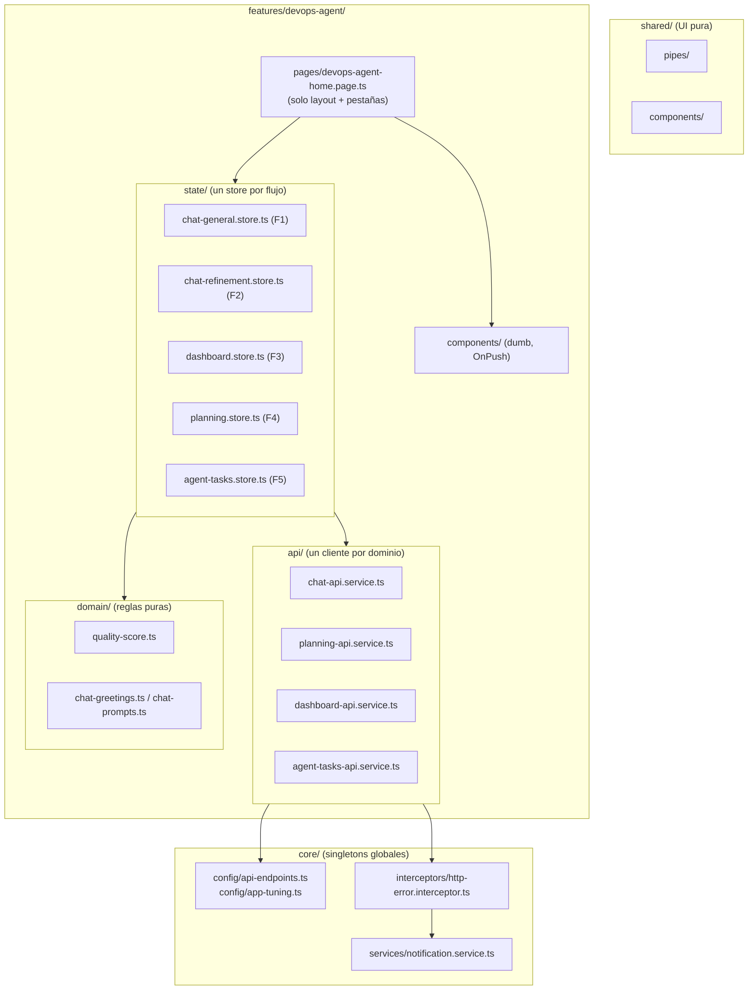

# PLAN MAESTRO — Desacoplamiento de flujos del frontend Angular

> **Módulo:** `azure-devops-frontend` · **Versión:** 1.0 · **Fecha:** 2026-08-31
> **Regla que gobierna:** `rules/angular-rules.md`
> **Estado global:** 🟡 EN CURSO — Fase 01 pendiente de ejecución

---

## 1. Misión del módulo

`azure-devops-frontend` es la **única interfaz de usuario** del ecosistema Planix. Su responsabilidad es presentar y orquestar la interacción del usuario con el BFF (`azure-devops-backend`) y, a través de él, con el agente y el MCP.

Lo que **sí** es:

- Capa de presentación (componentes tontos) y orquestación de vistas (páginas / smart components).
- Capa de estado de UI reactiva y desacoplada por flujo de negocio.
- Capa de acceso a red encapsulada en servicios de API.

Lo que **no** es:

- No contiene inteligencia de negocio: los prompts, la clasificación de intención y la generación de historias viven en el agente.
- No habla directamente con Azure DevOps ni con el MCP: siempre pasa por el BFF.

---

## 2. Diagnóstico de la situación actual

### 2.1 Inventario medido (baseline declarado, pendiente de verificación en Fase 01)

| Artefacto                                                         | Líneas | Observación                                                       |
|-------------------------------------------------------------------|-------:|-------------------------------------------------------------------|
| `components/planning-dashboard/planning-dashboard.component.ts`   |    754 | God-component: ~500 líneas de template inline + lógica de negocio |
| `services/devops-agent-state.service.ts`                          |    406 | God-service: 5 flujos, copys, polling y orquestación              |
| `pages/devops-agent-home.page.ts`                                 |    277 | Página con ~220 líneas de template inline y estado de pestañas    |
| `components/planning-management/planning-management.component.ts` |    260 | Modal + tabla + edición en línea                                  |
| `components/planning-upload/planning-upload.component.ts`         |    128 | Lectura de archivo en componente                                  |
| `services/devops-agent-api.service.ts`                            |    124 | 11 endpoints de 4 dominios distintos en una sola clase            |
| `models/devops-agent.model.ts`                                    |    111 | Modelos compartidos                                               |
| `components/chat-messages/chat-messages.component.ts`             |    122 | Presentación                                                      |
| `components/chat-input/chat-input.component.ts`                   |     98 | Sugerencias hardcodeadas                                          |
| `shared/pipes/markdown-parser.pipe.ts`                            |     73 | Único artefacto en `shared/`                                      |

### 2.2 Los cinco flujos están fusionados en un único servicio

`DevopsAgentStateService` concentra **cinco flujos de negocio independientes** que hoy comparten estado, ciclo de vida y señales de carga:

| ID     | Flujo                   | Métodos implicados                                                                                     | Estado que consume                                        |
|--------|-------------------------|--------------------------------------------------------------------------------------------------------|-----------------------------------------------------------|
| **F1** | Chat General            | `sendGeneralMessage`, `clearGeneralChat`                                                               | `generalMessages$`, `loading$`                            |
| **F2** | Refinamiento HU/HA      | `sendRefinementMessage`, `clearRefinementChat`, `refineStoryInChat`                                    | `refinementMessages$`, `loading$`                         |
| **F3** | Tablero de Calidad      | `loadDashboardData`, `auditStory`                                                                      | `dashboardData$`, `dashboardError$`, `loading$`           |
| **F4** | Gestión de Planeaciones | `uploadPlanning`, `loadInitiatives`, `updateInitiativeCell`, `deleteInitiative`, `getInitiativeChunks` | `initiatives$`, `uploading$`, `uploadStatus$`, `loading$` |
| **F5** | Tareas del Agente       | `loadTasks`, `cancelTask`, `triggerImmediatePoll`, `scheduleNextPoll`                                  | `tasks$`, `pollingTimer`                                  |

**Consecuencia directa del acoplamiento:** los cinco flujos comparten un único `loading$`
(`devops-agent-state.service.ts:27`). Enviar un mensaje en el Chat General enciende el spinner del Refinamiento y bloquea el `chat-input` de la otra pestaña. Igualmente, `auditStory` (F3) llama a
`triggerImmediatePoll()` (F5), reiniciando el temporizador global desde un flujo ajeno.

### 2.3 Síntoma: fuga de memoria activa

El servicio arranca un temporizador en el constructor (`:95-98`) que se reprograma de forma indefinida (`scheduleNextPoll`, `:316-335`) y **no implementa `ngOnDestroy` ni usa `DestroyRef`**. En un servicio `providedIn: 'root'` sobrevive a toda la aplicación; en pruebas, cada `TestBed`
deja un temporizador colgado.

### 2.4 Síntoma: suscripciones manuales fuera de contrato

`rules/angular-rules.md` §3.3 prohíbe explícitamente mantener suscripciones manuales abiertas y exige `AsyncPipe` o `takeUntilDestroyed()`. Se incumple en:

- `pages/devops-agent-home.page.ts:261-264` — `Subscription` manual con `ngOnDestroy` artesanal.
- `components/planning-dashboard/planning-dashboard.component.ts:660-670` — dos `Subscription`
  manuales con `ngOnDestroy` artesanal.
- `components/planning-dashboard/planning-dashboard.component.ts:741` — `subscribe()` a
  `state.auditStory()` **desde el componente**, sin cierre y sin `takeUntilDestroyed`.

### 2.5 Síntoma: lógica de negocio dentro de la vista

`PlanningDashboardComponent` implementa reglas de negocio que no le corresponden:

- Clasificación de calidad con umbrales `90 / 70 / 50` (`:702-707`) y `80 / 50` (`:709-713`).
- Definición de «historia grande» con el umbral `13` puntos (`:715-718`).
- Filtrado de calidad `critical / regular / good` con los mismos umbrales replicados (`:627-637`).
- Traducción de estados de Azure DevOps a clases CSS (`:720-732`).

Los mismos umbrales aparecen **tres veces** en el mismo archivo con valores literales.

### 2.6 Síntoma: orden de inicialización frágil

En `devops-agent-state.service.ts`, `refinementMessages` (`:23-24`) se declara **antes** que
`refinementMessages$` (`:55`), que a su vez depende de `initialGreeting` (`:56`). El propio archivo documenta el riesgo de `TS2729` en un comentario (`:42-44, :88`). Cualquier reordenación inocente de campos rompe la construcción del servicio en tiempo de ejecución.

### 2.7 Síntoma: `any` en el contrato público

`rules/angular-rules.md` §5 prohíbe `any` sin excepciones. Ocurrencias vivas:

| Archivo                         | Línea | Firma                                      |
|---------------------------------|------:|--------------------------------------------|
| `devops-agent-api.service.ts`   |    32 | `uploadPlanning(): Observable<any>`        |
| `devops-agent-api.service.ts`   |   104 | `getInitiativeChunks(): Observable<any[]>` |
| `devops-agent-api.service.ts`   |   112 | `cancelTask(): Observable<any>`            |
| `devops-agent-state.service.ts` |   291 | `auditStory(): Observable<any>`            |
| `devops-agent-state.service.ts` |   402 | `getInitiativeChunks(): Observable<any[]>` |

### 2.8 Síntoma: sin capa `core/` ni configuración de entorno

`rules/angular-rules.md` §1 exige `core/{guards,interceptors,services}`. **No existe la carpeta.**
Consecuencias:

- Cero interceptores HTTP: el manejo de errores se replica con `console.error` en **10 puntos**
  distintos del servicio de estado.
- Cero notificación al usuario en `loadInitiatives`, `loadTasks`, `cancelTask`, `deleteInitiative`
  y `updateInitiativeCell`: el fallo es silencioso.
- Endpoints literales dispersos (`devops-agent-api.service.ts:25-121`), incluido un
  `POST '/'` opaco en `cancelTask` (`:121`).
- Sin `environments/`: las URLs dependen exclusivamente de `proxy.conf.json` con `localhost:8081`
  y `localhost:8082`.

### 2.9 Síntoma: rendimiento y pruebas

- **0 de 9 componentes** declaran `ChangeDetectionStrategy.OnPush`.
- `filteredItems` es un **getter** (`:618-640`) que recorre y filtra el array completo en cada ciclo de detección de cambios; lo mismo `uniqueStates` (`:642`) y `uniqueMembers` (`:650`).
- **0 de 9 componentes** tienen archivo `.spec.ts`. Solo hay pruebas en 2 servicios y 1 pipe.

---

## 3. Registro de deudas técnicas

| ID       | Deuda                                                                                 | Severidad | Evidencia                                                         | Fase       |
|----------|---------------------------------------------------------------------------------------|-----------|-------------------------------------------------------------------|------------|
| **D-01** | God-service: `DevopsAgentStateService` mezcla 5 flujos, copys, polling y orquestación | 🔴        | `devops-agent-state.service.ts` (418 L)                           | 05         |
| **D-02** | Fuga de memoria: `pollingTimer` sin `ngOnDestroy`/`DestroyRef`                        | 🔴        | `:24, :108-111, :329-348`                                         | 06         |
| **D-03** | Suscripciones manuales sin `takeUntilDestroyed()` (viola §3.3)                        | 🔴        | `home.page.ts:261`, `dashboard:660,668,741`, `management:204,208` | 08         |
| **D-04** | God-component: `PlanningDashboardComponent` con negocio + template de 500 L           | 🔴        | `planning-dashboard.component.ts` (753 L)                         | 07         |
| **D-05** | `any` en 9 puntos del código productivo (viola §5)                                    | 🔴        | `baseline-fase-01.md` §4.2                                        | 02         |
| **D-06** | Copys y prompts de negocio embebidos en el servicio de estado                         | 🟠        | state `:34-76, :296, :311`                                        | 03         |
| **D-07** | ~~Orden de inicialización frágil (`TS2729`)~~                                         | ✅        | **SALDADA** en Fase 01 vía excepción S-01                         | ~~03~~     |
| **D-08** | Endpoints literales dispersos; `POST '/'` opaco en `cancelTask`                       | 🟠        | api `:25-121`                                                     | 02 / 04    |
| **D-09** | Números mágicos: `30000`, `5000`, `90/80/70/50`, `13`                                 | 🟠        | state `:23,:148,:343,:354`; dashboard `:628-636,:702-717`         | 02 / 07    |
| **D-10** | Ausencia total de `core/` (interceptores, guards, servicios globales) — viola §1      | 🟠        | `src/app/`                                                        | 02         |
| **D-11** | 0/9 componentes con `ChangeDetectionStrategy.OnPush`                                  | 🟡        | Todos los `@Component`                                            | 08         |
| **D-12** | `shared/` incompleto: solo `pipes/`, sin `components/` ni `directives/`               | 🟡        | `src/app/shared/`                                                 | 08         |
| **D-13** | Alias público `messages` mantenido «por compatibilidad con tests antiguos»            | 🟡        | state `:92`                                                       | 05         |
| **D-14** | Sin `environments/`; configuración de red atada a `proxy.conf.json`                   | 🟠        | `proxy.conf.json`                                                 | 02         |
| **D-15** | Cobertura de pruebas insuficiente                                                     | 🟠 → 🟡   | **Parcialmente saldada:** 0/9 → 9/9 componentes, 29 → 188 casos   | 01 ✅ / 08 |
| **D-16** | `loading$` global compartido por los 5 flujos: acoplamiento visible en UI             | 🔴        | state `:32` + `home.page.ts:218,223,230,235`                      | 05         |
| **D-17** | `filteredItems`, `uniqueStates`, `uniqueMembers` como getters O(n) por ciclo de CD    | 🟠        | dashboard `:618-656`                                              | 07         |
| **D-18** | `auditStory` (F3) reinicia el polling de F5 vía `triggerImmediatePoll()`              | 🟠        | state `:147-150, :314`                                            | 06         |
| **D-19** | Copys en español embebidos en TypeScript sin capa de i18n ni constantes               | 🟡        | state `:38-76,:140,:240,:406`                                     | 03         |
| **D-20** | `console.error` como única observabilidad; fallos silenciosos para el usuario         | 🟠        | 10 ocurrencias en el servicio de estado                           | 02 / 08    |
| **D-21** | Sugerencias de chat y etiquetas de tecnología hardcodeadas en componentes             | 🟡        | `chat-input:52-59`, `info-cards:37`                               | 03         |
| **D-22** | `setTimeout` sin cancelar en `chat-input:81` y `chat-messages:114`                    | 🟡        | Fase 01 §4.3                                                      | 08         |
| **D-23** | `planning-dashboard.component.ts`: 753 líneas y **cero** `aria-label`                 | 🟠        | Fase 01 §4.4                                                      | 07         |
| **D-24** | `signal<any[]>` en `planning-management.component.ts:187`                             | 🟠        | Fase 01 §4.2                                                      | 02         |
| **D-25** | El repositorio se entregó sin compilar; no hay verificación de build en CI            | 🔴        | Fase 01 §1 (H-1)                                                  | 08         |
| **D-26** | `PlanningManagementComponent` inyecta `DevopsAgentApiService` directamente            | 🟠        | `planning-management.component.ts:190, :243`                      | 05         |
| **D-27** | **Zoneless: el estado de vista en campos planos no repinta la UI**                    | 🔴        | Fase 01 §8 (H-3)                                                  | 05         |

**Resumen tras la Fase 01:** 27 deudas registradas · 1 saldada (D-07) · 1 parcial (D-15) · 7 bloqueantes (🔴) · 11 altas (🟠) · 6 medias (🟡).

### 3.1 D-27 — Riesgo de secuencia que condiciona la Fase 05

La aplicación corre en modo **zoneless** (`app.config.ts` no declara zona). El estado de vista guardado en campos planos y mutado desde suscripciones RxJS **no marca la vista como sucia**. Hoy la tabla de `planning-management` se pinta únicamente porque `loadInitiatives()` conmuta el `loading$`
compartido y ese signal fuerza el repintado.

> ⚠️ **Restricción de orden innegociable en la Fase 05:** migrar el estado de vista a `signal()`
> **antes** de separar el `loading` por flujo (D-16). El orden inverso deja la Gestión de
> Planeaciones sin datos visibles.

---

## 4. Arquitectura objetivo

### 4.1 Principios de la arquitectura objetivo

1. **Un store por flujo.** Cada uno de los cinco flujos (F1–F5) posee su propio servicio de estado, su propio `loading` y su propio ciclo de vida. Ningún flujo puede alterar el estado de otro.
2. **Un cliente de API por dominio.** `chat`, `planning`, `dashboard` y `tasks` dejan de compartir una única clase de 11 métodos.
3. **Reglas de negocio en `domain/`.** Umbrales de calidad, clasificación de historias y textos de prompt salen de los componentes y de los stores hacia módulos puros y testeables.
4. **Componentes tontos.** Todo componente bajo `components/` recibe datos por `@Input`, emite por
   `@Output`, declara `OnPush` y **no inyecta stores**. Solo `pages/` conoce los stores.
5. **Cero suscripciones manuales.** `AsyncPipe` en plantilla o `takeUntilDestroyed()` en TypeScript.
6. **Cero literales.** Endpoints, intervalos y umbrales viven en `core/config/` o `domain/`.

---

## 5. Desglose secuencial de fases

Cada fase deja el repositorio **compilando, con las pruebas verdes y desplegable**. No hay big-bang: ninguna fase depende de que la siguiente esté terminada.

| Fase   | Nombre                                                             | Deudas que salda                                                       | Riesgo | Estado                         |
|--------|--------------------------------------------------------------------|------------------------------------------------------------------------|--------|--------------------------------|
| **01** | Baseline y red de seguridad                                        | D-07 ✅, D-15 (parcial)                                                | Nulo   | 🟢 **COMPLETADA** (2026-08-31) |
| **02** | Núcleo transversal: `core/`, configuración y erradicación de `any` | D-05, D-24, D-08 (parcial), D-09 (parcial), D-10, D-14, D-20 (parcial) | Medio  | ⚪ PENDIENTE                   |
| **03** | Externalización de copys y prompts                                 | D-06, D-19, D-21                                                       | Bajo   | ⚪ PENDIENTE                   |
| **04** | Segregación de la capa de API por dominio                          | D-08 (resto)                                                           | Bajo   | ⚪ PENDIENTE                   |
| **05** | Separación de stores por flujo (F1–F4)                             | D-01, D-13, D-16, D-26, **D-27**                                       | Alto   | ⚪ PENDIENTE                   |
| **06** | Flujo de tareas: store dedicado y polling con ciclo de vida        | D-02, D-18                                                             | Alto   | ⚪ PENDIENTE                   |
| **07** | Descomposición del Tablero de Calidad                              | D-04, D-09 (resto), D-17, D-23                                         | Alto   | ⚪ PENDIENTE                   |
| **08** | Endurecimiento y cierre                                            | D-03, D-11, D-12, D-15 (resto), D-20 (resto), D-22, D-25               | Medio  | ⚪ PENDIENTE                   |

### FASE 01 — Baseline y red de seguridad

**Objetivo.** Congelar el comportamiento observable de los cinco flujos con pruebas de caracterización **antes** de tocar una sola línea productiva, y publicar el baseline medido.

**Entregable.** Suite de caracterización sobre `DevopsAgentStateService`, `DevopsAgentApiService`
y los dos componentes gordos; documento `docs/resultados/RESULTADO-FASE-01.md` con métricas reales.

**Restricción innegociable.** **Cero líneas modificadas en `src/app/**` fuera de archivos
`.spec.ts`.**

---

### FASE 02 — Núcleo transversal

**Objetivo.** Crear la capa `core/` que hoy no existe y erradicar `any` y los literales de red.

**Entregable.**

- `core/config/api-endpoints.ts` — todos los endpoints como constantes tipadas.
- `core/config/app-tuning.ts` — intervalos de polling (`5000`, `30000`) como constantes nombradas.
- `core/interceptors/http-error.interceptor.ts` — normaliza el error HTTP en un tipo de dominio.
- `core/services/notification.service.ts` — canal único de notificación al usuario.
- `src/environments/environment.ts` + `environment.development.ts` con `apiBaseUrl`.
- Sustitución de las 5 firmas con `any` por interfaces reales en `devops-agent.model.ts`.

---

### FASE 03 — Externalización de copys y saneamiento de inicialización

**Objetivo.** Sacar del servicio de estado los ~90 líneas de copys markdown y los prompts de negocio; eliminar la bomba de tiempo del orden de declaración.

**Entregable.**

- `features/devops-agent/domain/chat-greetings.ts` — `GENERAL_GREETING`, `REFINEMENT_GREETING`,
  `GENERAL_RESET_GREETING`, `REFINEMENT_RESET_GREETING`.
- `features/devops-agent/domain/chat-prompts.ts` — `buildRefinementPrompt`, `buildAuditPrompt`.
- Reordenamiento de campos del store con inicialización determinista.
- Sugerencias de `chat-input` y etiquetas de `info-cards` como `@Input` con valor por defecto externalizado.

---

### FASE 04 — Segregación de la capa de API

**Objetivo.** Partir `DevopsAgentApiService` (11 métodos, 4 dominios) en cuatro clientes.

**Entregable.** `api/chat-api.service.ts`, `api/planning-api.service.ts`,
`api/dashboard-api.service.ts`, `api/agent-tasks-api.service.ts`. `DevopsAgentApiService` queda como fachada delegadora **marcada como obsoleta**, sin lógica propia.

---

### FASE 05 — Separación de stores por flujo

**Objetivo.** Romper el god-service. Es la fase de mayor valor y mayor riesgo del plan.

**Entregable.**

- `state/chat-general.store.ts` (F1) con `loading` propio.
- `state/chat-refinement.store.ts` (F2) con `loading` propio.
- `state/planning.store.ts` (F4) con `loading`/`uploading` propios.
- `state/dashboard.store.ts` (F3) con `loading` y `error` propios.
- Eliminación del alias `messages` (D-13) previa resolución de **DP-01**.
- `DevopsAgentStateService` reducido a fachada de compatibilidad.

**Criterio de cierre visible.** Enviar un mensaje en el Chat General **no** activa el spinner del Refinamiento.

---

### FASE 06 — Flujo de tareas y polling con ciclo de vida

**Objetivo.** Aislar F5 y cerrar la fuga de memoria.

**Entregable.**

- `state/agent-tasks.store.ts` con `DestroyRef` y limpieza garantizada del temporizador.
- Sustitución del `setTimeout` recursivo por una cadena RxJS (`timer` + `switchMap` +
  `takeUntilDestroyed`).
- Eliminación de la llamada cruzada `auditStory → triggerImmediatePoll` (D-18): el disparo inmediato pasa a ser un evento explícito del store de tareas.

---

### FASE 07 — Descomposición del Tablero de Calidad

**Objetivo.** Reducir el componente de 754 líneas y sacar sus reglas de negocio.

**Entregable.**

- `domain/quality-score.ts` — umbrales `EXCELLENT/GOOD/REGULAR` y `LARGE_STORY_POINTS`
  (pendiente de **DP-02**), con `classifyQuality()` y `isLargeStory()` puros.
- `components/dashboard-filters/` — filtros como componente tonto.
- `components/dashboard-metrics/` — tarjetas de métricas.
- `components/dashboard-story-row/` — fila expandible con auditoría.
- `pages/quality-dashboard.page.ts` — smart component que conecta store y componentes.
- Getters O (n) sustituidos por `computed()` sobre signals (D-17).
- Templates inline extraídos a archivos `.html`.

---

### FASE 08 — Endurecimiento y cierre

**Objetivo.** Cumplir íntegramente el checklist de `rules/angular-rules.md` §8.

**Entregable.**

- `ChangeDetectionStrategy.OnPush` en el 100 % de los componentes.
- Cero suscripciones manuales: `AsyncPipe` o `takeUntilDestroyed()`.
- `shared/components/` con los elementos de UI genéricos extraídos.
- `aria-label` verificado en el 100 % de los botones de solo icono.
- Pruebas de componente para todos los componentes resultantes.
- `docs/resultados/CIERRE-DEL-PLAN.md`.

---

## 6. Matriz de criterios de aceptación

|    # | Métrica                                             | Baseline (declarado) |             Objetivo | Fase que lo cierra |
|-----:|-----------------------------------------------------|---------------------:|---------------------:|--------------------|
| M-01 | Líneas de `devops-agent-state.service.ts`           |                  406 |       ≤ 60 (fachada) | 05 / 06            |
| M-02 | Líneas del store más grande                         |                  406 |                ≤ 150 | 05                 |
| M-03 | Líneas de `planning-dashboard.component.ts`         |                  754 | ≤ 200 por componente | 07                 |
| M-04 | Ocurrencias de `any` en `src/app/`                  |                    5 |                    0 | 02                 |
| M-05 | Suscripciones manuales sin `takeUntilDestroyed()`   |                    4 |                    0 | 08                 |
| M-06 | Temporizadores sin limpieza de ciclo de vida        |                    1 |                    0 | 06                 |
| M-07 | Componentes con `OnPush`                            |                0 / 9 |                100 % | 08                 |
| M-08 | Componentes con archivo `.spec.ts`                  |                0 / 9 |                100 % | 01 / 08            |
| M-09 | Archivos `.spec.ts` totales                         |                    4 |                 ≥ 18 | 08                 |
| M-10 | Endpoints literales fuera de `core/config/`         |                   11 |                    0 | 02 / 04            |
| M-11 | Números mágicos (intervalos + umbrales)             |                   12 |                    0 | 02 / 07            |
| M-12 | Señales `loading` independientes por flujo          |         1 compartida |                    4 | 05                 |
| M-13 | Existencia de `core/{guards,interceptors,services}` |                   ❌ |                   ✅ | 02                 |
| M-14 | Existencia de `environments/`                       |                   ❌ |                   ✅ | 02                 |
| M-15 | Llamadas de red iniciadas desde un componente       |  1 (`dashboard:741`) |                    0 | 07                 |
| M-16 | Copys markdown embebidos en `.ts` de servicio       |           ~90 líneas |                    0 | 03                 |
| M-17 | Getters O(n) evaluados por ciclo de CD              |                    3 |                    0 | 07                 |
| M-18 | `pnpm build`                                        |                   ✅ |                   ✅ | Todas              |
| M-19 | `pnpm test`                                         |                   ✅ |                   ✅ | Todas              |
| M-20 | Botones de solo icono sin `aria-label`              |            por medir |                    0 | 08                 |

---

## 7. Definition of Done (obligatorio para toda fase)

Ninguna fase se considera cerrada si falla alguno de estos puntos:

- [ ] `pnpm build` termina sin errores.
- [ ] `pnpm test` termina sin fallos nuevos respecto al baseline de la Fase 01.
- [ ] Todos los componentes nuevos o tocados son `standalone: true`.
- [ ] Cero `*ngIf` / `*ngFor` / `*ngSwitch`: solo `@if` / `@for` / `@switch`.
- [ ] Cero `any` introducido.
- [ ] Cero suscripciones manuales sin `takeUntilDestroyed()` o `AsyncPipe`.
- [ ] Cero llamadas HTTP fuera de la capa `api/`.
- [ ] Cero secretos, tokens o credenciales en código o documentación.
- [ ] Métodos públicos con tipo de retorno explícito.
- [ ] Botones de solo icono con `aria-label`.
- [ ] Pruebas nuevas en formato `describe('GIVEN…')` → `describe('WHEN…')` → `it('THEN…')`.
- [ ] Ninguna decisión pendiente (DP-XX) que bloquee la fase permanece abierta.
- [ ] `docs/resultados/RESULTADO-FASE-XX.md` escrito con métricas reales.
- [ ] `docs/plan/ESTADO.md` actualizado.
- [ ] `docs/fases/fase-XX+1.md` generado.
- [ ] Commit conforme a `COMMIT_RULES.md`.

---

## 8. Decisiones pendientes (Política de No-Asunción)

El detalle vive en `docs/plan/DECISIONES_PENDIENTES.md`. Resumen de bloqueos:

| ID    | Pregunta                                                                              | Bloquea |
|-------|---------------------------------------------------------------------------------------|---------|
| DP-01 | ¿Puede eliminarse el alias público `messages` del servicio de estado?                 | 05      |
| DP-02 | ¿Los umbrales de calidad `90/80/70/50` y `13` puntos son regla de negocio confirmada? | 07      |
| DP-03 | ¿`cancelTask` debe seguir haciendo `POST '/'` o pasa a una ruta del BFF?              | 02, 04  |
| DP-04 | ¿Los copys de saludo y error son textos aprobados e intocables?                       | 03      |
| DP-05 | ¿El estado migra a Signals o se mantiene con `BehaviorSubject`?                       | 05, 06  |
| DP-06 | ¿Los intervalos de polling `5 s` / `30 s` están confirmados por negocio?              | 02, 06  |
| DP-07 | ¿Se introduce i18n o los copys quedan en constantes en español?                       | 03      |
| DP-08 | ¿Se acepta el cambio visual de tener un spinner por pestaña?                          | 05      |

---

## 9. Riesgos y mitigación

| Riesgo                                                | Impacto | Mitigación                                                                  |
|-------------------------------------------------------|---------|-----------------------------------------------------------------------------|
| Romper un flujo al partir el god-service              | Alto    | Fase 01 congela los 5 flujos con caracterización antes de tocar producción  |
| Cambio visual no autorizado al separar `loading`      | Medio   | DP-08 debe cerrarse antes de la Fase 05                                     |
| Cambiar umbrales de calidad por interpretación propia | Alto    | DP-02: se trasladan los valores **literales actuales** sin reinterpretarlos |
| Reescribir copys de cara al usuario sin aprobación    | Medio   | DP-04/DP-07: la Fase 03 **mueve** los textos, no los reescribe              |
| Regresión de rendimiento al introducir `OnPush`       | Medio   | Se introduce en la última fase, con pruebas de componente ya existentes     |
| Pérdida de contexto de sesión del agente ejecutor     | Alto    | Protocolo de continuidad §10                                                |

---

## 10. Protocolo de continuidad

Regla operativa para poder reanudar el trabajo tras una desconexión o un reinicio de sesión:

1. El punto de entrada **siempre** es `docs/plan/ESTADO.md`. Indica la fase activa y su estado.
2. Cada fase vive en un archivo autosuficiente `docs/fases/fase-XX.md` con la estructura obligatoria de tres bloques: **CONTEXTO**, **INSTRUCCIONES**, **ORDEN DE EJECUCIÓN**.
3. Antes de ejecutar una fase, hay que leer `docs/plan/DECISIONES_PENDIENTES.md`. Si alguna DP que la bloquea sigue 🔴 ABIERTA, **hay que detenerse y preguntar al usuario**.
4. Al terminar una fase es **innegociable**:
  - escribir `docs/resultados/RESULTADO-FASE-XX.md` con métricas reales;
  - actualizar `docs/plan/ESTADO.md`;
  - **generar `docs/fases/fase-XX+1.md`** a partir de `docs/fases/_PLANTILLA_FASE.md`.
5. Sin el resultado no hay trazabilidad y sin el MD de la siguiente fase el trabajo no es reanudable: en cualquiera de los dos casos la fase se declara **incompleta**.

---

## 11. Convención de commits

Conforme a `COMMIT_RULES.md`, en formato `tipo(scope): descripcion en espanol`.

| Fase | Commit sugerido                                                                     |
|------|-------------------------------------------------------------------------------------|
| 01   | `test(devops_agent): agregar pruebas de caracterizacion de los flujos del frontend` |
| 02   | `refactor(core): crear capa core con configuracion, interceptor y tipos sin any`    |
| 03   | `refactor(devops_agent): externalizar copys y prompts del servicio de estado`       |
| 04   | `refactor(devops_agent): segregar la capa de api por dominio`                       |
| 05   | `refactor(devops_agent): separar el estado en stores independientes por flujo`      |
| 06   | `fix(agent_tasks): aislar el flujo de tareas y cerrar la fuga del temporizador`     |
| 07   | `refactor(quality_dashboard): descomponer el tablero de calidad en componentes`     |
| 08   | `refactor(devops_agent): endurecer componentes con onpush, a11y y pruebas`          |

---

## 12. Fuera de alcance

1. Migración a otra librería de componentes distinta de PrimeNG.
2. Rediseño visual: el plan **conserva** la apariencia actual salvo lo autorizado en DP-08.
3. Autenticación y autorización en el frontend (no hay contrato definido a la fecha).
4. Server-Side Rendering / hidratación.
5. Cambios en el contrato del BFF: cualquier necesidad se registra como DP y se consulta.

