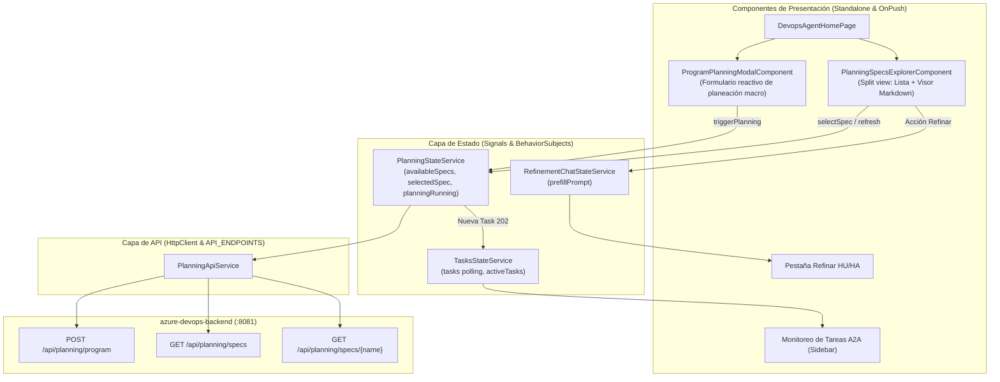

# Plan Maestro — Integración de Program Planning y Almacenamiento Documental en el Frontend

> **Versión:** 1.0.0 · **Fecha:** 2026-09-06  
> **Alineado con:** Clean Architecture Bancolombia (`AGENTS.md` - Fase 1 Frontend), Angular 22, PrimeNG 21, Tailwind CSS, A2A Protocol v1.0  
> **Especificación Base:** `docs/specs/ESPECIFICACION-INTEGRACION-PLANNING-FRONTEND.md`  
> **Módulo:** `azure-devops-frontend`

---

## 1. Objetivo y Caso de Uso

Implementar en la interfaz de usuario de **`azure-devops-frontend`** la experiencia integral para **Program Planning** y **Gestión Documental de Especificaciones**, conectándola a los endpoints del BFF (`azure-devops-backend`):
1. **Planificador Trimestral Macro (Agente Planner):** Activación de planeaciones trimestrales (`POST /api/planning/program`) con parámetros estructurados (Quarter, Sprints, Capacidad, Frentes y Objetivos) y seguimiento asíncrono en tiempo real de la tarea (`Task`) del agente.
2. **Explorador y Visor Documental de Specs (Roadmaps y Frentes):** Consulta y lectura interactiva de las especificaciones Markdown íntegras (`GET /api/planning/specs` y `GET /api/planning/specs/{name}`), con buscador, categorización y renderizado estilizado.
3. **Conexión Táctica con Refinamiento HU/HA (Agente Story Creator):** Acción rápida de *«Refinar HU en este Frente»* desde la visualización de un spec para transferir el contexto hacia la pestaña de refinamiento y acelerar la creación de historias estructuradas bajo el marco **HyMS**.
4. **Desacoplamiento Gradual de Vectorización Legada (`pgvector`):** Reemplazar la dependencia de la tabla de iniciativas vectorizadas por el explorador de especificaciones documentales, preservando la compatibilidad y sin regresiones en la suite de pruebas.

---

## 2. Diagnóstico y Deuda Técnica a Resolver

| ID | Componente / Archivo | Diagnóstico / Deuda Actual | Solución Propuesta |
| :---: | :--- | :--- | :--- |
| **D-FE-01** | `core/config/api-endpoints.ts` | Solo contiene endpoints legados de pgvector (`/api/planning/ingest`, `/api/planning/initiatives`). No expone rutas de Program Planning ni Specs. | Añadir `PLANNING_PROGRAM`, `PLANNING_SPECS` y el helper `specUrl(name)`. |
| **D-FE-02** | `models/devops-agent.model.ts` | No existen modelos TypeScript ni DTOs para las respuestas y solicitudes estructuradas de planeación trimestral ni de specs Markdown. | Declarar `ProgramPlanRequestDTO`, `ProgramPlanResponseDTO`, `SpecListDTO` y `SpecDocumentDTO`. |
| **D-FE-03** | `services/api/planning-api.service.ts` | El servicio solo sabe invocar la ingestión y borrado de iniciativas vectorizadas en PostgreSQL. | Extender el servicio con `triggerProgramPlanning`, `getAvailableSpecs` y `getSpecDocument`. |
| **D-FE-04** | `services/state/planning-state.service.ts` | Solo maneja estado de iniciativas cargadas por chunks y estado de carga de texto plano. | Incorporar Signals para almacenar el listado de specs, spec seleccionado y estado de ejecución del planificador. |
| **D-FE-05** | `components/planning-management/` | La vista de "Gestión de Planeaciones" muestra una tabla de chunks vectorizados de PostgreSQL. No permite leer ni explorar documentos Markdown. | Crear `PlanningSpecsExplorerComponent` con navegación en dos columnas (lista + visor Markdown) y botón de nuevo plan. |
| **D-FE-06** | `pages/devops-agent-home.page.ts` | No hay diálogo modal ni interfaz para lanzar la planeación macro trimestral ni transferir frentes a refinamiento. | Crear `ProgramPlanningModalComponent` y conectar el flujo de transición fluida hacia el asistente de refinamiento. |

---

## 3. Arquitectura Objetivo



---

## 4. Mapa de Fases del Plan

```
[Fase 01] Contratos de API, Modelos y DTOs (core/config y models)
    │
    ▼
[Fase 02] Servicios de API y Gestión de Estado Reactivo (services/api y services/state)
    │
    ▼
[Fase 03] Visor y Explorador Documental de Specs (components/planning-specs-explorer)
    │
    ▼
[Fase 04] Modal Lanzador de Program Planning (components/program-planning-modal)
    │
    ▼
[Fase 05] Integración en Página Principal, Navegación a Refinamiento y Cierre E2E
```

---

### Detalle de Fases:

### **Fase 01 — Contratos de API, Modelos y DTOs (`core/config` y `models`)**
* **Objetivo:** Registrar las constantes de endpoints (`PLANNING_PROGRAM`, `PLANNING_SPECS`, `specUrl`) en `api-endpoints.ts` y modelar las interfaces TypeScript inmutables (`ProgramPlanRequestDTO`, `ProgramPlanResponseDTO`, `SpecListDTO`, `SpecDocumentDTO`) en `devops-agent.model.ts`.
* **Archivos involucrados:**
  - `src/app/core/config/api-endpoints.ts` [MODIFICAR]
  - `src/app/features/devops-agent/models/devops-agent.model.ts` [MODIFICAR]
* **Entregable:** Tipos y constantes compilando con cero errores y cero uso de `any`.
* **Dependencias:** Ninguna.

### **Fase 02 — Servicios de API y Gestión de Estado Reactivo (`services/api` y `services/state`)**
* **Objetivo:** Extender `PlanningApiService` con las llamadas a los nuevos endpoints del BFF y dotar a `PlanningStateService` de señales (`signals`) y observables para orquestar la lista de specs, el documento activo y la notificación de nuevas tareas hacia `TasksStateService`.
* **Archivos involucrados:**
  - `src/app/features/devops-agent/services/api/planning-api.service.ts` [MODIFICAR]
  - `src/app/features/devops-agent/services/api/planning-api.service.spec.ts` [MODIFICAR]
  - `src/app/features/devops-agent/services/state/planning-state.service.ts` [MODIFICAR]
  - `src/app/features/devops-agent/services/state/planning-state.service.spec.ts` [MODIFICAR]
* **Entregable:** Capa de comunicación y estado reactivo completamente probada con tests unitarios.
* **Dependencias:** Fase 01.

### **Fase 03 — Visor y Explorador Documental de Specs (`components/planning-specs-explorer`)**
* **Objetivo:** Construir el componente standalone `PlanningSpecsExplorerComponent` con navegación en dos paneles (lista de especificaciones + visor Markdown estilizado), buscador en tiempo real, badges de estado y acción para copiar o exportar el documento.
* **Archivos involucrados:**
  - `src/app/features/devops-agent/components/planning-specs-explorer/planning-specs-explorer.component.ts` [CREAR]
  - `src/app/features/devops-agent/components/planning-specs-explorer/planning-specs-explorer.component.spec.ts` [CREAR]
  - `src/app/features/devops-agent/components/index.ts` [MODIFICAR]
* **Entregable:** Componente visual reactivo `standalone: true`, `OnPush`, probado al 100%.
* **Dependencias:** Fase 02.

### **Fase 04 — Modal Lanzador de Program Planning (`components/program-planning-modal`)**
* **Objetivo:** Construir el diálogo modal accesible `ProgramPlanningModalComponent` para parametrizar Quarter, Sprints, Capacidad, Frentes y Objetivos, con validación reactiva en tiempo real y despacho hacia `PlanningStateService`.
* **Archivos involucrados:**
  - `src/app/features/devops-agent/components/program-planning-modal/program-planning-modal.component.ts` [CREAR]
  - `src/app/features/devops-agent/components/program-planning-modal/program-planning-modal.component.spec.ts` [CREAR]
  - `src/app/features/devops-agent/components/index.ts` [MODIFICAR]
* **Entregable:** Componente modal accesible con validación de inputs y feedback de envío.
* **Dependencias:** Fase 02.

### **Fase 05 — Integración en Página Principal, Navegación a Refinamiento y Cierre E2E**
* **Objetivo:** Montar el explorador de specs y el disparador del modal en `DevopsAgentHomePage`, conectar la acción *«Refinar HU en este Frente»* con la pestaña de refinamiento, verificar el build de producción (`pnpm build`), ejecutar la suite completa de pruebas y redactar el reporte de cierre.
* **Archivos involucrados:**
  - `src/app/features/devops-agent/pages/devops-agent-home.page.ts` [MODIFICAR]
  - `src/app/features/devops-agent/pages/devops-agent-home.page.spec.ts` [MODIFICAR]
  - `azure-devops-frontend/docs/plan/ESTADO.md` [MODIFICAR]
  - `azure-devops-frontend/docs/resultados/RESULTADO-FASE-05.md` [CREAR]
* **Entregable:** Módulo frontend completamente integrado, build limpio y reporte final de cierre.
* **Dependencias:** Fase 03, Fase 04.

---

## 5. Métricas de Éxito y Criterios de Aceptación Globales

1. **Compilación y Build:** `pnpm build` compila con 0 errores y genera los bundles dentro de los budgets de producción.
2. **Pruebas Automatizadas:** 100% de pruebas unitarias pasando en componentes y servicios tocados o creados.
3. **Calidad de Código y Arquitectura:**
   - Todos los componentes son `standalone: true` con `ChangeDetectionStrategy.OnPush`.
   - Cero uso de directivas obsoletas (`*ngIf`, `*ngFor`): uso exclusivo del nuevo control flow (`@if`, `@for`, `@switch`).
   - Todos los botones icon-only cuentan con su respectivo `aria-label`.
   - Cero uso del tipo `any`.
4. **Criterio Funcional E2E:**
   - El usuario puede abrir el modal, ingresar parámetros y activar `POST /api/planning/program`.
   - La tarea devuelta se refleja en tiempo real en el panel lateral de tareas del agente.
   - El usuario puede explorar la lista de specs de `GET /api/planning/specs` y visualizar cualquier archivo Markdown completo con `GET /api/planning/specs/{name}`.
   - Desde un spec de frente, el usuario puede saltar a la pestaña de refinamiento con un solo clic.
