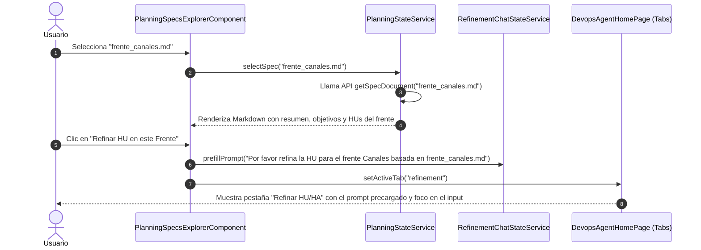

# ESPECIFICACIÓN TÉCNICA DE INTEGRACIÓN — FRONTEND DE PROGRAM PLANNING

> **Módulo:** `azure-devops-frontend` (Angular 22 / PrimeNG / Tailwind)  
> **Versión:** 1.0.0  
> **Fecha:** 2026-09-06  
> **Estado:** 🟢 PROPUESTA PARA APROBACIÓN TÉCNICA  
> **Alineado con:** Clean Architecture Bancolombia (`AGENTS.md` - Fase 1 Frontend), Standalone Components, Reactive Signals, OnPush, A2A Protocol v1.0  
> **Especificación Base del Backend:** `azure-devops-backend/docs/specs/ESPECIFICACION-INTEGRACION-PLANNING-BFF.md`

---

## 1. Alcance y Propósito del Sistema

Esta especificación técnica define formalmente la arquitectura, modelos de datos, flujos de usuario, servicios de API, stores reactivos, componentes visuales y pruebas requeridas en **`azure-devops-frontend`** para habilitar la experiencia de usuario de **Program Planning** y **Almacenamiento Documental de Especificaciones (`SpecStoragePort`)**, consumiendo los nuevos endpoints del BFF (`azure-devops-backend`) implementados bajo las decisiones **DP-BFF-01**, **DP-BFF-02** y **DP-BFF-03**.

### 1.1 Objetivos de la Experiencia de Usuario
1. **Lanzador de Program Planning (Macro / Estratégico):**
   Permitir al usuario parametrizar y activar una planeación trimestral macro (`quarter`, `sprintCount`, `maxCapacityPerSprint`, `targetFronts`, `objectives`), invocando el BFF de forma asíncrona (`202 Accepted`) y siguiendo en tiempo real la `Task` asociada con el Agente Planner.
2. **Explorador y Visor Documental de Specs (Roadmaps & Frentes):**
   Listar y visualizar de forma interactiva los roadmaps generados (`ideas_planning_QX.md`) y las especificaciones por frente (`frente_*.md`), con formateo Markdown estilizado, navegación por secciones y metadatos del documento.
3. **Conexión Táctica con Refinamiento HU/HA (Micro / Táctico):**
   Desde la consulta de cualquier especificación técnica de un frente, habilitar una acción directa (*«Refinar Historia en este Frente»*) que transfiera el contexto y active la pestaña de **Refinar HU/HA**, acelerando el ciclo de creación de historias bajo el marco **HyMS**.
4. **Desacoplamiento Progresivo de la Vectorización Legada (`pgvector`):**
   Evolucionar la pestaña actual de *«Gestión de Planeaciones»* hacia un *«Centro de Planeación y Especificaciones»* moderno y reactivo, preservando compatibilidad con los flujos de tareas y sin romper la suite existente de pruebas.

---

## 2. Contratos de Comunicación (BFF $\leftrightarrow$ Frontend)

El Frontend interactúa exclusivamente con el BFF a través de rutas relativas gestionadas por `API_ENDPOINTS` y configuradas con `environment.apiBaseUrl`.

### 2.1 Mapeo de Rutas en `api-endpoints.ts`

```typescript
export const API_ENDPOINTS = {
  // Rutas existentes preservadas
  AGENT_CARD: `${BASE}/.well-known/agent-card.json`,
  MESSAGE_SEND: `${BASE}/message:send`,
  PLANNING_INGEST: `${BASE}/api/planning/ingest`,
  PLANNING_INITIATIVES: `${BASE}/api/planning/initiatives`,
  DEVOPS_DASHBOARD: `${BASE}/api/devops/dashboard`,
  DEVOPS_DASHBOARD_STREAM: `${BASE}/api/devops/dashboard/stream`,
  TASKS: `${BASE}/api/tasks`,
  TASKS_CANCEL_RPC: '/',

  // NUEVAS RUTAS: Program Planning y Gestión Documental de Specs (DP-BFF-01, DP-BFF-02)
  PLANNING_PROGRAM: `${BASE}/api/planning/program`,
  PLANNING_SPECS: `${BASE}/api/planning/specs`,
} as const;

/** URL para consultar un documento Markdown de especificación específico. */
export const specUrl = (name: string): string =>
  `${API_ENDPOINTS.PLANNING_SPECS}/${encodeURIComponent(name)}`;
```

---

### 2.2 Modelos de Datos TypeScript (`devops-agent.model.ts`)

```typescript
// ==========================================
// PROGRAM PLANNING (MACRO)
// ==========================================

export interface ProgramPlanRequestDTO {
  quarter: string;                 // ej. "Q3-2026" (validación: ^[qQ][1-4]-\d{4}$)
  sprintCount: number;             // mayor a 0 (ej. 6)
  maxCapacityPerSprint: number;    // mayor a 0 (ej. 34)
  targetFronts: string[];          // ej. ["Canales", "Core", "DevOps"]
  objectives: string;              // Objetivos estratégicos y funcionales
  contextId?: string;              // Opcional para correlación de sesión A2A
}

export interface ProgramPlanResponseDTO {
  summary: string;
  quarter: string;
  sprintCount: number;
  maxCapacityPerSprint: number;
  targetFronts: string[];
  contextId: string;
  task: AgentTask;                 // Tarea trazable A2A devuelta con 202 Accepted
}

// ==========================================
// GESTIÓN DOCUMENTAL DE SPECS (MARKDOWN)
// ==========================================

export interface SpecListDTO {
  specs: string[];                 // Listado de nombres de archivos disponibles (ej. ["ideas_planning_q3.md", "frente_canales.md"])
  total: number;
}

export interface SpecDocumentDTO {
  name: string;                    // Nombre del archivo (ej. "ideas_planning_q3.md")
  content: string;                 // Contenido íntegro en Markdown puro
  path: string;                    // Ruta en disco resuelta por el BFF
}

export type PlanningActiveView = 'explorer' | 'new-plan' | 'legacy-vector';
```

---

## 3. Diagramas de Secuencia de Usuario

### 3.1 Disparo y Seguimiento de Program Planning

```mermaid
sequenceDiagram
    autonumber
    actor Dev as Usuario (Scrum / Tech Lead)
    participant UI as ProgramPlanningModal / Launcher
    participant State as PlanningStateService
    participant TasksState as TasksStateService
    participant API as PlanningApiService
    participant BFF as azure-devops-backend (:8081)

    Dev->>UI: Llena formulario (Q3-2026, 6 sprints, 34 SP, Frentes, Objetivos)
    Dev->>UI: Clic en "Iniciar Planeación Trimestral"
    UI->>State: triggerPlanning(payload)
    State->>API: triggerProgramPlanning(payload)
    API->>BFF: POST /api/planning/program (JSON)
    BFF-->>API: 202 Accepted (ProgramPlanResponseDTO con Task id="task-123")
    API-->>State: Response recibida
    State->>TasksState: notifyNewTask(response.task)
    Note over TasksState,Dev: El panel lateral de tareas muestra "task-123" en estado "working"<br/>con spinner animado y polling reactivo
    State-->>UI: Cierra modal y muestra notificación Toast de éxito
    
    rect rgb(25, 35, 50)
        Note over TasksState,BFF: Polling automático de /api/tasks hasta finalización
        TasksState->>BFF: GET /api/tasks
        BFF-->>TasksState: Task estado "completed"
        TasksState-->>State: Tarea finalizada -> refrescar lista de specs
        State->>API: getAvailableSpecs()
        API->>BFF: GET /api/planning/specs
        BFF-->>API: SpecListDTO con "ideas_planning_q3.md"
        State-->>UI: Actualiza lista y selecciona nuevo roadmap automáticamente
    end
```



---

### 3.2 Exploración Documental y Salto a Refinamiento



---

## 4. Arquitectura de Componentes y Diseño Visual

### 4.1 Estructura de Archivos Propuesta

```text
azure-devops-frontend/src/app/
├── core/
│   └── config/
│       └── api-endpoints.ts                                [MODIFICAR] (Añadir PLANNING_PROGRAM y PLANNING_SPECS)
└── features/devops-agent/
    ├── models/
    │   └── devops-agent.model.ts                           [MODIFICAR] (Agregar DTOs de Program Planning y Specs)
    ├── services/
    │   ├── api/
    │   │   ├── planning-api.service.ts                     [MODIFICAR] (Añadir métodos de Program Planning y Specs)
    │   │   └── planning-api.service.spec.ts                [MODIFICAR] (Tests de las nuevas llamadas HTTP)
    │   └── state/
    │       ├── planning-state.service.ts                   [MODIFICAR] (Incorporar señales para specs y disparo macro)
    │       └── planning-state.service.spec.ts              [MODIFICAR] (Tests reactivos de estado)
    ├── components/
    │   ├── planning-management/
    │   │   ├── planning-management.component.ts            [MODIFICAR / EVOLUCIONAR] (Integrar pestañas: Specs vs Vectorizado)
    │   │   ├── planning-specs-explorer/
    │   │   │   ├── planning-specs-explorer.component.ts    [NUEVO] (Lista interactiva de specs y visualizador Markdown)
    │   │   │   ├── planning-specs-explorer.component.spec.ts [NUEVO] (Pruebas unitarias completas)
    │   │   │   └── spec-markdown-viewer.component.ts       [NUEVO] (Renderizado limpio de tablas, badges y Markdown)
    │   │   └── program-planning-modal/
    │   │       ├── program-planning-modal.component.ts     [NUEVO] (Formulario de activación de planeación macro)
    │   │       └── program-planning-modal.component.spec.ts [NUEVO] (Pruebas unitarias y validaciones de formulario)
    │   └── index.ts                                        [MODIFICAR] (Exportar nuevos componentes)
    └── pages/
        └── devops-agent-home.page.ts                       [MODIFICAR] (Conectar disparador de modal y navegación entre tabs)
```

---

### 4.2 Principios de Diseño UI / UX (Alineados con la Estética Existente)

- **Paleta de Color Corporativa:**
  - Fondo Canvas: `#0b0f19` con gradientes radiales sutiles.
  - Acento Primario (Brand): Oro Bancolombia `#f2c94c` (utilizado para encabezados, botones de acción principal e íconos destacados).
  - Éxito / Completado: `#10b981` (para tareas finalizadas y badges de specs activos).
  - Azul Eléctrico / A2A: `#2563eb` y `#3b82f6` (para badges de frentes y llamadas al agente).
  - Bordes y Paneles Glassmorphism: `border-[rgba(255,255,255,0.08)]`, `bg-[rgba(17,24,39,0.5)]` con `backdrop-blur-md`.
- **Accesibilidad y Calidad:**
  - Todo botón icon-only llevará obligatoriamente su atributo `aria-label`.
  - Formularios con validación reactiva instantánea: deshabilitar el botón de submit si el Quarter no coincide con `Q[1-4]-YYYY` o si los sprints son $\le 0$.
  - Manejo de estados de carga explícitos con spinners accesibles (`animate-spin`) y skeletons para la carga de documentos Markdown.

---

## 5. Diseño Detallado de Componentes

### 5.1 `PlanningSpecsExplorerComponent`
* **Propósito:** Muestra un panel dividido (Split View):
  - **Columna Izquierda (30%):** Lista de especificaciones disponibles (`ideas_planning_*.md` y `frente_*.md`), con buscador en tiempo real, filtro por tipo (Roadmap Maestro vs Frente) y botón destacado *«+ Nueva Planeación»*.
  - **Columna Derecha (70%):** Visor del documento seleccionado con barra de herramientas superior:
    - Nombre del spec y badge de tamaño / última modificación.
    - Botón de acción: *«Refinar HU en este Frente»* (si es un archivo de frente).
    - Botón de acción: *«Copiar Markdown»*.
    - Renderizador Markdown estilizado (soporte para títulos, listas de sprints, tablas de capacidad, bloques de código y llamadas estilo alerta).

### 5.2 `ProgramPlanningModalComponent`
* **Propósito:** Diálogo modal flotante accesible para lanzar una planeación trimestral:
  - Campo **Quarter:** Input de texto con validación en tiempo real (ej. `Q3-2026`).
  - Campo **Sprints:** Input numérico (por defecto `6`, rango 1-24).
  - Campo **Capacidad Máxima por Sprint:** Input numérico en Story Points (por defecto `34`, rango 1-500).
  - Campo **Frentes Involucrados:** Tags o checkboxes seleccionables (ej. *Canales Móviles*, *Core Bancario*, *DevOps*, *Seguridad*).
  - Campo **Objetivos del Trimestre:** Textarea multilínea para lineamientos de negocio.
  - Botón de Envío: Despacha la planeación, cierra el modal, activa la notificación y muestra la tarea en el panel de monitoreo.

---

## 6. Plan de Fases Atómicas Propuesto para Frontend

Siguiendo la metodología probada en los planes maestros de Agent y Backend, el trabajo se dividirá en **5 fases atómicas independientes**:

| # | Fase | Objetivo Principal | Entregable Clave |
|:---:|:---|:---|:---|
| **01** | Contratos de API, Modelos y Configuración | Extender `api-endpoints.ts` y `devops-agent.model.ts` con los DTOs inmutables de specs y planeación macro. | Modelos TypeScript y constantes de endpoints probados. |
| **02** | Servicios de API y Gestión de Estado Reactivo | Actualizar `PlanningApiService` y `PlanningStateService` con llamadas HTTP, señales reactivas y pruebas unitarias. | Servicios reactivos con mocks y cobertura de tests $\ge 90\%$. |
| **03** | Visor y Explorador Documental de Specs | Construir `PlanningSpecsExplorerComponent` y el renderizador de Markdown con navegación entre frentes. | Componente standalone OnPush probado unitariamente. |
| **04** | Modal Lanzador de Program Planning | Construir `ProgramPlanningModalComponent` con validación de formularios y despacho asíncrono. | Modal accesible con pruebas de validación reactiva. |
| **05** | Integración Global, Navegación y Validación E2E | Enlazar el explorador en `DevopsAgentHomePage`, conectar el salto a refinamiento, ejecutar `pnpm build` y certificar cero regresiones. | Suite completa pasando y reporte final de integración. |

---

## 7. Criterios de Aceptación Globales

1. **Compilación Limpia:** `pnpm build` compila con 0 errores de TypeScript y emite los bundles de producción sin sobrepasar los presupuestos de tamaño.
2. **Pruebas Automatizadas:** 100% de pruebas unitarias pasando en componentes y servicios creados, sin regresiones en los flujos preexistentes.
3. **Clean Architecture & Standalone:** Cumplimiento total de las directrices de `AGENTS.md` (Standalone, OnPush, señales reactivas, `@if`/`@for`, botones con `aria-label`).
4. **Flujo E2E Completo:**
   - El usuario puede abrir el modal, ingresar parámetros de planeación y disparar `POST /api/planning/program`.
   - La tarea devuelta se refleja inmediatamente en el panel lateral de tareas del agente.
   - El usuario puede listar los specs de `GET /api/planning/specs` y leer cualquier archivo Markdown con `GET /api/planning/specs/{name}`.
   - Desde un frente seleccionado, el usuario puede saltar a la pestaña de refinamiento de HU/HA con un solo clic.
