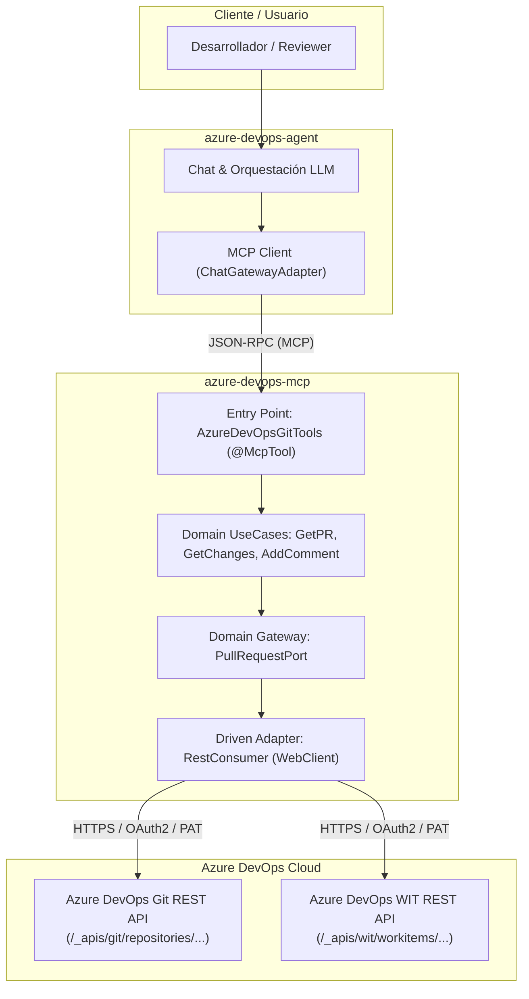

# Plan Maestro — Evaluación de Pull Requests con Azure DevOps MCP

> **Versión:** 1.0 · **Fecha:** 2026-09-08  
> **Alineado con:** Clean Architecture Bancolombia, Spring Boot 4.1 / WebFlux, Spring AI MCP y
> Spec-Driven Development (SDD).

---

## 1. Objetivo y Caso de Uso

Habilitar la capacidad de **revisión y evaluación automatizada de Pull Requests (PRs) asistida por
Inteligencia Artificial** dentro del ecosistema de Azure DevOps.

Actualmente, el servidor MCP (`azure-devops-mcp`) solo expone capacidades para consultar y modificar
Work Items (historias, tareas, sprints). Este plan extiende el monorepo para:

1. Conectar con la API REST de Git de Azure DevOps en `azure-devops-mcp`.
2. Exponer herramientas MCP atómicas para consultar metadatos de PRs, obtener diferencias de código
   (diffs) y publicar comentarios/retroalimentación en los hilos del PR.
3. Permitir que el agente inteligente (`azure-devops-agent`) orqueste la evaluación contrastando el
   código modificado contra los criterios de aceptación del Work Item asociado, buenas prácticas de
   Clean Architecture y calidad de código.

---

## 2. Diagnóstico y Deuda Técnica a Resolver

|    ID    | Componente / Archivo                                            | Diagnóstico / Deuda Actual                                                                                                                                  | Solución Propuesta                                                                                                                     |
|:--------:|:----------------------------------------------------------------|:------------------------------------------------------------------------------------------------------------------------------------------------------------|:---------------------------------------------------------------------------------------------------------------------------------------|
| **D-01** | `azure-devops-mcp/domain/model`                                 | No existen modelos de dominio que representen entidades de Git (Pull Request, iteraciones, cambios, hilos de comentarios) ni puertos para repositorios Git. | Crear modelos de dominio puros e inmutables y el puerto gateway `PullRequestPort`.                                                     |
| **D-02** | `azure-devops-mcp/domain/usecase`                               | No existen casos de uso para consultar información de PRs, diffs o registrar feedback.                                                                      | Crear casos de uso específicos: `GetPullRequestUseCase`, `GetPullRequestChangesUseCase` y `CreatePullRequestCommentUseCase`.           |
| **D-03** | `azure-devops-mcp/infrastructure/driven-adapters/rest-consumer` | El consumidor REST actual solo invoca endpoints de Work Items (`_apis/wit/...`). No existe cliente ni DTOs para Azure DevOps Git API (`_apis/git/...`).     | Implementar las operaciones REST reactivas para Git con sus respectivos DTOs externos y mappers de infraestructura a dominio.          |
| **D-04** | `azure-devops-mcp/infrastructure/entry-points/mcp-server`       | La clase de herramientas `AzureDevOpsTools` solo expone operaciones de Work Items; faltan herramientas MCP para PRs.                                        | Crear un entry point dedicado `AzureDevOpsGitTools` que exponga `@McpTool` seguras con control de acceso (`@PreAuthorize`).            |
| **D-05** | `azure-devops-agent`                                            | El agente no dispone de una guía o prompt especializado para estructurar la evaluación de código y validación contra requerimientos de negocio.             | Configurar el contexto/prompts del agente para realizar análisis estático, detección de deuda y contraste con criterios de aceptación. |

---

## 3. Arquitectura Objetivo



---

## 4. Mapa de Fases del Plan

```
[Fase 01] Modelos de Dominio y Puertos de Git / Pull Request
    │
    ▼
[Fase 02] Casos de Uso de Consulta de PRs y Cambios
    │
    ▼
[Fase 03] Adaptador REST para API Git de Azure DevOps
    │
    ▼
[Fase 04] Casos de Uso y Adaptador para Comentarios y Feedback de PR
    │
    ▼
[Fase 05] Entry Points MCP Server (Tools @McpTool)
    │
    ▼
[Fase 06] Orquestación y Prompt de Evaluación en el Agente
```

### Detalle de Fases Atómicas:

### **Fase 01 — Modelos de Dominio y Puertos de Git / Pull Request**

* **Objetivo:** Definir las entidades de dominio puras e inmutables para Pull Requests y los
  contratos de puerto en `azure-devops-mcp/domain/model`.
* **Entregable:** Clases `PullRequest`, `GitChange`, `PullRequestIteration` y el contrato
  `PullRequestPort`, con sus pruebas de dominio.
* **Dependencias:** Ninguna (fase inicial).

### **Fase 02 — Casos de Uso de Consulta de PRs y Cambios**

* **Objetivo:** Implementar la lógica de negocio pura para consultar un PR y obtener sus cambios en
  `azure-devops-mcp/domain/usecase`.
* **Entregable:** `GetPullRequestUseCase` y `GetPullRequestChangesUseCase`, con pruebas unitarias y
  mocks de puertos.
* **Dependencias:** Fase 01.

### **Fase 03 — Adaptador REST para API Git de Azure DevOps**

* **Objetivo:** Implementar en `rest-consumer` el consumo reactivo de la API REST de Git de Azure
  DevOps con sus DTOs y mappers.
* **Entregable:** DTOs de Git API, mappers de infraestructura a dominio y métodos en el adaptador
  que implementan `PullRequestPort`.
* **Dependencias:** Fase 02.

### **Fase 04 — Casos de Uso y Adaptador para Comentarios y Feedback de PR**

* **Objetivo:** Implementar la capacidad de publicar revisiones y comentarios en hilos (`threads`)
  del PR.
* **Entregable:** Modelo `PullRequestComment`, caso de uso `CreatePullRequestCommentUseCase` e
  integración en el adaptador REST.
* **Dependencias:** Fase 03.

### **Fase 05 — Entry Points MCP Server (Tools @McpTool)**

* **Objetivo:** Exponer los endpoints MCP anotados con `@McpTool` y protegidos por roles
  (`@PreAuthorize`) en `mcp-server`.
* **Entregable:** Clase `AzureDevOpsGitTools` con tools `getPullRequest`, `getPullRequestChanges` y
  `createPullRequestComment`, con pruebas de integración MCP.
* **Dependencias:** Fase 04.

### **Fase 06 — Orquestación y Prompt de Evaluación en el Agente**

* **Objetivo:** Verificar la auto-detección de herramientas MCP en `azure-devops-agent` y proveer el
  prompt de sistema para evaluación integral de PRs.
* **Entregable:** Configuración y plantilla de evaluación de PRs en el agente inteligente, validada
  en ejecución de prueba.
* **Dependencias:** Fase 05.

---

## 5. Métricas de Éxito y Criterios de Aceptación Globales

1. **Compilación y Build:** Build limpio `./gradlew clean build` en `azure-devops-mcp` sin errores.
2. **Cobertura y Pruebas:** $\ge 90\%$ de cobertura de pruebas unitarias en las nuevas clases de
   dominio y use cases.
3. **Pureza de Dominio:** Cero dependencias de frameworks (Spring, Jackson, WebFlux) en
   `domain/model` y `domain/usecase`.
4. **Seguridad y Roles:** Herramientas de lectura protegidas con `MCP.AZURE_DEVOPS.READ` y de
   escritura con `MCP.AZURE_DEVOPS.WRITE`.
5. **Criterio Funcional:** Un agente LLM conectado vía MCP es capaz de recibir el ID de un PR,
   consultar los archivos modificados, analizar el código y emitir un dictamen fundamentado en los
   requerimientos del Work Item vinculado.
