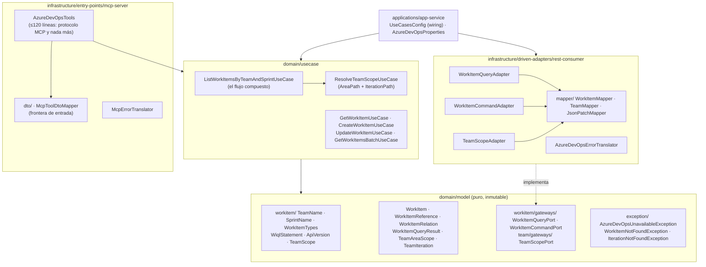

# PLAN MAESTRO — Refactorización `azure-devops-mcp`

> **Versión:** 1.0 · **Fecha:** 2026-08-30 · **Estado:** 🟡 ABIERTO
> **Reglas:** [`rules/spring-rules.md`](../../../rules/spring-rules.md) ·
> [`.github/copilot-instructions.md`](../../../.github/copilot-instructions.md) ·
> [`COMMIT_RULES.md`](../../COMMIT_RULES.md)
> **Precedentes:** `azure-devops-agent/docs/resultados/CIERRE-DEL-PLAN.md` ·
> `azure-devops-backend/docs/resultados/CIERRE-DEL-PLAN.md`
> **Fases:** 8 (01 → 08) · **Fase activa:** [`docs/fases/fase-06.md`](../fases/fase-06.md) ·
> **Completadas:** **01, 02, 03, 04, 05**

---

## 1. Misión del proyecto

`azure-devops-mcp` es el **servidor MCP (Model Context Protocol)** del sistema. Es el **último
eslabón** de la cadena y el **único que habla con Azure DevOps**:

```
Front (4200) ── /api/** ──► BFF (8081) ── JSON-RPC 2.0 ──► Agente (8082) ── MCP ──► MCP (8080) ──► Azure DevOps REST API
```

Su misión, derivada de esa posición:

1. **Exponer capacidades de Azure DevOps como herramientas MCP** con contrato estable y descrito.
2. **Ser el dueño del «cómo»**: cómo se consulta Azure DevOps, cómo se construye una sentencia WIQL,
   cómo se resuelven `AreaPath` e `IterationPath`. Quien define la herramienta define cómo se usa.
3. **Aislar al resto del sistema de la API de Azure DevOps**: versiones, formatos, códigos de error y
   nomenclatura de tipos de work item **no deben filtrarse** aguas arriba.
4. **Aplicar la autorización** por rol sobre cada operación, lectura incluida.

> El **cerebro** (prompts, intenciones, estimación) vive en el **agente**. El MCP **no razona**:
> ejecuta y devuelve datos. Esta frontera es la que ordena todo el plan.

### 1.1 Consecuencia directa

El punto 2 es la razón de ser de la deuda **D-35** del plan del BFF: *«las reglas WIQL van al MCP»*.
Este plan la ejecuta desde su destino. El MCP ya recibe **nombre de célula** y **nombre de sprint**
—no rutas fabricadas por el BFF— y debe convertirlos en una consulta correcta **dentro de su
dominio**, no dentro de su entry-point.

---

## 2. Diagnóstico

### 2.1 Estado medido (baseline declarado, a confirmar en la Fase 01)

| Artefacto                                                  | Líneas | Diagnóstico                                                                     |
|------------------------------------------------------------|-------:|---------------------------------------------------------------------------------|
| `entry-points/mcp-server/.../tools/AzureDevOpsTools.java`   |  **267** | 6 tools + el **único flujo compuesto**, con WIQL, rutas y normalización dentro   |
| `driven-adapters/rest-consumer/.../RestConsumer.java`       |  **237** | **7 gateways** en una clase + 8 mappers privados                                |
| `applications/app-service/.../config/McpSecurityConfig.java`|  **~180** | Termina en `.anyExchange().permitAll()`                                          |
| `domain/usecase/**` (7 clases)                              |  **~175** | 6 de 7 son delegantes de 17–18 líneas; **la capa está vacía**                    |
| `domain/model/**` (21 tipos)                                |      — | Anémico, mutable y **usado como contrato de cable** en los dos extremos          |

**Stack confirmado:** Java toolchain **25** · Spring Boot **4.1.0** · Spring AI **2.0.0-RC1**
(`spring-ai-starter-mcp-server-webflux`, protocolo `STATELESS`, tipo `ASYNC`) · Reactor ·
Resilience4j 2.4.0 · Lombok 1.18.46 · JaCoCo 0.8.15 · Pitest 1.19.0 · ArchUnit 1.4.2.

**Módulos Gradle:** `:app-service`, `:model`, `:usecase`, `:mcp-server`, `:rest-consumer`.

### 2.2 El hallazgo central: la pirámide está invertida

Todo el valor del sistema —la única lógica que no es una llamada HTTP— vive **fuera de donde debe
vivir**:

```
HOY                                          OBJETIVO

entry-point  ████████████ 267 líneas         entry-point  ███ (protocolo MCP y nada más)
             (WIQL + rutas + normalización)
usecase      █ (7 delegantes vacíos)         usecase      ███████ (el flujo compuesto)
model        █ (anémico, mutable)            model        █████ (VOs con invariantes)
adapter      ████████ (7 gateways juntos)    adapter      ██ ██ ██ (uno por agregado)
```

`listWorkItemsByTeamAndSprint` (44 líneas, `AzureDevOpsTools.java:120-163`) **es** el sistema: limpia
cadenas, pregunta el `AreaPath`, pregunta el `IterationPath`, normaliza los tipos de work item,
**redacta la sentencia WIQL con `String.format`** y encadena la consulta. Las otras cinco tools son
pasamanos. Y `spring-rules.md` es explícito para `entry-points`: **«Cero lógica de negocio»**.

### 2.3 El dominio es el contrato de cable, en los dos extremos

No hay frontera. El mismo tipo de `domain/model` lo **deserializa Jackson** en la entrada MCP y lo
**serializa el `WebClient`** en la salida HTTP:

```java
// ENTRADA — entry-point: Jackson construye un modelo de dominio desde el payload MCP
@McpToolParam(...) List<JsonPatchOperation> patch          // AzureDevOpsTools.java:70, :88

// SALIDA — adaptador: el WebClient serializa el modelo de dominio tal cual
.bodyValue(query)     // RestConsumer.java:99  → WiqlQuery
.bodyValue(patch)     // RestConsumer.java:67  → List<JsonPatchOperation>
.bodyValue(request)   // RestConsumer.java:122 → WorkItemsBatchRequest
```

Consecuencias: cualquier cambio en el JSON de Azure DevOps **rompe el dominio**; el nombre
`WorkItemsBatchRequest` delata su origen y **rompe ArchUnit `Rule_2.2`**; y no existe ningún mapper
de salida, cuando `spring-rules.md` los declara **obligatorios**.

### 2.4 La seguridad está construida, pero desactivada **con comentarios**

> **Contexto ratificado por el propietario el 2026-08-30 (DP-01).** El sistema es una **POC**. Toda
> la seguridad está construida a propósito y desactivada a propósito: **todavía no existe el Service
> Principal**, y el objetivo es enviar a pre y producción una **copia 1 a 1** del binario, sin
> reconstruir nada. El flujo objetivo es: el front obtiene del IDP (Entra ID) un token **de usuario**
> válido **solo para el BFF**; el BFF llama al agente; y el agente obtiene un **segundo token M2M**,
> distinto del de usuario, para hablar con el MCP.
>
> **La decisión de estar laxo es correcta. El mecanismo para estarlo, no.**

```java
.authorizeExchange(exchanges -> exchanges
        .pathMatchers("/actuator/health", "/actuator/info").permitAll()
        .pathMatchers("/h2-console/**").permitAll()
        .anyExchange().permitAll())          // ← McpSecurityConfig, última línea
```

El `oauth2ResourceServer` valida el token **si llega**, pero nadie lo exige. Y en las tools, los
`@PreAuthorize` de lectura están **comentados**:

| Tool                          | Autorización                                              |
|-------------------------------|-----------------------------------------------------------|
| `createWorkItem`              | ✅ `hasRole('MCP.AZURE_DEVOPS.WRITE')`                    |
| `updateWorkItem`              | ✅ `hasRole('MCP.AZURE_DEVOPS.WRITE')`                    |
| `getWorkItem`                 | 🟠 `@PreAuthorize` **comentado**                          |
| `getWorkItemsBatch`           | 🟠 `@PreAuthorize` **comentado**                          |
| `queryByWiql`                 | 🟠 comentada la tool **y** la autorización                |
| `listWorkItemsByTeamAndSprint`| 🔴 **nunca la tuvo**                                      |
| `checkHealth`, `getServerInfo`| 🟠 sin autorización                                       |

El problema no es que hoy esté abierto: es que **el interruptor es el compilador**. Desactivar la
seguridad comentando anotaciones y escribiendo `permitAll` tiene tres consecuencias que van
justamente en contra del objetivo declarado de «copia 1 a 1»:

1. **Encender la seguridad exige recompilar**, y por tanto el binario de producción **no será** el
   probado en la POC. Es lo contrario de lo que se buscaba.
2. **Nada de lo comentado se compila ni se prueba.** El día del Service Principal, seis
   `@PreAuthorize` se activarán por primera vez en la vida, en producción, sin una sola prueba que
   los haya ejecutado nunca. `listWorkItemsByTeamAndSprint` —el flujo más usado— **ni siquiera tiene
   la línea que descomentar**: hay que acordarse de escribirla.
3. **La laxitud es indistinguible de un olvido.** Nada en el repositorio dice «esto está abierto
   porque falta el SP». Un `permitAll` sin explicación se lee igual que un descuido, y sobrevive a
   las revisiones por esa misma razón.

A esto se suma `/h2-console/**` abierto con `permitAll` y `spring.h2.console.enabled: true`, en un
proyecto **sin dependencia H2 ni datasource**: eso no es una decisión, es un residuo del scaffold.

**Por eso la Fase 02 no «cierra la seguridad»: la convierte en configuración.** Mismo binario, dos
modos declarados (`permissive` para la POC, `enforced` para pre y producción), todas las anotaciones
activas y probadas en ambos, y el salto a producción reducido a un cambio de variable de entorno.

### 2.5 Los cortacircuitos no son los que están configurados

`RestConsumer` declara siete instancias por nombre —`getWorkItem`, `createWorkItem`,
`updateWorkItem`, `queryByWiql`, `getWorkItemsBatch`, `getTeamFieldValues`, `getTeamIterations`— y
`application.yaml` declara **otras dos**: `testGet` y `testPost`, nombres del scaffold que **no usa
nadie**. Los siete cortacircuitos reales corren con la configuración **por defecto** de Resilience4j
sin que nadie la haya elegido. No es un fallo visible: es peor, es un parámetro operativo fantasma.

### 2.6 Ningún error se traduce

No hay una sola excepción de dominio en el repositorio. Un `401`, un `404` o un `TF401232` de Azure
DevOps viaja **crudo** hasta el cliente MCP como `WebClientResponseException`. El único tratamiento
es un `doOnError` en `queryByWiql` que **registra y no traduce** (`RestConsumer.java:102-107`).

### 2.7 Deudas heredadas del plan del BFF

El plan de `azure-devops-backend` cerró con cuatro deudas cuyo **dueño es este repositorio**. Se
incorporan aquí con su identificador original entre paréntesis:

| Origen | Deuda                                                                         | Aquí     |
|--------|-------------------------------------------------------------------------------|----------|
| D-35   | Las reglas WIQL deben vivir en el MCP; el BFF debe enviar **intenciones**      | **D-08** |
| D-36   | `RestConsumerTest` no cubre `getTeamFieldValues` **ni** `getTeamIterations`    | **D-21** |
| D-37   | El repliegue por concatenación **sigue calculando el año** y nadie lo mide     | **D-09** |
| D-39   | Violación **preexistente** de ArchUnit `Rule_2.2` (1 vez)                      | **D-17** |

---

## 3. Deudas técnicas

### 🔴 Bloqueantes — seguridad y wiring

> **Reencuadre tras DP-01 y DP-02 (2026-08-30).** D-01 a D-04 **no dicen «el sistema está
> abierto»**: el sistema está abierto **a propósito**, porque todavía no existe el Service Principal.
> Dicen *«el interruptor para cerrarlo es el compilador, y eso rompe el objetivo declarado de copia
> 1 a 1»*. La Fase 02 **no cambia la postura de seguridad de la POC**: cambia el **mecanismo** con el
> que se elige esa postura. D-03 es la excepción: no es una decisión de la POC, es un residuo.

| ID       | Deuda                                                                                                                                                                                                                | Regla violada        |
|----------|----------------------------------------------------------------------------------------------------------------------------------------------------------------------------------------------------------------------|----------------------|
| ~~**D-01**~~ | ✅ **SALDADA (Fase 02).** La postura de acceso es ahora **configuración**: `mcp.security.mode` (`PERMISSIVE` por defecto / `ENFORCED`), leída de `MCP_SECURITY_MODE`. **Cero recompilaciones** para endurecerla; los dos modos están probados (`McpSecurityModeTest`) | Configuración, DP-01 |
| ~~**D-02**~~ | ✅ **SALDADA (Fase 02).** Las **8 tools** tienen autorización **declarada, compilada y ejecutada en los dos modos** (`McpToolsAuthorizationTest`), incluida `listWorkItemsByTeamAndSprint`, que nunca la tuvo. **0 anotaciones de seguridad comentadas**. Roles centralizados en `McpRoles` (B-03) | Código muerto, riesgo latente |
| ~~**D-03**~~ | ✅ **SALDADA (Fase 02).** Retirados `spring.h2.console.*` y `/h2-console/**`, previo `grep` con **0 coincidencias** de `h2database`, `datasource` y `jdbc:` en todo el repositorio | Seguridad            |
| ~~**D-04**~~ | ✅ **SALDADA (Fase 02).** Eliminado el default `your-token-here`; el formato `Base64(":" + PAT)` se **valida al arranque** (decodificable y con `:`) y se documenta en el YAML y en el javadoc. En `ENFORCED` la ausencia **rompe el arranque**; en `PERMISSIVE` deja un `WARN` (B-01: el formato **no** cambió) | S2068, arranque silencioso |
| **D-05** | 🔽 **DEGRADADA a 🟡 en la Fase 01.** `UseCasesConfig` combina `@ComponentScan(..., includeFilters REGEX "^.+UseCase$")` con siete `@Bean` manuales del mismo tipo, pero **se midió y el escaneo es inerte**: cada caso de uso resuelve a **exactamente un bean**. No es un riesgo de arranque, es **código muerto que induce a error**. *Fase 08* | SRP, claridad        |
| **D-06** | Los `@CircuitBreaker` nombran instancias que **no existen** en `application.yaml`, que solo declara `testGet` y `testPost`: corren con la configuración por defecto sin que nadie la haya elegido. 🔸 **Actualizada en la Fase 05 (B-05):** ya no son **siete** nombres por operación sino **tres por adaptador** —`workItemQuery`, `workItemCommand`, `teamScope`—. **La deuda no se cierra, se reduce y se ordena**: siguen sin estar declaradas, pero la Fase 06 encuentra ya los nombres definitivos que debe configurar. *Fase 06* | Operación            |

### 🟠 Altas — separación y desacoplamiento de flujos

| ID       | Deuda                                                                                                                                                                                                                     | Regla violada         |
|----------|-------------------------------------------------------------------------------------------------------------------------------------------------------------------------------------------------------------------------|-----------------------|
| ~~**D-07**~~ | ✅ **SALDADA (Fase 04).** El flujo compuesto salió del entry-point a `ListWorkItemsByTeamAndSprintUseCase`. `AzureDevOpsTools` pasa de **278 a 157 líneas** y de **4 reglas de negocio a 0**; la sentencia WIQL se redacta ahora en `WiqlStatement` *(dominio)*, verificada **idéntica carácter a carácter en las 8 ramas** | «Cero lógica de negocio» |
| ~~**D-08**~~ | ✅ **SALDADA (Fase 04).** **DP-04 §0.2 declaró las reglas de Azure DevOps regla de dominio, no configuración.** Los tipos por defecto, la traducción `User Story → Historia de Usuario` y el entrecomillado viven en el objeto de valor inmutable `WorkItemTypes`, con **11 pruebas propias** *(← D-35)* | SRP, DRY |
| ~~**D-09**~~ | ✅ **SALDADA (Fase 04) en su parte medible.** El repliegue salió del entry-point a `TeamPathFallback` *(dominio)* y **DP-04 §0.1 decidió conservarlo —opción (a)—** para no cambiar el comportamiento observable. Lo que se cerró es el vacío real: **cada disparo se cuenta** (`azuredevops.teamscope.fallback`, con etiqueta propia para el caso que intercala el año) **y emite un `WARN` con la causa**. Además el año dejó de ser un número mágico calculado con `LocalDate.now()`: se inyecta un `Clock` *(← D-37)* | S109, observabilidad |
| ~~**D-10**~~ | ✅ **SALDADA (Fase 05).** `RestConsumer` —**191 líneas implementando 7 gateways**— se parte en **tres adaptadores por agregado y responsabilidad**: `WorkItemQueryAdapter` (**115** líneas), `WorkItemCommandAdapter` (**80**) y `TeamScopeAdapter` (**78**), los tres **≤ 120**. Los **5 mappers de la Fase 03 se repartieron, no se duplicaron**. Ya se puede probar un flujo sin arrastrar los otros seis: `RestConsumerTest` se dividió en tres clases con sus 11 escenarios **literalmente intactos**. **0 URLs, verbos, `contentType`, cuerpos o versiones alterados**, verificado con diff literal | SOLID-I, SOLID-S      |
| ~~**D-11**~~ | ✅ **SALDADA (Fase 03).** El dominio **dejó de ser el contrato de cable en los dos extremos**. Entrada: `JsonPatchOperationInput` y `WorkItemsBatchInput` en `mcp-server/.../mcp/dto/`, traducidos por `McpToolDtoMapper`. Salida: `JsonPatchOperationRequestDTO`, `WiqlQueryRequestDTO` y `WorkItemsBatchRequestDTO` en `rest-consumer/.../consumer/dto/`, con **5 mappers** en `consumer/mapper/`. **0 modelos de dominio deserializados como `@McpToolParam`**, **0 serializados por el `WebClient`**, y el cuerpo emitido verificado **carácter a carácter** (`OutboundPayloadCharacterizationTest`) | «Mappers obligatorios» |
| ~~**D-12**~~ | ✅ **SALDADA (Fase 04).** La capa de aplicación dejó de estar vacía: alberga el flujo compuesto y la resolución de rutas. Los seis delegantes **siguen siendo delegantes a propósito** —no toda intención necesita lógica—, pero ahora están **probados uno a uno** (`DelegatingUseCasesTest`). Cobertura de `domain/usecase`: **68,2 % → 97,8 %** | Pirámide invertida    |
| **D-13** | **Ningún error se traduce**: no existe una sola excepción de dominio; un 401 o un 404 de Azure DevOps llega crudo al cliente MCP                                                                                           | Manejo de excepciones |

### 🟡 Medias

| ID       | Deuda                                                                                                                                                          | Regla violada       |
|----------|----------------------------------------------------------------------------------------------------------------------------------------------------------------|---------------------|
| ~~**D-14**~~ | ✅ **SALDADA (Fase 05).** ✅ **DP-05 eligió la opción (a)**: se reagrupan **paquetes y puertos**. De **7 paquetes CRUD y 7 puertos por operación** a **2 paquetes por agregado** (`workitem/`, `team/`) y **3 puertos por responsabilidad**: `WorkItemQueryPort`, `WorkItemCommandPort` y `TeamScopePort` — los nombres que §4.1 ya anticipaba. **Ninguna firma de método cambió al fundirlos**, de modo que los casos de uso solo cambiaron su `import`. **El `ArchitectureTest` no se tocó**: importa `co.com.bancolombia.model` como raíz y no nombra ningún subpaquete | SOLID-I, DDD        |
| ~~**D-15**~~ | ✅ **SALDADA (Fase 05, B-06).** `workitem/gateways/WorkItemRepository` era una interfaz **vacía** que nadie implementaba ni usaba: **borrada**. De paso se retiraron las **5 clases vacías del scaffold** (`GetWorkItem`, `CreateWorkItem`, `UpdateWorkItem`, `GetWorkItemsBatch`, `QueryByWiql`), también sin una sola referencia, previa autorización del propietario. Puertos huérfanos: **1 → 0** | Código muerto       |
| **D-16** | Modelo **anémico y mutable**: `@Setter` en las 21 clases de `domain/model`, sin una sola invariante                                                              | «Prohibido el modelo anémico» |
| ~~**D-17**~~ | ✅ **SALDADA (Fase 03).** `WorkItemsBatchRequest` → **`WorkItemBatchCriteria`** (DP-03). El sufijo `Request` vive ahora donde le corresponde: en el DTO del adaptador. **`Rule_2.2` a 0 violaciones reales**, verificado **en el log** del `ArchitectureTest` — por D-25 el `issues.json` no sirve como prueba *(← D-39)* | Rule_2.2            |
| **D-18** | Versiones de API **repetidas y hardcodeadas** siete veces (`"7.1"`, `"7.0"`) con el mismo ternario copiado. 🔸 **Aliviada en la Fase 05 (B-07):** el ternario, que estaba copiado **cinco** veces, se centraliza en `consumer/ApiVersions` — **mismos dos literales y misma condición**, un solo sitio. Las **dos** consultas de ámbito de equipo siguen con `api-version=7.0` escrito literalmente en la ruta porque cambiarlas habría alterado una llamada HTTP. **Tiparlas y llevarlas a configuración sigue pendiente.** *Fase 06* | DRY, configuración  |
| **D-19** | La tool `queryByWiql` tiene su `@McpTool` **comentado**: el método es público, el caso de uso y el gateway existen, pero **no se expone**. Camino muerto sin documentar | Claridad            |
| **D-20** | `HealthTool` **duplica el actuator** y devuelve la versión hardcodeada con un placeholder sin rellenar: `"Server:  v1.0.0"`                                       | DRY                 |
| **D-21** | `RestConsumerTest` (127 líneas) **no cubre** `getTeamFieldValues` ni `getTeamIterations`: las dos consultas que sostienen la resolución de rutas *(← D-36)*      | Cobertura           |
| **D-22** | 🔽 **SALDADA EN SU MAYOR PARTE (Fase 02).** Retirados `spring.h2.console` y `profiles.include: null`. **`spring.devtools.add-properties` se conservó deliberadamente**: el `grep` demostró que la dependencia `runtimeOnly('spring-boot-devtools')` **existe** en `app-service/build.gradle:13`, luego la propiedad no es un residuo huérfano. Retirar la dependencia es una decisión de empaquetado → *Fase 08* | Limpieza            |
| **D-23** | `McpAuditAspect` llama a `joinPoint.proceed()` **antes** de resolver el contexto de seguridad y **no audita** la rama no reactiva (solo un `warn`)               | Auditoría           |
| **D-24** | Sin `timeout` reactivo por operación: solo hay timeouts de Netty de 5 s **compartidos** por todas las llamadas, incluida la de lote                              | Resiliencia         |
| **D-25** | 🟠 **El informe de ArchUnit para Sonar sale vacío pese a existir una violación real.** `checkWithWarning` descarta en silencio toda incidencia cuyo fichero no resuelva: los **seis** `issues.json` son `{"issues":[],"rules":[]}` mientras el log grita `Rule_2.2 ... violated (1 times)`. **SonarQube nunca ha visto una sola violación de arquitectura de este repositorio** *(hallazgo de la Fase 01)* | Observabilidad      |
| **D-26** | 🟠 **`domain/model` no tiene carpeta `src/test`**: 21 clases de dominio con **cero** pruebas. No es cobertura baja, es que el módulo **no participa en la medición** *(hallazgo de la Fase 01)* | Cobertura           |
| **D-27** | 🟠 **`UseCasesConfigTest` miente por partida doble** *(hallazgo de la Fase 01)*: registra su propio bean `myUseCase`, que satisface por sí solo la única aserción («existe algún bean acabado en `UseCase`»), **y** envuelve todo en un `catch (UnsatisfiedDependencyException)` con `assertTrue(true)`. Como no registra ningún gateway, el contexto **no puede** arrancar y **el camino que toma siempre es el `catch`**: la aserción probablemente no se ha ejecutado nunca. Mismo antipatrón que la D-17 del plan del BFF | Prueba falsa        |

---

## 4. Arquitectura objetivo



### 4.1 Contratos nuevos clave

```java
// domain/model/.../model/workitem/ — dominio puro, sin Spring, sin Jackson, inmutable
public record TeamName(String value) { /* autovalida: no nulo, no en blanco, sin ruta */ }
public record SprintName(String value) { /* autovalida y se queda con el último tramo */ }
public record WorkItemTypes(List<String> values) {
    public static WorkItemTypes defaults();        // 'Historia de Usuario','Habilitador'
    public static WorkItemTypes parse(String csv); // normaliza y deduplica
}
public record TeamScope(String areaPath, String iterationPath) { }
public record WiqlStatement(String value) { }     // se construye, no se concatena a mano
public record ApiVersion(String value) { public static ApiVersion defaultForQuery(); }

// domain/model/.../model/workitem/gateways/ — puertos segregados por responsabilidad (CQS)
public interface WorkItemQueryPort {
    Mono<WorkItem> findById(AzureDevOpsTarget target, int id, ApiVersion version);
    Mono<List<WorkItem>> findBatch(AzureDevOpsTarget target, WorkItemBatchCriteria c, ApiVersion v);
    Mono<WorkItemQueryResult> query(AzureDevOpsTarget target, WiqlStatement wiql, ApiVersion v);
}
public interface WorkItemCommandPort {
    Mono<WorkItem> create(AzureDevOpsTarget target, String type, List<FieldPatch> patch, ApiVersion v);
    Mono<WorkItem> update(AzureDevOpsTarget target, int id, List<FieldPatch> patch, ApiVersion v);
}
public interface TeamScopePort {
    Mono<TeamAreaScope> findAreaScope(AzureDevOpsTarget target, TeamName team);
    Mono<List<TeamIteration>> findIterations(AzureDevOpsTarget target, TeamName team);
}

// domain/usecase/.../listworkitems/ — el flujo compuesto, fuera del entry-point
public class ListWorkItemsByTeamAndSprintUseCase {
    public Mono<WorkItemQueryResult> execute(ListWorkItemsCommand command) { ... }
}
```

### 4.2 Principio de corte

Cada fase deja el repositorio **compilando, con `./gradlew build` verde y desplegable**. No hay
big-bang. Si una fase no puede cerrarse verde, **se revierte completa** y el bloqueo se documenta en
su propio `fase-NN.md`, sección **Resultado**.

---

## 5. Desglose secuencial de fases

| #      | Fase                                          | Objetivo                                                                                                                                                                     | Deudas                       | Decisión           | Riesgo |
|--------|-----------------------------------------------|------------------------------------------------------------------------------------------------------------------------------------------------------------------------------|------------------------------|--------------------|--------|
| **01** | **Baseline, caracterización y wiring**        | Medir el estado real y **congelar el comportamiento actual** con pruebas de caracterización. Verificar el doble wiring (D-05) y los nombres de cortacircuito (D-06). **Cero cambios en `src/main`.** | D-05, D-06, D-21             | —                  | Nulo   |
| **02** | **Seguridad conmutable y saneamiento**        | **Mismo binario, dos modos declarados** (`permissive` / `enforced`): la postura pasa de código a configuración, **todas** las anotaciones se activan y se prueban en ambos modos, se retira la consola H2 y el token falla al arranque si falta. | D-01…D-04, D-22              | ✅ **DP-01**, **DP-02** | Medio  |
| **03** | **Frontera de contrato: DTOs y mappers**      | El dominio **deja de ser el contrato de cable**: DTOs propios en el entry-point y en el adaptador, con mappers en ambas fronteras. `Rule_2.2` a **cero**.                     | D-11, D-17                   | **DP-03**          | Medio  |
| **04** | **Desacople del flujo compuesto**             | El WIQL, las rutas y la normalización **salen del entry-point** a `ListWorkItemsByTeamAndSprintUseCase` + Value Objects. El entry-point vuelve a ser protocolo.               | D-07, D-08, D-09, D-12       | **DP-04**          | Alto   |
| **05** | **Segregación de puertos y adaptadores**      | `RestConsumer` se parte por agregado y responsabilidad (CQS); los gateways se reagrupan por agregado; se retira el puerto huérfano.                                            | D-10, D-14, D-15             | **DP-05**          | Medio  |
| **06** | **Errores, resiliencia y contrato de fallos** | Excepciones de dominio, traducción única en el adaptador, cortacircuitos con nombres reales, timeouts por operación, versiones de API tipadas.                                 | D-06, D-13, D-18, D-24       | **DP-06**          | Medio  |
| **07** | **Dominio rico y cobertura ≥ 90 %**           | Value Objects inmutables con invariantes, fin del `@Setter` indiscriminado, cobertura de `domain/model` y `domain/usecase` ≥ 90 %.                                             | D-16, D-21                   | —                  | Bajo   |
| **08** | **Configuración tipada, ArchUnit y cierre**   | `@ConfigurationProperties` tipadas, ArchUnit **a error en vez de warning**, resolución de D-19/D-20/D-23, informe de cierre.                                                    | D-19, D-20, D-23, D-05, D-06 | —                  | Bajo   |

> **Sobre el orden.** La Fase 02 va antes que el desacople **a propósito**, pero tras **DP-01** su
> urgencia cambia de naturaleza: el sistema no está abierto por descuido, sino porque falta el
> Service Principal. Lo que no puede esperar es que **el interruptor sea el compilador**: cuanto más
> código se escriba sobre unas anotaciones comentadas, más caro sale activarlas. La Fase 02 las pone
> a compilar y a probarse **sin cambiar la postura actual**, que es lo que permite que las Fases 03 a
> 08 se construyan encima sin deuda nueva.

---

## 6. Criterios de aceptación

> Columna **Fase 02** añadida al cierre de la Fase 02 (2026-08-30) con cifras **medidas**.
> Columna **Fase 03** añadida al cierre de la Fase 03 (2026-08-30), también con cifras **medidas**.
> Columna **Fase 04** añadida al cierre de la Fase 04 (2026-08-30), también con cifras **medidas**.
> Columna **Fase 05** añadida al cierre de la Fase 05 (2026-08-30), también con cifras **medidas**.
> **Nota de medición:** las cifras de cobertura son **cobertura de líneas** de JaCoCo, que es el
> criterio con el que se tomó el baseline. Medida por instrucciones, la Fase 05 arroja
> 95,8 % · 98,6 % · 76,6 % · 91,1 % · 53,8 %.

| Métrica                                                        |        Baseline | Fase 02 | Fase 03 | Fase 04 | Fase 05 |   Objetivo |
|----------------------------------------------------------------|----------------:|--------:|--------:|--------:|--------:|-----------:|
| Modos de seguridad declarados y probados                       |           **0** | ✅ **2** |   **2** |   **2** | **2** *(`permissive` + `enforced`)* | **2** *(`permissive` + `enforced`)* |
| Recompilaciones necesarias para pasar a `enforced`             |           **1** | ✅ **0** |   **0** |   **0** |      **0** |      **0** |
| Tools MCP con autorización declarada **y compilada**           |           **2** | ✅ **8** |   **8** |   **8** |  **8 de 8** |  **8 de 8** |
| Anotaciones de seguridad comentadas                            |           **3** | ✅ **0** |   **0** |   **0** |      **0** |      **0** |
| Rutas abiertas a componentes inexistentes (`/h2-console/**`)   |           **1** | ✅ **0** |   **0** |   **0** |      **0** |      **0** |
| Secretos con valor por defecto en YAML                         |           **1** | ✅ **0** |   **0** |   **0** |      **0** |      **0** |
| Arranques posibles sin credencial en modo `enforced`           |         **sí** | ✅ **no** |  **no** |  **no** |     **no** |     **no** |
| Mecanismos de wiring por bean                                  |           **2** |   **2** |   **2** |   **2** |   **2** |      **1** |
| Cortacircuitos declarados **sin** configuración correspondiente|           **7** |   **7** |   **7** |   **7** | **3** ▼4 |      **0** |
| Líneas de `AzureDevOpsTools`                                   |         **267** | **275** | **277** | **157** ▼121 |    **≤ 120** | **157** = |
| Líneas de `RestConsumer` (clase única)                         |         **237** | **237** | ✅ **186** ▼51 | **191** | **≤ 120 por adaptador resultante** | ✅ **3 adaptadores: 115 / 80 / 78** |
| Clases productivas > 200 líneas                                |           **2** |   **2** | ✅ **1** | ✅ **0** |      **0** |      **0** |
| Reglas de negocio en `entry-points`                            |       **4** *(WIQL, rutas, tipos, defaults)* | **4** | **4** | ✅ **0** | **0** | **0** |
| Sentencias WIQL construidas con `String.format`                |           **1** |   **1** |   **1** | ✅ **0 fuera del dominio** *(1 dentro, en `WiqlStatement`)* | **0** | **0** |
| Cálculos del año por calendario                                |           **1** |   **1** |   **1** | ✅ **1, medido, en un solo punto del dominio y con `Clock` inyectado** | **1, medido y en un solo punto del dominio** | **1, medido y en un solo punto del dominio** |
| Modelos de dominio serializados por Jackson/`WebClient`        |           **3** |   **3** | ✅ **0** |   **0** |      **0** |      **0** |
| Modelos de dominio deserializados como `@McpToolParam`         |           **2** |   **2** | ✅ **0** |   **0** |      **0** |      **0** |
| Mappers en la frontera de salida                               |           **0** |   **0** | ✅ **5** |   **5** |  **≥ 3**   |  **≥ 3**   |
| Mappers en la frontera de entrada                              |           **0** |   **0** | ✅ **1** |   **1** |  **≥ 1**   |  **≥ 1**   |
| Value Objects inmutables en `domain/model`                     |           **0** |   **0** |   **0** | ✅ **6** *(+1 servicio de dominio)* |  **≥ 5** |  **≥ 5** |
| Excepciones de dominio                                         |           **0** |   **0** |   **0** |   **0** |  **≥ 3**   |  **≥ 3**   |
| Errores técnicos que llegan crudos al cliente MCP              |         **todos** | **todos** | **todos** | **todos** |  **0** |  **0** |
| Puertos por agregado (hoy por operación CRUD)                  |       **7 / 1** | **7 / 1** | **7 / 1** | **7 / 1** *(+1 puerto de observabilidad)* | ✅ **3** *(+1 de observabilidad)* | **≤ 3 puertos, agrupados por agregado** |
| Puertos huérfanos                                              |           **1** |   **1** |   **1** |   **1** | ✅ **0** |      **0** |
| Versiones de API hardcodeadas                                  |           **7** |   **7** |   **7** |   **7** | **7** *(en **1** sitio, no en 5)* |      **0** |
| Clases de `domain/model` con `@Setter`                         |          **21** |  **21** |  **21** |  **21** *(los 6 VOs nuevos nacen inmutables)* | **0** | **0** |
| ArchUnit `Rule_2.2` (violaciones reales)                       |           **1** |   **1** | ✅ **0** | ✅ **0** | ✅ **0** |      **0** |
| ArchUnit — violaciones **exportadas a Sonar**                  | **0 de 1** *(informe roto, D-25)* | **0 de 1** | **0 de 0** | **0 de 0** *(D-25 sigue viva)* | **= reales** | **= reales** |
| ArchUnit ejecutado como                                        |     **warning** | **warning** | **warning** | **warning** | **warning** | **error**  |
| Módulos sin carpeta de pruebas                                 |           **1** *(`domain/model`)* | **1** | **1** | ✅ **0** | **0** | **0** |
| Tests totales                                                  |          **33** | **67** ▲19 | **77** ▲10 | **148** ▲71 | **148** = |  **≥ 120** ✅ |
| Tests fallando                                                 |           **0** | ✅ **0** | ✅ **0** | ✅ **0** | ✅ **0** |      **0** |
| Cobertura `domain/model`                                       | **0 %** *(sin pruebas)* | **0 %** | **0 %** | ✅ **94,7 %** |  **≥ 90 %** ✅ | **94,7 %** = |
| Cobertura `domain/usecase`                                     |      **68,2 %** | **68,2 %** | **68,2 %** | ✅ **97,8 %** |   **≥ 90 %** ✅ | **97,8 %** = |
| Cobertura `mcp-server` / `rest-consumer` / `app-service`       | **70,5 % / 51,1 % / 17,0 %** | **70,2 % / 90,0 % / 48,4 %** | **73,1 % / 88,1 % / 48,4 %** | **80,7 % / 88,2 % / 58,2 %** | **≥ 80 / 80 / 60 %** | **80,7 % / 88,4 % ▲0,2 / 58,2 %** |
| Mutaciones eliminadas (Pitest)                                 |      **5 / 44** | *por remedir* | **19 / 52 (37 %)** | *por remedir* |   **≥ 60 %** | *por remedir* |
| Cobertura de `getTeamFieldValues` y `getTeamIterations`        |           **0 %** | **cubiertas** | **cubiertas** | **cubiertas** | **cubiertas** | **cubiertas** |
| Complejidad cognitiva máx. por método                          | *por medir (Fase 04)* | *por medir* | *por medir* | **≤ 5** *(el método mayor del flujo tiene 3 puntos)* |     **≤ 15** ✅ | **≤ 5** = |

**Criterio transversal:** al cerrar cada fase, `./gradlew build` termina en verde y **el contrato MCP
público no cambia** —nombres de tool, nombres de parámetro y forma del resultado— salvo donde una
`DP-nn` diga expresamente lo contrario. El agente y el BFF son clientes reales: romperles el contrato
sin aviso es un fallo de la fase, no un efecto colateral.

---

## 7. Decisiones

### Resueltas

| ID        | Decisión                                                                                                                                                                                                                                                                                                                                                                                                                                                                                                                                                                                                                                                                                                                                                                                                                                                                                                                                                                                                       | Fuente  | Fecha      |
|-----------|-------------------------------------------------------------------------------------------------------------------------------------------------------------------------------------------------------------------------------------------------------------------------------------------------------------------------------------------------------------------------------------------------------------------------------------------------------------------------------------------------------------------------------------------------------------------------------------------------------------------------------------------------------------------------------------------------------------------------------------------------------------------------------------------------------------------------------------------------------------------------------------------------------------------------------------------------------------------------------------------------------------|---------|------------|
| **DP-01** | **La seguridad se queda laxa, pero deja de ser código y pasa a ser configuración.** El sistema es una **POC** y **no existe todavía el Service Principal**, así que ni el agente ni el BFF envían token. El objetivo declarado es enviar a pre y producción una **copia 1 a 1** del binario, sin reconstruir. · **Flujo objetivo:** el front pide al IDP (Entra ID) un token **de usuario** válido **solo para el BFF**; el BFF llama al agente; el agente obtiene un **segundo token M2M**, distinto del de usuario, para hablar con el MCP. · **Por tanto: no se elimina nada de la seguridad existente.** Se introduce `mcp.security.mode` con dos valores —`permissive` (por defecto, comportamiento **idéntico** al de hoy) y `enforced` (`.anyExchange().authenticated()`)—, se **descomentan y uniforman los `@PreAuthorize`** en las seis tools que hoy no los tienen, y en `permissive` se concede una identidad anónima con los roles de lectura y escritura para que **el comportamiento observable no cambie**. Resultado: mismo binario, dos modos, ambos probados. | Usuario | 2026-08-30 |
| **DP-02** | **El PAT vive fuera del repositorio y su ausencia debe romper el arranque, no una llamada.** Se usa un **usuario de servicio** para Azure DevOps que **todavía no existe**; en local cada desarrollador usa su PAT personal, y en los entornos el valor vendrá de una **variable de entorno o un secreto**. · **Por tanto:** se elimina el valor por defecto `your-token-here`; en modo `enforced` la ausencia de token **falla al arranque** con un mensaje explícito; en `permissive` arranca con un `WARN` inequívoco. · **Corrección técnica registrada:** el PAT de Azure DevOps **no es la fusión de dos claves**. El encabezado es `Basic Base64(":" + PAT)` — usuario **vacío**, dos puntos y el PAT; el usuario se ignora, por eso «cualquier cosa`:`PAT» también funciona. El código actual **asume que la propiedad ya llega en Base64** y solo le antepone `Basic `, de modo que un PAT crudo produce un **401 mudo**. Se resuelve en la Fase 02 con **B-01**. | Usuario | 2026-08-30 |
| **DP-03** | **Sí se permite renombrar tipos de `domain/model`, y el cable no se toca.** Tres respuestas: **(1)** el DTO de entrada **se renombra** a `WorkItemsBatchInput` en el entry-point, para que se distinga del DTO de salida del adaptador; **(2)** se **autoriza renombrar la clase de dominio** a `WorkItemBatchCriteria`, que es como ya la llamaba §4.1 de este plan, cerrando `Rule_2.2` (D-17) sin excepciones a la regla ni tocar el `ArchitectureTest`; **(3)** `JsonPatchOperation` se **duplica**: un DTO por frontera (`JsonPatchOperationInput` en el entry-point, `JsonPatchOperationRequestDTO` en el adaptador) con el dominio en medio — un DTO compartido habría dejado al entry-point serializando hacia Azure DevOps, moviendo el acoplamiento de sitio en vez de eliminarlo. · **Cuestión colateral arbitrada el mismo día:** cerrar `Rule_2.2` obliga a tocar **3 líneas de `RestConsumerTest`** (un `import` y dos usos del nombre de clase), lo que colisiona con la regla «0 pruebas heredadas modificadas». Se autorizó el **renombrado mecánico de símbolo**, sin alterar ni una aserción, ni un cuerpo JSON, ni un código de estado: la red de seguridad queda intacta. | Usuario | 2026-08-30 |
| **DP-04** | **El repliegue se conserva y se mide; las reglas de tipos son dominio; el caso de uso recibe un objeto comando.** Tres respuestas: **(1)** opción **(a)** — el repliegue por concatenación **se conserva, año del calendario incluido**, con **contador de Micrometer y `log.warn`**. Las opciones (b) y (c) habrían cambiado el comportamiento observable ante un fallo de Azure DevOps —donde hoy sale un tablero vacío, saldría un error—, y eso es contrato de facto (`CONTRATO-MCP.md` §2.4, puntos 5 y 6): lo decide el propietario, no un refactor. Lo que sí se cerró es el motivo por el que la decisión llevaba años aplazada: **hasta ahora nadie sabía cuántas veces se disparaba**. **(2)** Los tipos por defecto y el mapeo `User Story → Historia de Usuario` son **regla de dominio**, no configuración: viven en el objeto de valor inmutable `WorkItemTypes`, tal y como anticipaba §4.1. `@ConfigurationProperties` es material explícito de la Fase 08. **(3) B-04:** el caso de uso recibe un **objeto comando** `ListWorkItemsCommand`, que vive en `domain/model/.../model/workitem/` y **no cruza el cable**, de modo que no reabre DP-03. · **Cuestión colateral arbitrada el mismo día:** mover el flujo cambia la firma del constructor de `AzureDevOpsTools`, lo que rompía **15 pruebas heredadas** (`@InjectMocks` con nulos) y dejaba **una sin compilar** (`McpToolsAuthorizationTest`, que hace `new AzureDevOpsTools(...)` con 7 argumentos). Las casillas «entry-point sin lógica» y «0 pruebas heredadas modificadas» eran **mutuamente excluyentes**. Conforme a `spring-rules.md` §6 se detuvo el trabajo y se preguntó: el propietario autorizó **reubicar y adaptar las pruebas siempre que no cambie ningún escenario**. Es lo que el propio javadoc de `WiqlCharacterizationTest`, escrito en la Fase 01, ya anticipaba: «esta prueba existe para ser movida, no para ser borrada». | Usuario | 2026-08-30 |
| **DP-05** | **Sí se reagrupan los paquetes y los puertos: opción (a).** Los **7 paquetes por operación CRUD** (`getworkitem`, `createworkitem`, `updateworkitem`, `getworkitemsbatch`, `querybywiql`, `team`, `iteration`) pasan a **2 por agregado** (`workitem/`, `team/`), y los **7 puertos por operación** a **3 por responsabilidad**: `WorkItemQueryPort`, `WorkItemCommandPort` y `TeamScopePort` — exactamente los nombres que §4.1 de este plan ya anticipaba. **Ninguna firma de método cambió al fundirlos**, de modo que los casos de uso solo cambiaron su `import`. · **El riesgo que motivaba la pregunta no se materializó:** el `ArchitectureTest` **no hubo que tocarlo**, porque importa `co.com.bancolombia.model` como **raíz** y no nombra ningún subpaquete; su aviso «Please do not modify this file» queda intacto. · **Sub-decisiones: B-05** los siete `@CircuitBreaker` **se renombran por adaptador** (`workItemQuery`, `workItemCommand`, `teamScope`), anticipando la Fase 06; el comportamiento no cambia porque **ni las viejas ni las nuevas instancias están declaradas en el YAML** (D-06). **B-06** el puerto huérfano `WorkItemRepository` **se borra**. **B-07** los adaptadores **comparten el `WebClient`** existente —`RestConsumerConfig` no se tocó— y un helper común de versión de API, `consumer/ApiVersions`, que centraliza el ternario copiado cinco veces **sin cambiar ni un literal**. · **Cuestión colateral arbitrada el mismo día:** partir la clase y fundir los puertos dejaba **5 clases de prueba heredadas sin compilar**; las casillas «0 gateways con más de una responsabilidad» y «0 pruebas heredadas modificadas» eran **mutuamente excluyentes**. Se preguntó antes de escribir código y el propietario autorizó la **adaptación mecánica**, sin alterar ni un escenario. Se autorizó también **borrar las 5 clases vacías del scaffold** (`GetWorkItem`, `CreateWorkItem`, `UpdateWorkItem`, `GetWorkItemsBatch`, `QueryByWiql`), que DP-05 no cubría y que nadie referenciaba. | Usuario | 2026-08-30 |

### Sub-decisiones abiertas dentro de la Fase 02

| ID       | Cuestión                                                                                                                                                                                                                                                                                                                                                                                                                                                     | Recomendación                                                                                                                                                                                                            |
|----------|--------------------------------------------------------------------------------------------------------------------------------------------------------------------------------------------------------------------------------------------------------------------------------------------------------------------------------------------------------------------------------------------------------------------------------------------------------------|--------------------------------------------------------------------------------------------------------------------------------------------------------------------------------------------------------------------------|
| **B-01** | ✅ **RESUELTA (2026-08-30) — el formato NO cambia: la propiedad sigue recibiendo el Base64 ya calculado.** Se evaluó migrar al PAT crudo y **se descartó**: los entornos ya están configurados con el valor codificado, así que el cambio haría fallar **cada entorno existente** con el mismo 401 mudo que se pretendía evitar — un riesgo real y garantizado a cambio de uno hipotético. Además, mantener el secreto **opaco** en la bóveda es preferible: la aplicación transporta la credencial, no la transforma. · **Lo que sí es deuda y la Fase 02 corrige:** que **nada valide ni documente** el formato. Se retira el default `your-token-here`, se **valida al arranque** que el valor sea Base64 decodificable y contenga `:`, y el formato esperado se documenta en la propiedad. | Usuario | 2026-08-30 |
| **B-02** | **¿`mcp.security.mode` o un perfil de Spring (`poc` / `prod`)?** Una propiedad es más explícita y se ve en el log de arranque; un perfil arrastra además el resto de configuración del entorno.                                                                                                                                                                                                                                                              | **Propiedad**, porque el objetivo de DP-01 es que el modo sea **una variable de entorno visible**, no un efecto lateral de qué perfil esté activo.                                                                        |
| **B-03** | **¿Los nombres de rol se quedan como están?** Hoy conviven `MCP.AZURE_DEVOPS.WRITE` (usado) y `MCP.AZURE_DEVOPS.READ` (solo en comentarios). Al no haber SP, **nadie los ha validado contra Entra ID**.                                                                                                                                                                                                                                                       | **Conservarlos literalmente** y centralizarlos en constantes. Cambiarlos sin App Registration real sería asumir un contrato inexistente (`spring-rules.md` §6).                                                           |

### Pendientes

| ID        | Fase | Decisión requerida                                                                                                                                                                                                                                                                                              |
|-----------|------|-------------------------------------------------------------------------------------------------------------------------------------------------------------------------------------------------------------------------------------------------------------------------------------------------------------------|
| **DP-06** | 06   | **¿Qué debe ver el cliente MCP ante un fallo de Azure DevOps?** Forma exacta del error (mensaje, código, si se propaga el cuerpo original) y **valores de resiliencia**: umbrales de cada cortacircuito y timeout por operación, incluido el de lote.                                                            |


---

## 8. Protocolo de continuidad

Este plan está diseñado para sobrevivir a reinicios de sesión y pérdidas de contexto.

1. Cada fase vive en **`docs/fases/fase-NN.md`** con exactamente tres secciones: **Contexto**,
   **Instrucciones** y **Orden de Ejecución** (checklist).
2. **Regla de continuidad:** al concluir la implementación de una fase se debe, en este orden:
   1. marcar su checklist completo;
   2. rellenar su bloque **Resultado** con lo realmente alcanzado (no con lo planeado);
   3. actualizar §9 (Bitácora) y la cabecera de este documento (**Fase activa** / **Completadas**);
   4. **generar `docs/fases/fase-NN+1.md`** con el estado real alcanzado como Contexto.
3. **Punto de reanudación ante reinicio:** leer §9 de este documento, abrir el último `fase-NN.md`
   sin cerrar y continuar por el **primer paso sin marcar** de su Orden de Ejecución.
4. Ninguna fase arranca con el build en rojo heredado. La 01 es la única excepción declarada, y solo
   si el baseline lo encuentra así.
5. Ninguna `DP-nn` se resuelve por cuenta propia (`rules/spring-rules.md` §6, Política de
   No-Asunción). Si una fase se bloquea por una decisión, se documenta en su **Resultado**, se deja
   **abierta** y se pasa a la siguiente si no hay dependencia técnica.
6. Un commit por fase como mínimo, con el formato de `COMMIT_RULES.md` (§10 de este plan).
7. **Cada fase se ejecuta en una sesión nueva.** Al generar `fase-NN+1.md` se genera también
   **`docs/fases/PROMPT-FASE-NN+1.md`**: un prompt de arranque **autocontenido** que no dependa del
   historial de la sesión anterior. Debe incluir, como mínimo: la lectura obligatoria en orden, el
   estado real medido, **todas las decisiones ya resueltas** —para que la sesión nueva no las
   replantee ni las contradiga—, las reglas innegociables, lo que queda fuera de alcance y la
   Definición de Hecho. Es la defensa contra la pérdida de contexto entre sesiones.

---

## 9. Bitácora

| Fase | Estado             | Fecha      |        Tests | Resultado |
|------|--------------------|------------|-------------:|-----------|
| 01   | 🟢 **COMPLETADA**  | 2026-08-30 | **48** (0 ❌) | [`fase-01.md`](../fases/fase-01.md) · [`BASELINE.md`](../resultados/BASELINE.md) · [`CONTRATO-MCP.md`](../resultados/CONTRATO-MCP.md) · **+15 pruebas** · **D-21 saldada** · **sentencia WIQL congelada carácter a carácter (8 ramas)** · `rest-consumer` 51,1 % → **71,5 %** · **D-06 y D-17 confirmadas** · **D-05 degradada a 🟡** (el `@ComponentScan` es inerte) · **D-25, D-26 y D-27 detectadas** · **0 ficheros de `src/main` tocados** |
| 02   | 🟢 **COMPLETADA**  | 2026-08-30 | **67** (0 ❌) | [`fase-02.md`](../fases/fase-02.md) · [`ACTIVACION-SEGURIDAD.md`](../resultados/ACTIVACION-SEGURIDAD.md) · **+19 pruebas** · **D-01, D-02, D-03 y D-04 saldadas**; **D-22 saldada en su mayor parte** · **2 modos de seguridad** (`PERMISSIVE`/`ENFORCED`) conmutables por `MCP_SECURITY_MODE`, **sin recompilar** · **8/8 tools con autorización declarada, compilada y probada con rol y sin rol**; **0 anotaciones comentadas** · token sin default, **validado al arranque** (B-01: formato intacto) · `/h2-console/**` y `spring.h2.console` retirados tras `grep` con **0 coincidencias**; **`spring.devtools` conservado porque el `grep` demostró que su dependencia existe** · `rest-consumer` 71,5 % → **90 %**, `app-service` 23,6 % → **48,4 %** · **0 pruebas heredadas modificadas** y **0 cambios observables** en `PERMISSIVE` |
| 03   | 🟢 **COMPLETADA**  | 2026-08-30 | **77** (0 ❌) | [`fase-03.md`](../fases/fase-03.md) · **+10 pruebas** · **D-11 y D-17 saldadas** · ✅ **DP-03 resuelta** · **el dominio dejó de ser el contrato de cable**: **0** modelos deserializados como `@McpToolParam` y **0** serializados por el `WebClient` · **1 mapper de entrada** (`McpToolDtoMapper`) y **5 de salida** (`JsonPatchMapper`, `WiqlQueryMapper`, `WorkItemBatchMapper`, `WorkItemMapper`, `TeamMapper`) · `WorkItemsBatchRequest` → **`WorkItemBatchCriteria`**: **`Rule_2.2` a 0 violaciones**, verificado **en el log** (D-25 sigue viva) · `RestConsumer` 237 → **186** líneas · `mcp-server` 70,2 % → **73,1 %** · **0 nombres de campo del cable modificados**, con prueba por reflexión · cuerpo HTTP emitido congelado **carácter a carácter** · **0 cambios en el contrato MCP público** · **1 desviación**: 3 líneas de `RestConsumerTest` renombradas, autorizado por el propietario |
| 04   | 🟢 **COMPLETADA**  | 2026-08-30 | **148** (0 ❌) | [`fase-04.md`](../fases/fase-04.md) · **+71 pruebas** · **D-07, D-08, D-09 y D-12 saldadas** · ✅ **DP-04 resuelta** (repliegue **conservado con métrica**, reglas de tipos **de dominio**, caso de uso con **objeto comando**) · **el entry-point dejó de ser el sistema**: `AzureDevOpsTools` 278 → **157** líneas y **4 → 0** reglas de negocio · **la sentencia WIQL es idéntica carácter a carácter en las 8 ramas** · **6 Value Objects inmutables** + 1 servicio de dominio + 1 puerto de observabilidad · **`domain/model` estrena `src/test`**: 0 % → **94,7 %** (D-26 saldada de hecho) · `domain/usecase` 68,2 % → **97,8 %** · `mcp-server` 73,1 % → **80,7 %**, `app-service` 48,4 % → **58,2 %** · **el repliegue por concatenación ya se mide** (`azuredevops.teamscope.fallback` + `WARN` con la causa) y el año se inyecta con `Clock` · **0 cambios en el contrato MCP público** · **2 desviaciones**: `AzureDevOpsTools` queda en 157 y no ≤ 120 *(lo que resta es declaración de protocolo)*, y **3 pruebas heredadas reubicadas/adaptadas con autorización expresa del propietario**, sin alterar ni un escenario |
| 05   | 🟢 **COMPLETADA**  | 2026-08-30 | **148** (0 ❌) | [`fase-05.md`](../fases/fase-05.md) · **±0 pruebas** *(las 148 se conservan; 11 se redistribuyen)* · **D-10, D-14 y D-15 saldadas** · ✅ **DP-05 resuelta — opción (a)** · **ningún adaptador tiene ya siete responsabilidades**: `RestConsumer` (**191 líneas, 7 gateways**) → `WorkItemQueryAdapter` **115**, `WorkItemCommandAdapter` **80**, `TeamScopeAdapter` **78**, los tres **≤ 120** · `domain/model` pasa de **7 paquetes CRUD y 7 puertos** a **2 paquetes por agregado y 3 puertos por responsabilidad** (`WorkItemQueryPort`, `WorkItemCommandPort`, `TeamScopePort`) · **puerto huérfano borrado** (B-06) y **5 clases vacías del scaffold** retiradas: puertos huérfanos **1 → 0** · **B-05**: 7 cortacircuitos → **3 por adaptador** (`workItemQuery`, `workItemCommand`, `teamScope`), sin cambio de comportamiento porque ninguna instancia estaba en el YAML · **B-07**: `WebClient` **compartido** —`RestConsumerConfig` intacto— y ternario de versión centralizado en `ApiVersions`, **sin cambiar un literal** · **el `ArchitectureTest` NO se tocó**: importa `model` como raíz · **`Rule_2.2` a 0 violaciones reales**, verificado en el log · **0 URLs, verbos, `contentType`, cuerpos o versiones alterados**, comprobado con **diff literal** contra `HEAD` · `rest-consumer` 88,2 % → **88,4 %**; el resto de módulos **sin variación** · **0 cambios en el contrato MCP público** · **5 desviaciones**: 5 pruebas heredadas adaptadas mecánicamente y `RestConsumerTest` dividida en 3 —ambas **autorizadas por el propietario**, sin alterar ni un escenario—, 5 clases vacías borradas, el §4 de `fase-04.md` hallado **sin rellenar**, y **D-25 sigue viva** |
| 06   | 🔵 **Activa**   | —     | —     | [`fase-06.md`](../fases/fase-06.md) · generada · **bloqueada por DP-06** en su primer paso |
| 07   | ⚪ Pendiente    | —     | —     | — |
| 08   | ⚪ Pendiente    | —     | —     | — |

---

## 10. Convención de commits del plan

Formato obligatorio de `COMMIT_RULES.md`: `tipo(scope_snake_case): descripción en español`.

| Fase | Commit sugerido                                                                    |
|------|------------------------------------------------------------------------------------|
| 01   | `test(mcp_baseline): agregar pruebas de caracterizacion de las herramientas mcp`   |
| 02   | `security(mcp_server): exigir autenticacion y retirar rutas abiertas del scaffold` |
| 03   | `refactor(mcp_contract): separar los dto de cable de los modelos de dominio`       |
| 04   | `refactor(work_item_query): mover la construccion del wiql al caso de uso`         |
| 05   | `refactor(rest_consumer): segregar los adaptadores de azure devops por agregado`   |
| 06   | `refactor(error_handling): traducir los fallos de azure devops a excepciones de dominio` |
| 07   | `refactor(domain_model): convertir el modelo en objetos de valor inmutables`       |
| 08   | `chore(mcp_config): tipar la configuracion y activar las reglas de arquitectura`   |

---

## 11. Riesgos y mitigación

| Riesgo                                                                    | Impacto | Mitigación                                                                                                     |
|---------------------------------------------------------------------------|---------|----------------------------------------------------------------------------------------------------------------|
| Cerrar la seguridad deja **sin servicio** al agente y al BFF, que hoy no envían token | **Alto** | **Resuelto por DP-01:** no se cierra. `permissive` es el valor por defecto y reproduce el comportamiento actual; `enforced` existe, se prueba y **no se activa** hasta que haya Service Principal |
| El día del Service Principal, seis `@PreAuthorize` se estrenan en producción sin haberse ejecutado nunca | **Alto** | La Fase 02 los **descomenta y los prueba en los dos modos**: en `enforced` con roles concedidos y denegados. Es el motivo principal de que la fase exista |
| Configurar mal el PAT produce un **401 mudo** imposible de diagnosticar | Medio | ✅ **Mitigado en la Fase 02.** **B-01** decidió que el formato **no cambia**: la propiedad sigue recibiendo el `Base64(":" + PAT)` ya calculado. Lo que se añadió es **validación al arranque** (decodificable y con `:`), documentación en el YAML y en el javadoc, y un fallo explícito en `ENFORCED` |
| Renombrar un tipo que Jackson deserializa rompe el contrato MCP en silencio | **Alto** | **DP-03**; la Fase 01 congela el contrato con pruebas de caracterización que comparan nombres y forma del payload |
| Mover el WIQL de sitio cambia la consulta y el tablero sale vacío           | **Alto** | La Fase 01 fija la sentencia WIQL **byte a byte**; la Fase 04 debe reproducirla idéntica antes de tocarla        |
| Partir `RestConsumer` altera el comportamiento de los cortacircuitos        | Medio   | ✅ **Mitigado en la Fase 05.** **B-05** decidió renombrarlos por adaptador (7 → 3). El riesgo **no se materializó** porque ni las siete instancias viejas ni las tres nuevas están declaradas en `application.yaml` (D-06): todas corrían y siguen corriendo con la configuración por defecto de Resilience4j, así que el comportamiento es idéntico. La Fase 06 fija ya umbrales sobre los **nombres definitivos** |
| Pérdida de contexto o desconexión a mitad del trabajo                      | Medio   | Protocolo de continuidad de §8: un MD por fase con Contexto, Instrucciones y checklist                           |
| El `ArchitectureTest` lleva un aviso de «no modificar» y rutas absolutas    | Bajo    | ✅ **Resuelto en la Fase 05 sin coste.** **DP-05** autorizó tocarlo, pero **no hizo falta**: el test importa `co.com.bancolombia.model` como **raíz** y no nombra ningún subpaquete, de modo que reagrupar los 7 paquetes en 2 le resultó transparente. El aviso queda intacto; las rutas absolutas siguen ahí (D-25, Fase 08) |

---

## 12. Fuera de alcance

- Modificar `azure-devops-agent`, `azure-devops-backend` o `azure-devops-frontend`.
  > **Consecuencia de DP-01:** la Fase 02 deja `enforced` **construido y probado, pero apagado**. El
  > día que exista el Service Principal habrá que (a) registrar la App en Entra ID y conceder los
  > roles `MCP.AZURE_DEVOPS.READ` / `.WRITE`, (b) dar al **agente** la capacidad de obtener su token
  > **M2M** hacia el MCP —distinto del token de usuario que el front obtiene para el BFF— y (c)
  > exportar `MCP_SECURITY_MODE=enforced`. Los pasos (a) y (b) **no son de este plan**: requieren
  > plan propio y coordinación entre los tres repositorios. Este plan solo garantiza que (c) sea
  > suficiente por parte del MCP.
- **Crear o gestionar el Service Principal y el usuario de servicio de Azure DevOps.** No existen
  todavía (DP-01, DP-02); el plan se limita a dejar el MCP preparado para consumirlos.
- Cambiar el **protocolo MCP**, el modo `STATELESS`/`ASYNC` o la versión de Spring AI.
- Añadir tools nuevas o capacidades MCP (`resource`, `prompt`) que hoy no existen.
- Migrar el proveedor de identidad (Entra ID) o el esquema de roles.
- Tocar `skills/`, `overlays/` y el resto de `docs/`: son documentación de producto, no código.

