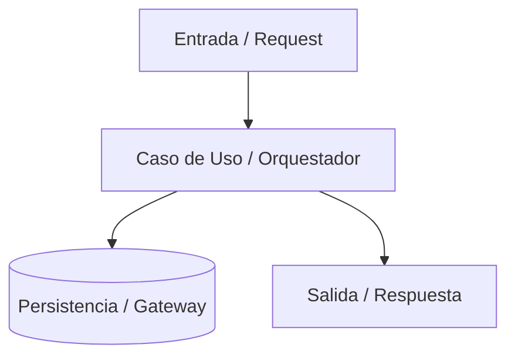

# PLANTILLA OBLIGATORIA: PLAN MAESTRO

> Copia este archivo para generar cada `PLAN_MAESTRO.md`.  
> **Propósito:** Definir el contrato de arquitectura, visión técnica, fases ejecutables y métricas de éxito del plan.  
> **Lineamiento:** Mantenerlo accionable, ágil y sin burocracia innecesaria. Debe caber en la ventana de contexto de cualquier agente.

---

```markdown
# Plan Maestro — <Título del Plan / Feature / Módulo>

> **Versión:** 1.0 · **Fecha:** AAAA-MM-DD  
> **Alineado con:** <Arquitectura del proyecto, e.g., Clean Architecture Bancolombia, SOLID, Marco HyMS>

---

## 1. Objetivo y Caso de Uso

<Descripción concisa del problema que resuelve este plan y el valor técnico o de negocio que entrega.>

---

## 2. Diagnóstico y Deuda Técnica a Resolver

<Inventario estructurado del estado actual vs. la necesidad. Usa identificadores claros (D-01, D-02...) para trazabilidad.>

| ID | Componente / Archivo | Diagnóstico / Deuda Actual | Solución Propuesta |
| :---: | :--- | :--- | :--- |
| **D-01** | `ruta/al/componente` | <Problema actual> | <Ajuste arquitectónico> |
| **D-02** | `ruta/al/componente` | <Problema actual> | <Ajuste arquitectónico> |

---

## 3. Arquitectura Objetivo

<Diagrama Mermaid que ilustre el flujo de datos, la interacción entre capas o el diseño de componentes.>



---

## 4. Mapa de Fases del Plan

```
[Fase 01] <Nombre Fase 01>
    │
    ▼
[Fase 02] <Nombre Fase 02>
    │
    ▼
[Fase 03] <Nombre Fase 03>
    │
    ▼
[Fase 0N] <Nombre Fase 0N>
```

### Detalle de Fases:

### **Fase 01 — <Nombre de la Fase>**
* **Objetivo:** <Propósito específico de la fase.>
* **Entregable:** <Qué existirá al cerrar esta fase.>
* **Dependencias:** <Ninguna o fase previa.>

### **Fase 02 — <Nombre de la Fase>**
* **Objetivo:** <Propósito específico de la fase.>
* **Entregable:** <Qué existirá al cerrar esta fase.>
* **Dependencias:** Fase 01.

---

## 5. Métricas de Éxito y Criterios de Aceptación Globales

1. **Compilación y Build:** Build limpio sin errores ni warnings críticos.
2. **Cobertura y Pruebas:** $\ge 90\%$ de cobertura en capas de dominio y lógica de negocio; 100% tests pasando.
3. **Calidad y Reglas:** Cero violaciones de arquitectura (ArchUnit / Linters) y sin dependencias no autorizadas.
4. **Criterio Funcional:** <Condición de negocio que valida la entrega completa.>
```
