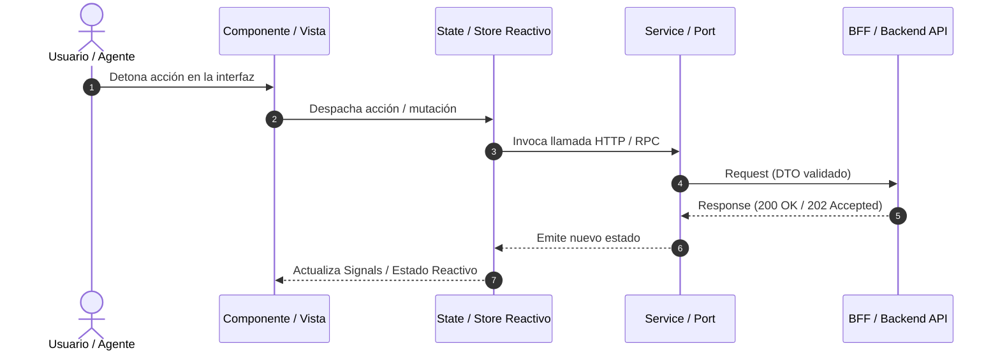

# PLANTILLA OBLIGATORIA DE ESPECIFICACIÓN TÉCNICA (MACRO-SPEC / SDD)

> Copia este archivo para generar cada especificación base en `docs/specs/ESPECIFICACION-<nombre-iniciativa>.md`.
> **Propósito:** Actuar como el *Software Design Document (SDD)* rector del sistema o funcionalidad. 
> Define la arquitectura macro, los contratos de comunicación, modelos de datos y flujos antes de desglosar el trabajo en el `PLAN_MAESTRO.md` y sus fases atómicas.

---

```markdown
# ESPECIFICACIÓN TÉCNICA — <Nombre del Módulo o Iniciativa>

> **Módulo:** `<nombre-del-modulo>` (<Stack tecnológico: ej. Angular 22 / Spring Boot 3 / etc.>)  
> **Versión:** 1.0.0  
> **Fecha:** <YYYY-MM-DD>  
> **Estado:** 🟡 EN_REVISIÓN · 🟢 APROBADA · 🔴 RECHAZADA  
> **Alineado con:** <Estándar arquitectónico del proyecto, ej. Clean Architecture Bancolombia, Reactive Signals, OnPush>  
> **Especificación Base / Relacionada:** `<ruta o enlace a spec complementaria, ej. backend/docs/specs/ESPECIFICACION-BFF.md>`

---

## 1. Alcance y Propósito del Sistema

### 1.1 Contexto y Problema
<Descripción clara del problema técnico o de negocio que motiva esta iniciativa. De dónde surge la necesidad y qué dolores resuelve.>

### 1.2 Objetivos del Sistema / Experiencia de Usuario
1. **<Objetivo 1>:** <Descripción del comportamiento, capacidad o flujo principal.>
2. **<Objetivo 2>:** <Descripción de capacidades secundarias, visores, gestión de estado o interacción.>
3. **<Objetivo 3>:** <Capacidades de integración o desacoplamiento progresivo.>

### 1.3 Límites y Fuera de Alcance (Out of Scope)
* <Qué NO resolverá esta especificación para evitar dispersión de alcance.>
* <Funcionalidades postergadas para versiones futuras.>

---

## 2. Contratos de Comunicación e Integración (API / Eventos)

<Definición formal de cómo se comunica este componente con el exterior (BFF, Microservicios, Broker de Eventos, etc.).>

### 2.1 Mapeo de Rutas / Endpoints
```typescript
export const API_ENDPOINTS = {
  // Rutas existentes preservadas
  BASE_RESOURCE: `${BASE}/api/v1/resource`,

  // NUEVAS RUTAS de esta especificación
  FEATURE_ACTION: `${BASE}/api/v1/feature/action`,
  FEATURE_DETAIL: (id: string) => `${BASE}/api/v1/feature/${encodeURIComponent(id)}`,
} as const;
```

### 2.2 Modelos de Datos y DTOs
```typescript
// ==========================================
// DTOs de Entrada (Request) y Salida (Response)
// ==========================================

export interface FeatureRequestDTO {
  readonly id: string;
  readonly title: string;
  readonly metadata?: Record<string, unknown>;
}

export interface FeatureResponseDTO {
  readonly status: 'SUCCESS' | 'FAILED' | 'IN_PROGRESS';
  readonly data: FeatureRequestDTO;
  readonly timestamp: string;
}
```

---

## 3. Arquitectura y Componentes Involucrados

### 3.1 Diagrama de Flujo o Secuencia


### 3.2 Capas y Responsabilidades Afectadas
| Capa / Directorio | Archivos o Módulos Clave | Responsabilidad en esta Spec |
| :--- | :--- | :--- |
| **Dominio / Modelos** | `src/app/models/...` | Interfaces inmutables y contratos DTO. |
| **Servicios / Infra** | `src/app/services/...` | Clientes HTTP, mapeo de endpoints y adaptadores. |
| **Estado / Store** | `src/app/store/...` | Signals reactivos, estados de carga, error y caché. |
| **Presentación / UI** | `src/app/components/...` | Componentes standalone, OnPush, accesibilidad. |

---

## 4. Requisitos No Funcionales y Criterios de Calidad

### 4.1 Rendimiento y Resiliencia
- [ ] Uso de estructuras inmutables y funciones puras.
- [ ] Manejo explícito de errores de red con degradación visual limpia (*empty states*, toasts, retry).
- [ ] Cancelación de peticiones concurrentes obsoletas (ej. `switchMap` o abort controllers).

### 4.2 Seguridad y Validaciones
- [ ] Sanitización y codificación de parámetros URL (`encodeURIComponent`).
- [ ] Validación de esquemas en tiempo de compilación (tipado estricto sin uso de `any`).

---

## 5. Estrategia de Testing y Verificación

### 5.1 Pruebas Unitarias Mínimas
* **Servicios:** Cobertura de casos felices (200/202) y captura de errores HTTP (400, 404, 500).
* **Stores / Estado:** Verificación de transiciones reactivas de estado (Loading $\rightarrow$ Success / Error).
* **Componentes:** Renderizado de estados sin romper la suite existente.

### 5.2 Mocks Requeridos
```typescript
export const MOCK_FEATURE_RESPONSE: FeatureResponseDTO = {
  status: 'SUCCESS',
  data: { id: 'test-1', title: 'Ejemplo Mock' },
  timestamp: '2026-09-11T00:00:00Z',
};
```

---

## 6. Desglose Preliminar para el Plan Maestro

<Propuesta inicial de desglose atómico para ser transferido a `docs/plan/PLAN_MAESTRO.md`:>

* **Fase 01:** Contratos de API, modelos de datos e interfaces DTO.
* **Fase 02:** Adaptadores de infraestructura, servicios HTTP y mocks de prueba.
* **Fase 03:** Store reactivo, gestión de estados y signals.
* **Fase 04:** Componentes visuales y cableado con la interfaz de usuario.
* **Fase 05:** Pruebas unitarias de integración, cobertura y cierre.
```
